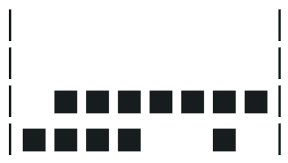

# 配列

## 配列とは？
配列とは、複数の値を順序付きでまとめて管理できるデータのことです。
例えば、複数の学校名や数字などをひとつの変数で扱いたいときに使います。

| 型 | 意味 |
| :-: | :-: |
| Array | 配列 |

配列の作り方（ _配列リテラル_ ）

### 構文
```
[値1, 値2, 値3]
```

:::tip
各値の間は「,」で区切ります。
:::

### 例
<CodePreview>
```javascript
let schools = ["小学校", "中学校", "高校"];
console.log(schools);
```
</CodePreview>

## 配列の値へのアクセス

### 構文
```
配列[インデックス]
```

:::caution
インデックスは0から始まります。ドット記法ではアクセスできません。
:::

### 例
<CodePreview>
```javascript
let schools = ["小学校", "中学校", "高校"];
// 読み取り
console.log(schools[0]);
console.log(schools[1]);
console.log(schools[2]);
// 書き換え
schools[2] = "高等学校";
console.log(schools[2]);
```
</CodePreview>

#### イメージ
配列は実はオブジェクトの一種で、キーが 0, 1, 2 ... の連番になっています。（イメージ）
※ただし、ドット記法ではアクセスできません。

<CodePreview>
```javascript
let schools = {
    0: "小学校",
    1: "中学校",
    2: "高校",
    ...
};
```
</CodePreview>

### lengthプロパティ
配列の要素数が入っています。

<CodePreview>
```javascript
let schools = ["小学校", "中学校", "高校"];
// 要素数を出力
console.log(schools.length);
```
</CodePreview>

---

## 配列の繰り返し処理

### for-of文
<CodePreview>
```javascript
let schools = ["小学校", "中学校", "高校"];
for (let value of schools) {
    // value に要素が入っている。
    console.log(value);
}
```
</CodePreview>

---

<Exercise title="演習1">
配列の要素を for...of 文で先頭から順に取り出し、「日」「月」…「土」と出力せよ。

```js
let arr = ["日", "月", "火", "水", "木", "金", "土"];
```

<Solution>
`for (let day of arr)` で要素を順に取り出し、`console.log(day)` でそのまま出力します。

<CodePreview>
```javascript
let arr = ["日", "月", "火", "水", "木", "金", "土"];
for (let day of arr) {
    console.log(day);
}
```
</CodePreview>
</Solution>
</Exercise>

---

<Exercise title="演習2">
次の配列を使って、「日曜日」「月曜日」…「土曜日」と出力せよ。

```js
let arr = ["日", "月", "火", "水", "木", "金", "土"];
```

<Solution>
配列を先頭から順に取り出すには `for...of` 文が簡単です。

- `for (let day of arr)` で、配列の各要素が順番に `day` に入ります。
- 取り出した要素に「曜日」という文字を結合して出力します（例: `"日" + "曜日"` → 「日曜日」）。
- これを全ての要素について繰り返すことで、日〜土までを順に出力できます。

<CodePreview>
```javascript
let arr = ["日", "月", "火", "水", "木", "金", "土"];
for (let day of arr) {
    console.log(day + "曜日");
}
```
</CodePreview>
</Solution>
</Exercise>

---

<Exercise title="演習2-発展1">
配列のすべての値の合計と平均を計算して出力せよ。

```js
let arr = [1, 2, 3, 4, 5, 6, 7];
```

:::info
このように出力されれば正解です。
```
合計: 28
平均: 4
```
:::

<Solution>
合計と平均は「足し込み → 最後に割る」という流れで求めます。

- まず `sum` を 0 で用意します。
- `for...of` で各要素を順に取り出し、`sum += num;` で加算していきます。
- ループが終わったら、`avg = sum / arr.length` で平均を計算します（要素数で割る）。
- 合計と平均をそれぞれ `console.log` で出力して確認します。

<CodePreview>
```javascript
let arr = [1, 2, 3, 4, 5, 6, 7];
let sum = 0;
for (let num of arr) {
    sum += num;
}
let avg = sum / arr.length;
console.log("合計:", sum);
console.log("平均:", avg);
```
</CodePreview>
</Solution>
</Exercise>

---

<Exercise title="演習2-発展2">
次の配列の値を逆順に（後ろから）出力せよ。

```js
let arr = ["a", "b", "c", "d", "e"];
```

:::tip
for...of 文では先頭から順番にしかループできないため、逆順には回せません。別の方法を考えましょう。
:::

<Solution>
配列を逆順に出力するには、最後のインデックスから 0 まで下がるループを使います。

- 配列の最後の位置は `arr.length - 1` です。
- `for (let i = arr.length - 1; i >= 0; i--)` のように、`i` を 1 ずつ減らしながら取り出します。
- 各ステップで `arr[i]` を出力すれば、後ろから前へと値が表示されます。

<CodePreview>
```javascript
let arr = ["a", "b", "c", "d", "e"];
for (let i = arr.length - 1; i >= 0; i--) {
    console.log(arr[i]);
}
```
</CodePreview>
</Solution>
</Exercise>

---

<Exercise title="演習2-発展3">
次の配列の最小値を `for...of` 文を使って求めて出力せよ。

```js
let arr = [189, 409, 408, 101, 163, 347, 109, 402, 166, 493];
```

:::info
配列の中の最小値（最も小さい数）は101なので、次のように出力されれば正解です。
```
101
```
:::

<Solution>
最小値の探索は「いまの最小」を持ちながら順に比べて更新していく方法が基本です。

- まず仮の最小値として、配列の先頭要素を `min` に入れておきます。
- ループで各 `num` を取り出し、`if (num < min)` なら `min` を更新します。
- すべて見終わった後の `min` が、配列全体の最小値になります。

<CodePreview>
```javascript
let arr = [189, 409, 408, 101, 163, 347, 109, 402, 166, 493];
let min = arr[0];
for (let num of arr) {
    if (num < min) {
        min = num;
    }
}
console.log(min);
```
</CodePreview>
</Solution>
</Exercise>

---

## 特別演習：ゲーム（テトリス）の一部分をちょっと作ってみよう

:::caution
激ムズ（かなり難しい問題です）。自分のペースで挑戦し、達成感を味わいましょう！
習った範囲内の知識だけで解けます。新しい文法などは使わなくても大丈夫です。
:::

<Exercise title="演習2-発展4（1）">
次の配列をその下の図のように出力せよ。（両端の縦棒|も出力すること）

```js
let tetrisField = 
    [
        ["　", "■", "■", "■", "■", "■", "■", "■"],
        ["■", "■", "■", "■", "■", "■", "■", "■"],
        ["■", "■", "■", "■", "　", "　", "■", "　"],
        ["■", "■", "■", "■", "■", "■", "■", "■"]
    ];
```


<Solution>
各行ごとに文字を連結して 1 行ずつ出力します。外側のループで行、内側のループでセルを処理し、行の前後に `|` を付けます。

<CodePreview>
```javascript
let tetrisField = 
    [
        ["　", "■", "■", "■", "■", "■", "■", "■"],
        ["■", "■", "■", "■", "■", "■", "■", "■"],
        ["■", "■", "■", "■", "　", "　", "■", "　"],
        ["■", "■", "■", "■", "■", "■", "■", "■"]
    ];

for (let row of tetrisField) {
    let line = "|";
    for (let cell of row) {
        line += cell;
    }
    line += "|";
    console.log(line);
}
```
</CodePreview>
</Solution>
</Exercise>

<Exercise title="演習2-発展4（2）">
（1）の tetrisField はテトリスというパズルゲームのフィールドを表している。このゲームでは、■が横一列すべて埋まったら、その行の■が消えて、それより上の行の内容がすべて１つ下の行に移動することになる。その処理を実装し、結果を出力せよ。（下の図のようになれば良い）



<Solution>
横一列が「■」で埋まった行を削除し、上の行を 1 行ずつ落とす処理を実装します。

処理の流れ
1. フィールドは 2 次元配列（行の配列の中に、セルの配列）で表します。
2. 自作関数 `isFilledRow(row)` を用意し、`for...of` で row の行の各セルがすべて "■" か判定します（1つでも違えば false を返す）。
3. `popAlignedRows` で各行を調べ、`isFilledRow(row)` ならその行は満杯として処理します。
4. 満杯の行が見つかったら `popRow` を呼び、`rowIndex-1` から上の行を下へコピーしていきます。
5. いちばん上の行（`field[0]`）は、空行（全角スペース）で初期化します。
6. 最後に（1）でやったように、2重ループで、行を `|` で囲んだ文字列に連結して出力します。

<CodePreview>
```javascript
let tetrisField = [
    ["　", "■", "■", "■", "■", "■", "■", "■"],
    ["■", "■", "■", "■", "■", "■", "■", "■"],
    ["■", "■", "■", "■", "　", "　", "■", "　"],
    ["■", "■", "■", "■", "■", "■", "■", "■"]
];
function isFilledRow(row) {
    for (let cell of row) {
        if (cell !== "■") {
            return false;
        }
    }
    return true;
}
function popRow(field, rowIndex) {
    for (let i = rowIndex - 1; i >= 0; i--) {
        field[i + 1] = field[i];
    }
    field[0] = ["　", "　", "　", "　", "　", "　", "　", "　"];
}
function popAlignedRows(field) {
    for (let i = 0; i < field.length; i++) {
        let row = field[i];
        if (isFilledRow(row)) {
            popRow(field, i);
        }
    }
}
popAlignedRows(tetrisField);
for (let row of tetrisField) {
    let line = "|";
    for (let cell of row) {
        line += cell;
    }
    line += "|";
    console.log(line);
}
```
</CodePreview>
</Solution>
</Exercise>
