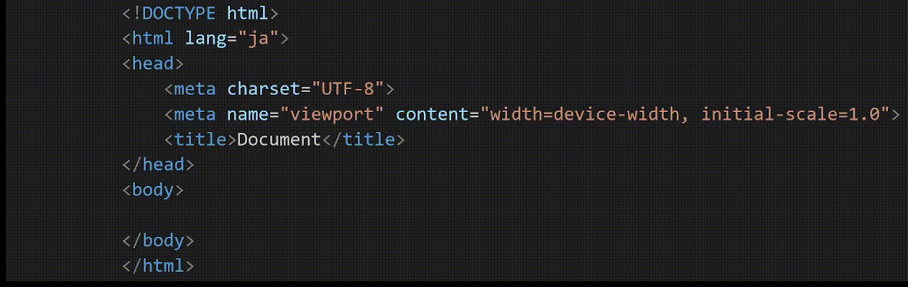

---
title: DOM謫堺ｽ懊→CSS謫堺ｽ・
---

## 蠕ｩ鄙抵ｼ・TML縺ｫ縺､縺・※・・

- _隕∫ｴ_ ・壼酔縺倥ち繧ｰ蜷阪ｒ繧ゅ▽髢句ｧ九ち繧ｰ・樒ｵゆｺ・ち繧ｰ縺ｮ縺ｲ縺ｨ縺九◆縺ｾ繧奇ｼ遺€ｻ邨ゆｺ・ち繧ｰ縺ｮ縺ｪ縺・ｦ∫ｴ繧ゅ≠繧具ｼ・

![蜷後§繧ｿ繧ｰ蜷阪ｒ繧ゅ▽髢句ｧ九ち繧ｰ・樒ｵゆｺ・ち繧ｰ縺ｮ縺ｲ縺ｨ縺九◆縺ｾ繧馨(./img/html-element.png)


---

## JavaScript 縺ｧ隕∫ｴ繧貞叙蠕励☆繧九↓縺ｯ

\_HTML縺ｮ隗｣譫舌′邨ゅｏ縺｣縺溷ｾ契 縺ｧ縲∽ｻ･荳九・髢｢謨ｰ繧剃ｽｿ逕ｨ縺吶ｋ縲・

|                 髢｢謨ｰ                 |                                       蜍穂ｽ・                                       |
| :------------------------------------: | :---------------------------------------------------------------------------------: |
| `document.querySelector(繧ｻ繝ｬ繧ｯ繧ｿ)` | 謖・ｮ壹＠縺櫃SS縺ｮ繧ｻ繝ｬ繧ｯ繧ｿ(譁・ｭ怜・)縺ｫ荳€閾ｴ縺吶ｋ縲・_譛€蛻昴・隕∫ｴ_ 繧定ｿ斐☆ |

<CodePreview>
```html
<body>
  <p>繝・せ繝・/p>
</body>
```

```javascript
// body隕∫ｴ繧貞叙蠕・
let bodyYouso = document.querySelector('body');

// 蜿門ｾ励＠縺溯ｦ∫ｴ繧貞・蜉・
console.log(bodyYouso); // 蜃ｺ蜉・ <body>...</body>

// 繧ゅ■繧阪ｓ螟画焚縺ｫ縺・ｌ縺壹↓逶ｴ謗･蜃ｺ縺励※繧り憶縺・
console.log(document.querySelector('p')); // 蜃ｺ蜉・ <p>繝・せ繝・/p>
```

</CodePreview>

## defer螻樊€ｧ縺ｫ縺､縺・※

`script` 隕∫ｴ縺ｫ `defer` 繧偵▽縺代ｋ縺ｨ縲・\_HTML縺ｮ隗｣譫舌′邨ゅｏ縺｣縺溷ｾ契 縺ｫ隱ｭ縺ｿ霎ｼ縺ｿ蜈医・ JavaScript 繧貞ｮ溯｡後〒縺阪ｋ縲・

```html
<script src="index.js" defer></script>
```

## 繧ｻ繝ｬ繧ｯ繧ｿ

_繧ｻ繝ｬ繧ｯ繧ｿ_ _・亥盾閠・ｼ喟 [https://saruwakakun.com/html-css/reference/selector](https://saruwakakun.com/html-css/reference/selector)_・雲

|                 蟇ｾ雎｡                  |    譖ｸ縺肴婿    |              繝偵Φ繝・              |    萓・     |
| :-------------------------------------: | :-------------: | :---------------------------------: | :---------: |
|               繧ｿ繧ｰ蜷・                |     `縲・€㌔     |   繧ｿ繧ｰ蜷阪ｒ縺昴・縺ｾ縺ｾ譖ｸ縺・   |    `div`    |
|                   id                    |    `#縲・€㌔     |     蜈磯ｭ縺ｫ `#` 繧剃ｻ倥￠繧・     |  `#sample`  |
|              繧ｯ繝ｩ繧ｹ蜷・              |    `.縲・€㌔     |     蜈磯ｭ縺ｫ `.` 繧剃ｻ倥￠繧・     |  `.sample`  |
| 隍・焚繧ｯ繝ｩ繧ｹ・井ｸ｡譁ｹ縺､縺剰ｦ∫ｴ・・ | `.縲・€・笆ｳ笆ｳ` |   繧ｹ繝壹・繧ｹ縺ｪ縺励〒邯壹￠繧・   |   `.a.b`    |
|     荳ｭ縺ｫ縺ゅｋ隕∫ｴ・亥ｭ仙ｭｫ・・      |    `縲・ﾃ輿     | 髢薙↓蜊願ｧ偵せ繝壹・繧ｹ繧貞・繧後ｋ | `.aaa div`  |
|            縺吶∋縺ｦ縺ｮ隕∫ｴ             |       `*`       |          縺吶∋縺ｦ繧帝∈縺ｶ           |     `*`     |
|            逶ｴ荳九・蟄占ｦ∫ｴ            |   `縲・> ﾃ輿    |        逶ｴ荳九□縺代ｒ驕ｸ縺ｶ         | `.aaa > h1` |
|          逶ｴ蠕後・蜈・ｼ溯ｦ∫ｴ           |   `縲・+ 笆ｳ`   |      逶ｴ蠕後・1縺､縺縺鷹∈縺ｶ       |  `.a + p`   |

---

<Exercise title="貍皮ｿ・">
**body蜀・′** 谺｡縺ｮ繧医≧縺ｫ縺ｪ縺｣縺ｦ縺・ｋHTML繝輔ぃ繧､繝ｫ縺ｫ蟇ｾ縺励※縲・_荳九・阮・・濶ｲ縺ｫ繝上う繝ｩ繧､繝医＆繧後※縺・ｋ5縺､縺ｮ隕∫ｴ繧胆 _1縺､縺壹▽縲＼ _JavaScript_ _縺ｮ_ _document.querySelector_ _縺ｧ蜿門ｾ誉 縺励※ console.log 縺ｧ蜃ｺ蜉帙○繧医€・

```html
// highlight-next-line
<h1>
  隕句・縺・/h1> // highlight-next-line
  <p>縺薙ｌ縺ｯ谿ｵ關ｽ1縺ｧ縺吶€・/p></p>
  <p>縺薙ｌ縺ｯ谿ｵ關ｽ2縺ｧ縺吶€・/p> // highlight-next-line</p>

  <p id="main">谿ｵ關ｽ3 縺薙％縺後Γ繧､繝ｳ</p>

  // highlight-next-line
  <p class="raberu">谿ｵ關ｽ4 繝ｩ繝吶ΝA</p>
  <p class="raberu">谿ｵ關ｽ5 繝ｩ繝吶ΝB</p>
  <div class="hako">
    // highlight-next-line
    <p>繝懊ャ繧ｯ繧ｹ蜀・・谿ｵ關ｽ1</p>
    <p>繝懊ャ繧ｯ繧ｹ蜀・・谿ｵ關ｽ2</p>
  </div>
</h1>
```

<CodePreview
  title="蜃ｺ蜉帑ｾ・
  sourceId="貍皮ｿ・"
  htmlVisible={false}
  jsVisible={false}
  previewVisible={false}
  consoleVisible={true}>

```html
<h1>
  隕句・縺・/h1>

  <p>縺薙ｌ縺ｯ谿ｵ關ｽ1縺ｧ縺吶€・/p></p>
  <p>縺薙ｌ縺ｯ谿ｵ關ｽ2縺ｧ縺吶€・/p></p>

  <p id="main">谿ｵ關ｽ3 縺薙％縺後Γ繧､繝ｳ</p>

  <p class="raberu">谿ｵ關ｽ4 繝ｩ繝吶ΝA</p>
  <p class="raberu">谿ｵ關ｽ5 繝ｩ繝吶ΝB</p>
  <div class="hako">
    <p>繝懊ャ繧ｯ繧ｹ蜀・・谿ｵ關ｽ1</p>
    <p>繝懊ャ繧ｯ繧ｹ蜀・・谿ｵ關ｽ2</p>
  </div>
</h1>
```

```javascript
// h1隕∫ｴ繧貞叙蠕・
console.log(document.querySelector('h1')); // 蜃ｺ蜉・ <h1>隕句・縺・/h1>

// 譛€蛻昴・p隕∫ｴ繧貞叙蠕・
console.log(document.querySelector('p')); // 蜃ｺ蜉・ <p>縺薙ｌ縺ｯ谿ｵ關ｽ1縺ｧ縺吶€・/p>

// id="main"縺ｮp隕∫ｴ繧貞叙蠕・
console.log(document.querySelector('#main')); // 蜃ｺ蜉・ <p id="main">谿ｵ關ｽ3 縺薙％縺後Γ繧､繝ｳ</p>

// class="raberu"縺ｮ譛€蛻昴・p隕∫ｴ繧貞叙蠕・
console.log(document.querySelector('.raberu')); // 蜃ｺ蜉・ <p class="raberu">谿ｵ關ｽ4 繝ｩ繝吶ΝA</p>

// class="hako"縺ｮdiv隕∫ｴ縺ｮ荳ｭ縺ｮ譛€蛻昴・p隕∫ｴ繧貞叙蠕・
console.log(document.querySelector('.hako p')); // 蜃ｺ蜉・ <p>繝懊ャ繧ｯ繧ｹ蜀・・谿ｵ關ｽ1</p>
```

</CodePreview>

<Solution>
<CodePreview sourceId="貍皮ｿ・"/>
</Solution>
</Exercise>

---

<Exercise title="貍皮ｿ・ - 逋ｺ螻・>
**body蜀・′** 谺｡縺ｮ繧医≧縺ｫ縺ｪ縺｣縺ｦ縺・ｋHTML繝輔ぃ繧､繝ｫ縺ｫ蟇ｾ縺励€・_荳九・阮・・濶ｲ縺ｫ繝上う繝ｩ繧､繝医＆繧後※縺・ｋ2縺､縺ｮ隕∫ｴ繧胆_1縺､縺壹▽縲＼ _JavaScript_ _縺ｮ_ _document.querySelector_ _縺ｧ蜿門ｾ誉 縺励※ console.log 縺ｧ蜃ｺ蜉帙○繧医€・

```html
<div class="moodaru open">
  <p>繝｢繝ｼ繝€繝ｫ繧ｦ繧｣繝ｳ繝峨え</p>
</div>

<div class="dorowa open">
  // highlight-next-line
  <button class="botan">繝懊ち繝ｳ1</button>
  <p>髢九＞縺ｦ縺・ｋ繝峨Ο繝ｯ繝ｼ蜀・・谿ｵ關ｽ</p>
</div>

<div class="dorowa">
  <button class="botan">繝懊ち繝ｳ2</button>
  // highlight-next-line
  <p>髢九＞縺ｦ縺・↑縺・ラ繝ｭ繝ｯ繝ｼ蜀・・谿ｵ關ｽ</p>
</div>
```

<CodePreview
  title="蜃ｺ蜉帑ｾ・
  sourceId="貍皮ｿ・ - 逋ｺ螻・
  htmlVisible={false}
  jsVisible={false}
  previewVisible={false}
  consoleVisible={true}>

```html
<div class="moodaru open">
  <p>繝｢繝ｼ繝€繝ｫ繧ｦ繧｣繝ｳ繝峨え</p>
</div>

<div class="dorowa open">
  <button class="botan">繝懊ち繝ｳ1</button>
  <p>髢九＞縺ｦ縺・ｋ繝峨Ο繝ｯ繝ｼ蜀・・谿ｵ關ｽ</p>
</div>

<div class="dorowa">
  <button class="botan">繝懊ち繝ｳ2</button>
  <p>髢九＞縺ｦ縺・↑縺・ラ繝ｭ繝ｯ繝ｼ蜀・・谿ｵ關ｽ</p>
</div>
```

```javascript
// 髢九＞縺ｦ縺・ｋ繝峨Ο繝ｯ繝ｼ蜀・・ button 隕∫ｴ繧貞叙蠕励＠縺ｦ蜃ｺ蜉・
console.log(document.querySelector('.dorowa.open button')); // 蜃ｺ蜉・ <button class="botan">繝懊ち繝ｳ1</button>

// .open 繧呈戟縺溘↑縺・ラ繝ｭ繝ｯ繝ｼ蜀・・ p 隕∫ｴ繧貞叙蠕励＠縺ｦ蜃ｺ蜉・
console.log(document.querySelector('.dorowa:not(.open) p')); // 蜃ｺ蜉・ <p>髢九＞縺ｦ縺・↑縺・ラ繝ｭ繝ｯ繝ｼ蜀・・谿ｵ關ｽ</p>
```

</CodePreview>

<Solution>
<CodePreview sourceId="貍皮ｿ・ - 逋ｺ螻・/>
</Solution>
</Exercise>

---

## CSS縺ｮ謫堺ｽ・

谺｡縺ｮ譖ｸ縺肴婿縺ｧ縲゛avaScript 縺九ｉ CSS 縺ｮ繝励Ο繝代ユ繧｣蛟､繧貞､画峩縺ｧ縺阪ｋ

```js
隕∫ｴ.style.CSS繝励Ο繝代ユ繧｣蜷・= "蛟､"
```

<CodePreview>
```html
<style>
p {
  color: green;
  font-size: 100px; /* 隕九ｄ縺吶＞繧医≧縺ｫ螟ｧ縺阪￥縺励◆縺縺・*/
}
</style>
<body>
  <p>繝・せ繝域枚遶</p>
</body>
```

```javascript
// p隕∫ｴ縺ｮ譁・ｭ苓牡繧定ｵ､縺ｫ螟画峩
// 隕∫ｴ = document.querySelector("p")
document.querySelector('p').style.color = 'red';
```

</CodePreview>

:::caution
background-color 縺ｮ繧医≧縺ｪ繝上う繝輔Φ縺ｮ縺ゅｋCSS繝励Ο繝代ユ繧｣縺ｮ蝣ｴ蜷医・縲｜ackgroundColor 縺ｮ繧医≧縺ｫ縲√ワ繧､繝輔Φ繧呈ｶ医＠縺ｦ縲√◎縺ｮ谺｡縺ｮ譁・ｭ励ｒ螟ｧ譁・ｭ励↓縺吶ｋ縲・
:::

<CodePreview>
```html
<style>
p {
  font-size: 100px;
}
</style>
<body>
  <p>繝・せ繝域枚遶</p>
</body>
```

```javascript
// p隕∫ｴ縺ｮ閭梧勹濶ｲ繧呈ｰｴ濶ｲ縺ｫ螟画峩
// 隕∫ｴ = document.querySelector("p")
document.querySelector('p').style.backgroundColor = 'lightblue';
```

</CodePreview>

---

<Exercise title="貍皮ｿ・">
**body蜀・′** 谺｡縺ｮ繧医≧縺ｫ縺ｪ縺｣縺ｦ縺・ｋHTML繝輔ぃ繧､繝ｫ縺ｫ蟇ｾ縺励€・_荳九・阮・・濶ｲ縺ｫ繝上う繝ｩ繧､繝医＆繧後※縺・ｋ3縺､縺ｮ隕∫ｴ繧胆 _1縺､縺壹▽縲＼ _JavaScript_ _縺ｧ_ 蜿ｳ縺ｮ繧ｳ繝｡繝ｳ繝医〒譖ｸ縺九ｌ縺滓欠遉ｺ縺ｮ騾壹ｊ縺ｫ螟画峩縺帙ｈ縲・

```html
// highlight-next-line
<h1 class="taitoru">
  莉頑律縺ｮ螟ｩ豌・/h1>
  <!-- 譁・ｭ苓牡繧偵€碁搨濶ｲ縲阪↓縺帙ｈ -->
  // highlight-next-line
  <p>
    譎ｴ繧後・縺｡縺上ｂ繧・/p>
    <!-- 閭梧勹濶ｲ繧偵€碁ｻ・牡縲阪↓縺帙ｈ -->
  </p>

  <div class="hako">
    // highlight-next-line
    <p>譛€鬮俶ｰ玲ｸｩ 18蠎ｦ</p>
    <!-- 譁・ｭ励し繧､繧ｺ繧偵€・0px縲阪↓縺帙ｈ -->
  </div>
</h1>
```

<CodePreview
  title="蜃ｺ蜉帑ｾ・
  sourceId="貍皮ｿ・"
  htmlVisible={false}
  jsVisible={false}
  previewVisible={true}>

```html
<h1 class="taitoru">
  莉頑律縺ｮ螟ｩ豌・/h1>
  <!-- 譁・ｭ苓牡繧偵€碁搨濶ｲ縲阪↓縺帙ｈ -->
  <p>
    譎ｴ繧後・縺｡縺上ｂ繧・/p>
    <!-- 閭梧勹濶ｲ繧偵€碁ｻ・牡縲阪↓縺帙ｈ -->
  </p>

  <div class="hako">
    <p>譛€鬮俶ｰ玲ｸｩ 18蠎ｦ</p>
    <!-- 譁・ｭ励し繧､繧ｺ繧偵€・0px縲阪↓縺帙ｈ -->
  </div>
</h1>
```

```javascript
// class="taitoru"縺ｮh1隕∫ｴ縺ｮ譁・ｭ苓牡繧帝搨縺ｫ螟画峩
document.querySelector('.taitoru').style.color = 'blue';

// 譛€蛻昴・p隕∫ｴ縺ｮ閭梧勹濶ｲ繧帝ｻ・牡縺ｫ螟画峩
document.querySelector('p').style.backgroundColor = 'yellow';

// class="hako"縺ｮdiv隕∫ｴ縺ｮ荳ｭ縺ｮp隕∫ｴ縺ｮ譁・ｭ励し繧､繧ｺ繧・0px縺ｫ螟画峩
document.querySelector('.hako p').style.fontSize = '80px';
```

</CodePreview>

<Solution>
<CodePreview sourceId="貍皮ｿ・"/>
</Solution>
</Exercise>

---

<Exercise title="貍皮ｿ・">
**body蜀・′** 谺｡縺ｮ繧医≧縺ｫ縺ｪ縺｣縺ｦ縺・ｋHTML繝輔ぃ繧､繝ｫ縺ｫ蟇ｾ縺励€・_荳九・阮・・濶ｲ縺ｫ繝上う繝ｩ繧､繝医＆繧後※縺・ｋ6縺､縺ｮ隕∫ｴ繧胆 _1縺､縺壹▽縲＼ _JavaScript_ _縺ｧ_ 繧ｳ繝｡繝ｳ繝医〒譖ｸ縺九ｌ縺滓欠遉ｺ縺ｮ騾壹ｊ縺ｫ螟画峩縺帙ｈ縲・

```html
<!-- highlight-next-line -->
<!-- 譁・ｭ苓牡繧定ｵ､縺ｫ縺帙ｈ -->
<!-- highlight-next-line -->
<h1 class="taitoru">縺顔衍繧峨○</h1>
<div class="hako">
  <!-- highlight-next-line -->
  <!-- 隕∫ｴ繧帝撼陦ｨ遉ｺ縺ｫ縺帙ｈ -->
  <!-- highlight-next-line -->
  <p class="messeji">縺薙・繝｡繝・そ繝ｼ繧ｸ縺ｯ髱櫁｡ｨ遉ｺ縺ｫ縺帙ｈ</p>
  <p class="messeji">縺薙・繝｡繝・そ繝ｼ繧ｸ縺ｯ豸医＆縺ｪ縺・〒繧医＞</p>

  <!-- highlight-next-line -->
  <!-- 閭梧勹: 繧ｪ繝ｬ繝ｳ繧ｸ / 譁・ｭ・ 逋ｽ / 繧ｵ繧､繧ｺ: 20px -->
  <!-- highlight-next-line -->
  <p class="notice">縺薙・驛ｨ蛻・↓縺ｯ3縺､縺ｮ陬・｣ｾ繧貞刈縺医ｈ</p>
  <p>
    縺薙・谿ｵ關ｽ縺ｫ縺ｯ菴輔ｂ縺励↑縺・/p>

    <!-- highlight-next-line -->
    <!-- 譁・ｭ励ｒ螟ｪ蟄励↓縺帙ｈ -->
    <!-- highlight-next-line -->
  </p>

  <p class="tyuui">驥崎ｦ・ｼ壼・螳ｹ繧貞ｼｷ隱ｿ縺帙ｈ</p>

  <!-- highlight-next-line -->
  <!-- 蟷・鬮倥＆ 60px / 閭梧勹: skyblue / 蜀・↓縺帙ｈ -->
  <!-- highlight-next-line -->
  <div class="maru"></div>

  <!-- highlight-next-line -->
  <!-- 荳埼€乗・蠎ｦ繧・20% 縺ｫ縺帙ｈ -->
  <!-- highlight-next-line -->
  <p class="usui">隧ｳ邏ｰ縺ｯ縺薙■繧峨ｒ縺皮｢ｺ隱阪￥縺縺輔＞</p>
</div>
```

<CodePreview
  title="蜃ｺ蜉帑ｾ・
  sourceId="貍皮ｿ・"
  htmlVisible={false}
  jsVisible={false}
  previewVisible={true}>

```html
<!-- 譁・ｭ苓牡繧定ｵ､縺ｫ縺帙ｈ -->
<h1 class="taitoru">縺顔衍繧峨○</h1>
<div class="hako">
  <!-- 隕∫ｴ繧帝撼陦ｨ遉ｺ縺ｫ縺帙ｈ -->
  <p class="messeji">縺薙・繝｡繝・そ繝ｼ繧ｸ縺ｯ髱櫁｡ｨ遉ｺ縺ｫ縺帙ｈ</p>
  <p class="messeji">縺薙・繝｡繝・そ繝ｼ繧ｸ縺ｯ豸医＆縺ｪ縺・〒繧医＞</p>

  <!-- 閭梧勹: 繧ｪ繝ｬ繝ｳ繧ｸ / 譁・ｭ・ 逋ｽ / 繧ｵ繧､繧ｺ: 20px -->

  <p class="notice">縺薙・驛ｨ蛻・↓縺ｯ3縺､縺ｮ陬・｣ｾ繧貞刈縺医ｈ</p>
  <p>
    縺薙・谿ｵ關ｽ縺ｫ縺ｯ菴輔ｂ縺励↑縺・/p>

    <!-- 譁・ｭ励ｒ螟ｪ蟄励↓縺帙ｈ -->
  </p>

  <p class="tyuui">驥崎ｦ・ｼ壼・螳ｹ繧貞ｼｷ隱ｿ縺帙ｈ</p>

  <!-- 蟷・鬮倥＆ 60px / 閭梧勹: skyblue / 蜀・↓縺帙ｈ -->

  <div class="maru"></div>

  <!-- 荳埼€乗・蠎ｦ繧・20% 縺ｫ縺帙ｈ -->

  <p class="usui">隧ｳ邏ｰ縺ｯ縺薙■繧峨ｒ縺皮｢ｺ隱阪￥縺縺輔＞</p>
</div>
```

```javascript
// h1.taitoru 繧定ｵ､縺ｫ
document.querySelector('.taitoru').style.color = 'red';

// 譛€蛻昴・ class="messeji" 繧帝撼陦ｨ遉ｺ縺ｫ縺吶ｋ
document.querySelector('.messeji').style.display = 'none';

// class="notice" 縺ｫ閭梧勹濶ｲ繧ｪ繝ｬ繝ｳ繧ｸ縲∵枚蟄苓牡逋ｽ縲∵枚蟄励し繧､繧ｺ20px 繧定ｨｭ螳・
let noticeYouso = document.querySelector('.notice');
noticeYouso.style.backgroundColor = 'orange';
noticeYouso.style.color = 'white';
noticeYouso.style.fontSize = '20px';

// class="tyuui" 縺ｮ譁・ｭ励ｒ螟ｪ蟄励↓縺吶ｋ
document.querySelector('.tyuui').style.fontWeight = 'bold';

// .maru 繧貞ｹ・鬮倥＆60px縲∬レ譎ｯ濶ｲ skyblue縲∽ｸｸ縺上☆繧・
let maruYouso = document.querySelector('.maru');
maruYouso.style.width = '60px';
maruYouso.style.height = '60px';
maruYouso.style.backgroundColor = 'skyblue';
maruYouso.style.borderRadius = '50%';

// class="usui" 縺ｮ荳埼€乗・蠎ｦ繧・0%縺ｫ縺吶ｋ
document.querySelector('.usui').style.opacity = '0.2';
```

</CodePreview>

:::info CSS縺ｮ繝偵Φ繝・

|              繧・ｊ縺溘＞縺薙→               |                      譖ｸ縺肴婿                       |                                                                      萓・                                                                       |
| :------------------------------------------: | :--------------------------------------------------: | :---------------------------------------------------------------------------------------------------------------------------------------------: |
|                  髱櫁｡ｨ遉ｺ                   |                   `display: none;`                   |                                                                `display: none;`                                                                 |
|              讓ｪ蟷・ｒ螟峨∴繧・              |                   `width: 謨ｰ蛟､;`                   |                                                                 `width: 100px;`                                                                 |
|              邵ｦ蟷・ｒ螟峨∴繧・              |                  `height: 謨ｰ蛟､;`                   |                                                                `height: 100vh;`                                                                 |
|                 蜀・↓縺吶ｋ                  | 讓ｪ蟷・→邵ｦ蟷・ｒ蜷後§縺ｫ縺励※ `border-radius: 50%;` |                                                `width: 60px; height: 60px; border-radius: 50%;`                                                 |
| 騾乗・蠎ｦ繧貞､峨∴繧具ｼ郁ｦ九∴譁ｹ縺ｮ逶ｮ螳会ｼ・ |                  `opacity: 0縲・;`                   | 隕九∴縺ｪ縺・竊・`opacity: 0;`<br/>螳悟・縺ｫ隕九∴繧・竊・`opacity: 1;`<br/>30%縺上ｉ縺・竊・`opacity: 0.3;`<br/>50%縺上ｉ縺・竊・`opacity: 0.5;` |

:::

<Solution>
<CodePreview sourceId="貍皮ｿ・"/>
</Solution>
</Exercise>

<Exercise title="貍皮ｿ・ - 逋ｺ螻・>
**body蜀・′** 谺｡縺ｮ繧医≧縺ｫ縺ｪ縺｣縺ｦ縺・ｋHTML繝輔ぃ繧､繝ｫ縺ｫ蟇ｾ縺励※縲゛avaScript縺ｧCSS繧貞､画峩縺吶ｋ縺薙→縺ｧ荳九・繝励Ξ繝薙Η繝ｼ縺ｮ隕九◆逶ｮ縺ｫ縺ｪ繧九ｈ縺・↓縺帙ｈ縲・

```html
<h2 class="banner">縺顔衍繧峨○</h2>
<p>縺顔衍繧峨○縺ｧ縺・/p></p>

<div class="banner content">
  <p class="alert">繧ｷ繧ｹ繝・Β譖ｴ譁ｰ縺ｮ縺顔衍繧峨○</p>
  <p class="detail">譛ｬ譌･18譎ゅｈ繧翫Γ繝ｳ繝・リ繝ｳ繧ｹ繧貞ｮ滓命縺励∪縺・/p></p>
  <p class="message">
    縺碑ｿｷ諠代ｒ縺翫°縺代＠縺ｾ縺吶€・br/>繧医ｍ縺励￥縺企｡倥＞閾ｴ縺励∪縺吶€・/p>
  </p>
  <div class="icon">笞・・/div></div>
</div>
```

<CodePreview
  sourceId="貍皮ｿ・-逋ｺ螻・
  htmlVisible={false}
  jsVisible={false}
  previewVisible={true}
  consoleVisible={false}>

```html
<h2 class="banner">縺顔衍繧峨○</h2>
<p>縺顔衍繧峨○縺ｧ縺・/p></p>

<div class="banner content">
  <p class="alert">繧ｷ繧ｹ繝・Β譖ｴ譁ｰ縺ｮ縺顔衍繧峨○</p>
  <p class="detail">譛ｬ譌･18譎ゅｈ繧翫Γ繝ｳ繝・リ繝ｳ繧ｹ繧貞ｮ滓命縺励∪縺・/p></p>
  <p class="message">
    縺碑ｿｷ諠代ｒ縺翫°縺代＠縺ｾ縺吶€・br>繧医ｍ縺励￥縺企｡倥＞閾ｴ縺励∪縺吶€・/p>
  </p>
  <div class="icon">笞・・/div></div>
</div>
```

```javascript
// .banner 縺ｫ濶ｲ縺ｨ菴咏區繧定ｨｭ螳・
let banner = document.querySelector('.banner');
banner.style.color = 'white';
banner.style.backgroundColor = '#007acc';
banner.style.paddingTop = '20px';
banner.style.paddingBottom = '20px';

// .alert 繧定ｵ､繝ｻ螟ｪ蟄励・蟾ｦ繝懊・繝€繝ｼ縺ｫ
let alert = document.querySelector('.alert');
alert.style.color = 'red';
alert.style.fontWeight = 'bold';
alert.style.borderLeft = '8px solid red';

// .detail 縺ｫ閭梧勹縺ｨ蜀・・菴咏區
let detail = document.querySelector('.detail');
detail.style.backgroundColor = '#f9f9f9';
detail.style.padding = '12px 16px';

// .icon 繧帝ｻ偵＞蜀・↓縺励※荳埼€乗・蠎ｦ繧・0.7 縺ｫ
let icon = document.querySelector('.icon');
icon.style.width = '60px';
icon.style.height = '60px';
icon.style.borderRadius = '50%';
icon.style.backgroundColor = 'black';
icon.style.display = 'grid';
icon.style.placeItems = 'center';

// .message 縺ｮ陦碁俣繧・2 蛟阪↓
document.querySelector('.message').style.lineHeight = '2';
```

</CodePreview>

:::info CSS縺ｮ繝偵Φ繝・

|           繧・ｊ縺溘＞縺薙→            |                             譖ｸ縺肴婿                             |
| :------------------------------------: | :---------------------------------------------------------------: |
| 繝・く繧ｹ繝医ｒ荳贋ｸ句ｷｦ蜿ｳ荳ｭ螟ｮ蟇・○ | 隕ｪ隕∫ｴ縺ｫ display: grid 縺ｨ place-items: center 繧呈欠螳壹☆繧・ |

:::

<Solution>
<CodePreview sourceId="貍皮ｿ・-逋ｺ螻・/>
</Solution>
</Exercise>
