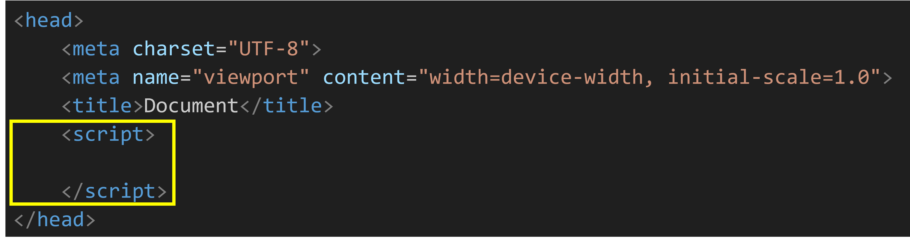
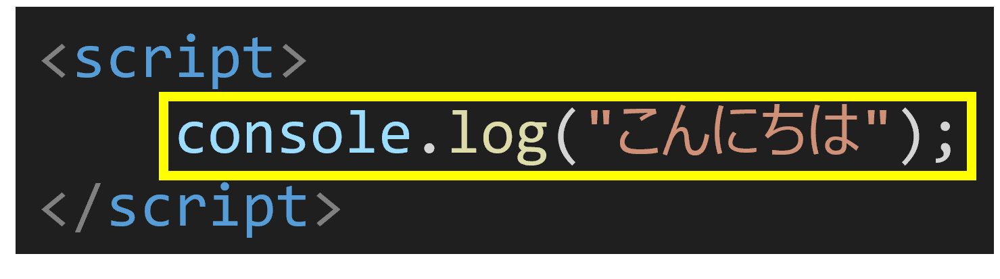
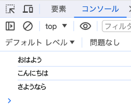
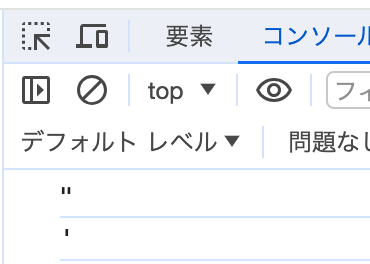

import Exercise, { QuickCheck } from '@metyatech/exercise/client';

export const Hint = Object.assign((props) => props.children, {
    __exerciseHint: true,
    displayName: 'ExerciseHint',
});

export const Answer = Object.assign((props) => props.children, {
    __exerciseAnswer: true,
    displayName: 'ExerciseAnswer',
});

:::note
このページに入る前に、次の共通基礎を確認してください。

- [Webページのしくみ](https://web-foundations-docs.vercel.app/docs/web-page-basics)
- [ファイル・フォルダ・拡張子](https://web-foundations-docs.vercel.app/docs/files-folders-extensions)
- [HTML文書の基本形](https://web-foundations-docs.vercel.app/docs/html-document-structure)
- [タグ・要素・属性](https://web-foundations-docs.vercel.app/docs/tags-elements-attributes)
  :::

## JavaScript とは？

たくさんある プログラミング言語（コンピュータの動作を記述したもの） の中の一つ。

プログラミング言語の例：C, C++, Java, JavaScript, PHP, Ruby, Python, ……

:::note

#### JavaScriptの例

<CodePreview>
```javascript
function popRow(field, rowIndex) {
    for (let i = rowIndex - 1; i >= 0; i--) {
        field[i + 1] = field[i];
    }
    field[0] = ['　', '　', '　', '　', '　', '　', '　'];
}

function popAlignedRows(field) {
    for (let i = 0; i < field.length; i++) {
        const row = field[i];
        if (isAlignedRow(row)) {
            popRow(field, i);
        }
    }
}
```
</CodePreview>
:::

---

## JavaScript を学ぶと何ができるのか

- ブラウザで動作する系
    - _Webページの一部分に動きをつける_
        - この授業で扱う（後で詳しく）
        - _JavaScript は、元々この用途で使うために作られた言語だった_
    - Webページのほぼ全体をJavaScriptで生成する（シングルページアプリケーション）
        - 例：Facebook、X、YouTube、Teams（Web版）
- インストールして動作する系（モバイルアプリ、デスクトップアプリ開発）
    - 例：Discord、Microsoft Teams、Amazon Kindle

### Webページの一部分に動きをつける例

- フォームのエラーチェック
    - 例：電話番号の入力エラー、メールアドレスの入力エラー
- さいたまIT・WEB専門学校トップページ（ [公式サイト](https://www.siw.ac.jp/) ）
    - 例：メニューの表示/非表示の切り替え、スライダーの作成

---

## インストール作業

[環境構築の資料](/docs/materials/environment-setup)を参照してください。

---

## JavaScript を書く

HTMLの基本形を作成したら、`<head>` の中に `<script>` を追加して JavaScript を書きます。

1. head要素の中にscript要素を書く。


2. script要素の中に JavaScript のコードを書く。


結果こうなっていればOK：

<CodePreview>
```html
<!DOCTYPE html>
<html lang="ja">
    <head>
        <meta charset="UTF-8" />
        <meta name="viewport" content="width=device-width, initial-scale=1.0" />
        <title>Document</title>
        <script>
            console.log('こんにちは');
        </script>
    </head>
    <body></body>
</html>
```

</CodePreview>

:::note
JavaScriptの実行結果やエラーを確認する方法は、次の共通基礎で確認できます。

- [ブラウザで確認する](https://web-foundations-docs.vercel.app/docs/browser-preview)
  :::

保存してからブラウザで開き、DevTools の Console に `こんにちは` と表示されるか確認してください。

:::note
外部JavaScriptファイルを読み込む前に、次の共通基礎を確認してください。

- [パス・URL・外部ファイル](https://web-foundations-docs.vercel.app/docs/paths-urls-external-files)
  :::

## JavaScript ファイルを外部に分ける

これまでは `<script>` タグの中に直接 JavaScript を書きました。
コードが増えてきたときは、JavaScript のコードを別のファイル（`.js` ファイル）に分けて書くのが一般的です。

### 外部ファイルを読み込む方法

1. `.js` ファイルを作成する（例：`index.js`）
2. HTML の `<head>` 内の `<script>` タグに `src` 属性でファイル名を指定する

```html
<script src="index.js"></script>
```

#### ファイル構成の例

```text
フォルダ/
├── index.html
└── index.js
```

**index.html の `<head>` の中：**

```html
<script src="index.js"></script>
```

**index.js：**

```js
console.log('外部ファイルから読み込まれました');
```

---

## 実行順序

プログラムは、上から順番に実行されます。

<CodePreview>
```javascript
console.log('あああ');
console.log('いいい');
console.log('ううう');
```
</CodePreview>

上記のプログラムを実行すると、次のような順序で表示されます。


## 文字列

文字列の表現方法（ _文字列リテラル_ ）

ダブルクォート（"）で囲む場合：
`"こんにちは"`

シングルクォート（'）で囲む場合：
`'こんにちは'`

どちらの書き方でも、動作結果は変わらない。

---

### 演習1

<Exercise>

「おはよう」「こんにちは」「さようなら」の3つを出力せよ。


<Hint>
「導入 / 演習1」では、問題文の「おはよう」「こんにちは」「さようなら」の3つを出力せよ」を満たすために、`console.log` に渡す値と出力順を先に分けて考えましょう。特に `.log` がどの値・要素を表すか確認してから書き始めましょう。
</Hint>

<Answer>

<CodePreview>
```html
<!DOCTYPE html>
<html lang="ja">
    <head>
        <meta charset="UTF-8" />
        <meta name="viewport" content="width=device-width, initial-scale=1.0" />
        <title>Document</title>
        <script>
            console.log('おはよう');
            console.log('こんにちは');
            console.log('さようなら');
        </script>
    </head>

    <body></body>
</html>
```
</CodePreview>

</Answer>

</Exercise>

### 演習1-発展

<Exercise>

「ダブルクォート(“)」「シングルクォート(‘)」の2つを次の画面のように出力せよ。


<Hint>
「導入 / 演習1-発展」では、問題文の「ダブルクォート(“)」「シングルクォート(‘)」の2つを次の画面のように出力せよ」を満たすために、`console.log` に渡す値と出力順を先に分けて考えましょう。特に `.log` がどの値・要素を表すか確認してから書き始めましょう。
</Hint>

<Answer>

<CodePreview>
```html
<!DOCTYPE html>
<html lang="ja">
    <head>
        <meta charset="UTF-8" />
        <meta name="viewport" content="width=device-width, initial-scale=1.0" />
        <title>Document</title>
        <script>
            console.log('"'); // ダブルクォートをシングルクォートで挟めば出力できる
            console.log("'"); // シングルクォートをダブルクォートで挟めば出力できる
        </script>
    </head>

    <body></body>
</html>
```
</CodePreview>

</Answer>

</Exercise>
