---
title: 蟆主・
---

## JavaScript 縺ｨ縺ｯ・・

縺溘￥縺輔ｓ縺ゅｋ 繝励Ο繧ｰ繝ｩ繝溘Φ繧ｰ險€隱橸ｼ医さ繝ｳ繝斐Η繝ｼ繧ｿ縺ｮ蜍穂ｽ懊ｒ險倩ｿｰ縺励◆繧ゅ・・・縺ｮ荳ｭ縺ｮ荳€縺､縲・

繝励Ο繧ｰ繝ｩ繝溘Φ繧ｰ險€隱槭・萓具ｼ咾, C++, Java, JavaScript, PHP, Ruby, Python, 窶ｦ窶ｦ

:::info

#### JavaScript縺ｮ萓・

<CodePreview>
```javascript
function popRow(field, rowIndex) {
    for (let i = rowIndex - 1; i >= 0; i--) {
        field[i + 1] = field[i];
    }
    field[0] = ["縲€", "縲€", "縲€", "縲€", "縲€", "縲€", "縲€"];
}

function popAlignedRows(field) {
for (let i = 0; i < field.length; i++) {
const row = field[i];
if (isAlignedRow(row)) {
popRow(field, i);
}
}
}

````
</CodePreview>
:::

---

## JavaScript 繧貞ｭｦ縺ｶ縺ｨ菴輔′縺ｧ縺阪ｋ縺ｮ縺・

- 繝悶Λ繧ｦ繧ｶ縺ｧ蜍穂ｽ懊☆繧狗ｳｻ
  - _Web繝壹・繧ｸ縺ｮ荳€驛ｨ蛻・↓蜍輔″繧偵▽縺代ｋ_
    - 縺薙・謗域･ｭ縺ｧ謇ｱ縺・ｼ亥ｾ後〒隧ｳ縺励￥・・
    - _JavaScript 縺ｯ縲∝・縲・％縺ｮ逕ｨ騾斐〒菴ｿ縺・◆繧√↓菴懊ｉ繧後◆險€隱槭□縺｣縺歙
  - Web繝壹・繧ｸ縺ｮ縺ｻ縺ｼ蜈ｨ菴薙ｒJavaScript縺ｧ逕滓・縺吶ｋ・医す繝ｳ繧ｰ繝ｫ繝壹・繧ｸ繧｢繝励Μ繧ｱ繝ｼ繧ｷ繝ｧ繝ｳ・・
    - 萓具ｼ哥acebook縲々縲〆ouTube縲ゝeams・・eb迚茨ｼ・
- 繧､繝ｳ繧ｹ繝医・繝ｫ縺励※蜍穂ｽ懊☆繧狗ｳｻ・医Δ繝舌う繝ｫ繧｢繝励Μ縲√ョ繧ｹ繧ｯ繝医ャ繝励い繝励Μ髢狗匱・・
  - 萓具ｼ咼iscord縲｀icrosoft Teams縲、mazon Kindle

### Web繝壹・繧ｸ縺ｮ荳€驛ｨ蛻・↓蜍輔″繧偵▽縺代ｋ萓・

- 繝輔か繝ｼ繝縺ｮ繧ｨ繝ｩ繝ｼ繝√ぉ繝・け
  - 萓具ｼ夐崕隧ｱ逡ｪ蜿ｷ縺ｮ蜈･蜉帙お繝ｩ繝ｼ縲√Γ繝ｼ繝ｫ繧｢繝峨Ξ繧ｹ縺ｮ蜈･蜉帙お繝ｩ繝ｼ
- 縺輔＞縺溘∪IT繝ｻWEB蟆る摩蟄ｦ譬｡繝医ャ繝励・繝ｼ繧ｸ・・[蜈ｬ蠑上し繧､繝・(https://www.siw.ac.jp/) ・・
  - 萓具ｼ壹Γ繝九Η繝ｼ縺ｮ陦ｨ遉ｺ/髱櫁｡ｨ遉ｺ縺ｮ蛻・ｊ譖ｿ縺医€√せ繝ｩ繧､繝€繝ｼ縺ｮ菴懈・

---

## 繧､繝ｳ繧ｹ繝医・繝ｫ菴懈･ｭ

縲梧肢讌ｭ繧貞女縺代ｋ縺溘ａ縺ｫ蠢・ｦ√↑迺ｰ蠅・€阪・雉・侭繧定ｦ九ｋ

---

## 繝輔か繝ｫ繝€繝ｻ繝輔ぃ繧､繝ｫ縺ｮ菴懈・

### 繝輔ぃ繧､繝ｫ繝ｻ繝輔か繝ｫ繝€縺ｨ縺ｯ・・

- 繝輔ぃ繧､繝ｫ: 1 縺､縺ｮ 繝・・繧ｿ 縺ｮ縺薙→・育判蜒上€∝虚逕ｻ縲・浹讌ｽ縺ｮ繝・・繧ｿ縺ｪ縺ｩ・・
- 繝輔か繝ｫ繝€: 繝輔ぃ繧､繝ｫ繧・ヵ繧ｩ繝ｫ繝€繧偵∪縺ｨ繧√※謨ｴ逅・☆繧九◆繧√・邂ｱ 縺ｮ縺薙→

#### 繧上ｊ縺ｨ繧ｷ繝ｳ繝励Ν縺ｪ萓・

![繧上ｊ縺ｨ繧ｷ繝ｳ繝励Ν縺ｪ萓犠(./img/folder-structure-simple.png)

#### 繧・ｄ縺薙＠繧√↑萓・

![繧・ｄ縺薙＠繧√↑萓犠(./img/folder-structure-complex.png)

:::caution
繝輔ぃ繧､繝ｫ繧・ヵ繧ｩ繝ｫ繝€縺後＄縺｡繧・＄縺｡繧・□縺ｨ繝輔ぃ繧､繝ｫ縺檎ｴ帛､ｱ縺励∪縺吶€る←蛻・↓邂｡逅・＠縺ｾ縺励ｇ縺・€・
:::

### 繝輔か繝ｫ繝€縺ｮ髫主ｱ､讒矩€繧定ｦ九ｄ縺吶￥縺吶ｋ縺溘ａ縺ｫ縲√ヱ繧ｹ繝舌・繧定｡ｨ遉ｺ

1. Finder 繧定ｵｷ蜍輔☆繧・

    ![Finder繧定ｵｷ蜍輔☆繧犠(./img/pathbar-toggle-1.png)
2. 荳企Κ縺ｮ繝｡繝九Η繝ｼ縺九ｉ縲ー陦ｨ遉ｺ] > [繝代せ繝舌・繧定｡ｨ遉ｺ]繧呈款縺吶€・

    ![繝代せ繝舌・繧定｡ｨ遉ｺ繧帝∈謚枉(./img/pathbar-toggle-2.png)

#### 繝輔ぃ繧､繝ｫ蜷阪・繝輔か繝ｫ繝€蜷阪・豕ｨ諢冗せ

- 繝輔ぃ繧､繝ｫ蜷阪€√ヵ繧ｩ繝ｫ繝€蜷阪↓邨ｶ蟇ｾ縺ｫ菴ｿ縺｣縺ｦ縺ｯ縺・￠縺ｪ縺・枚蟄暦ｼ壹€・縲搾ｼ医せ繝ｩ繝・す繝･・・
- 繝輔ぃ繧､繝ｫ蜷阪€√ヵ繧ｩ繝ｫ繝€蜷阪〒蛹ｺ蛻・ｊ繧貞・繧後ｋ縺ｨ縺阪↓繧医￥菴ｿ繧上ｌ繧区枚蟄暦ｼ壹€・縲搾ｼ医ワ繧､繝輔Φ・峨€・縲契縲搾ｼ医い繝ｳ繝€繝ｼ繧ｹ繧ｳ繧｢・・

### VSCode 縺ｧ繝輔か繝ｫ繝€繧帝幕縺・

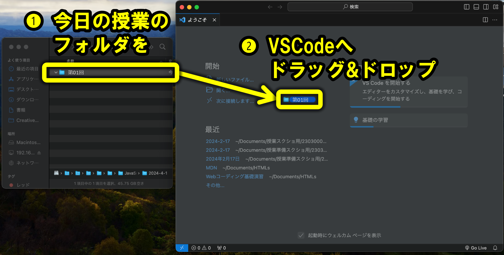
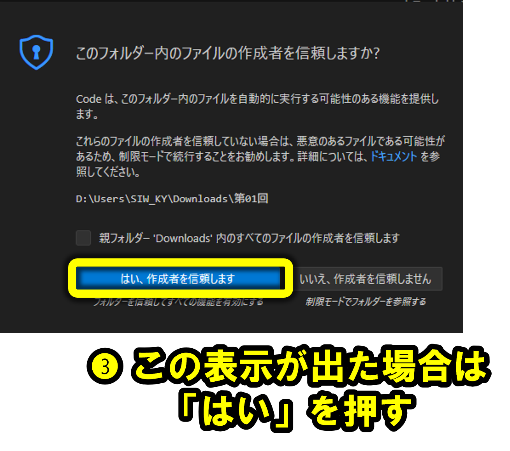

### 繝輔ぃ繧､繝ｫ蜷阪・讒区・

![繝輔ぃ繧､繝ｫ蜷阪・讒区・縺ｮ萓犠(./img/filename-composition.png)
萓具ｼ啻index.html`縲～main.js`縲～report.pdf`

#### 諡｡蠑ｵ蟄舌・萓・

繝峨ャ繝井ｻ･髯阪・驛ｨ蛻・ｒ縲梧僑蠑ｵ蟄舌€阪→縺・＞縺ｾ縺吶€ゅヵ繧｡繧､繝ｫ縺ｮ遞ｮ鬘槭ｒ陦ｨ縺励∪縺吶€・

| 諡｡蠑ｵ蟄・| 遞ｮ鬘・|
| :-: | :-: |
| .docx | (譛€霑代・)Microsoft Office Word譁・嶌 |
| .pdf | PDF譁・嶌 |
| **.html** | **HTML繝輔ぃ繧､繝ｫ** |
| **.js** | **JavaScript 繝輔ぃ繧､繝ｫ** |

### HTML繝輔ぃ繧､繝ｫ繧剃ｽ懈・

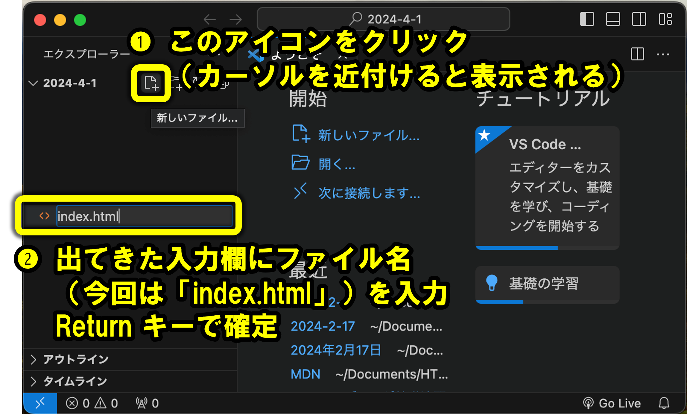
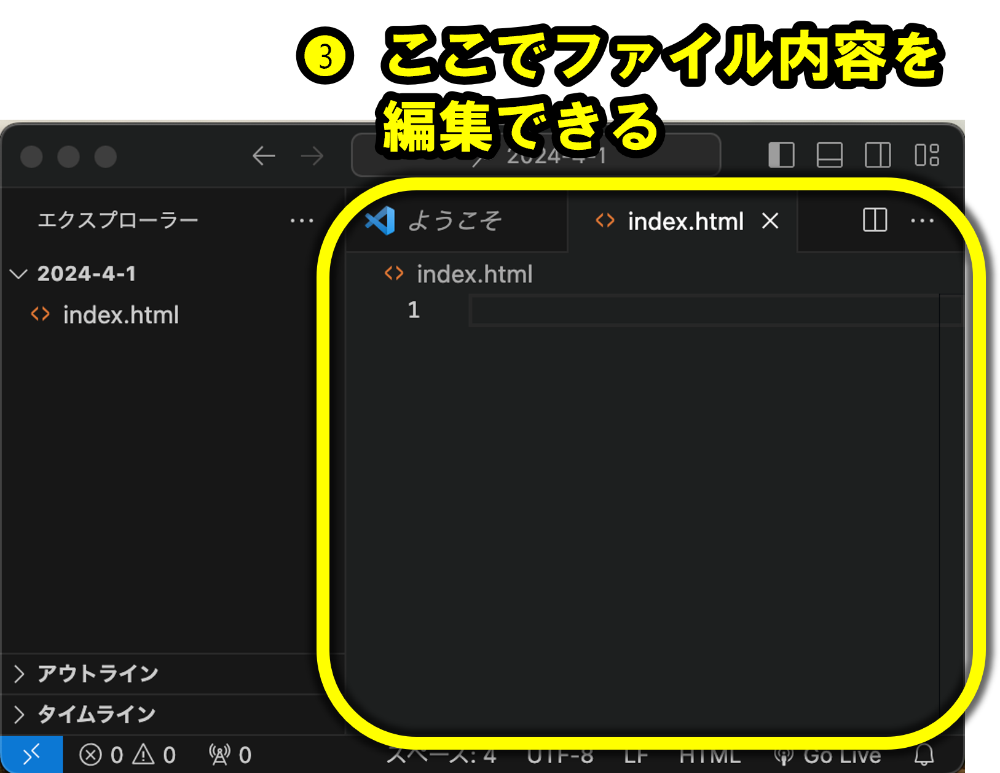

#### HTML繝輔ぃ繧､繝ｫ繧定ｨ倩ｿｰ

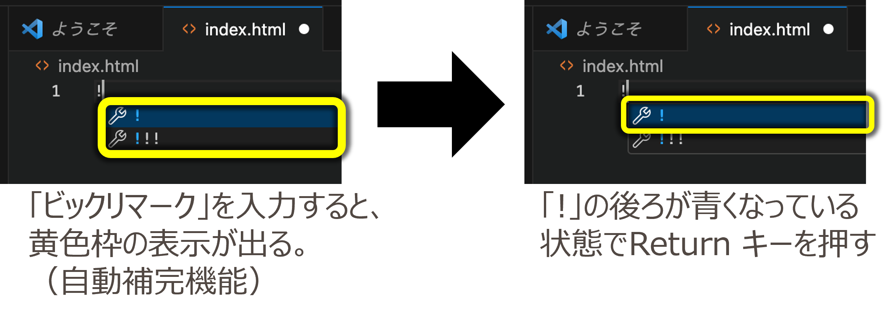

縺吶ｋ縺ｨ縲∵ｬ｡縺ｮ蜀・ｮｹ縺瑚・蜍募・蜉帙＆繧後ｋ・・

<CodePreview>
```html
<!DOCTYPE html>
<html lang="ja">
<head>
    <meta charset="UTF-8">
    <meta name="viewport" content="width=device-width, initial-scale=1.0">
    <title>Document</title>
</head>
<body>

</body>
</html>
````

</CodePreview>

## HTML縺ｮ讎ら払

HTML縺ｯWeb繝壹・繧ｸ繧剃ｽ懊ｋ縺溘ａ縺ｮ險€隱槭〒縺吶€・

### 繧ｿ繧ｰ縺ｨ縺ｯ・・

繧ｿ繧ｰ縺ｨ縺ｯ `<` 縺ｨ `>` 縺ｧ蝗ｲ縺ｾ繧後◆驛ｨ蛻・ｼ・<!DOCTYPE html>` 縺ｯ髯､縺擾ｼ峨・縺薙→縲・
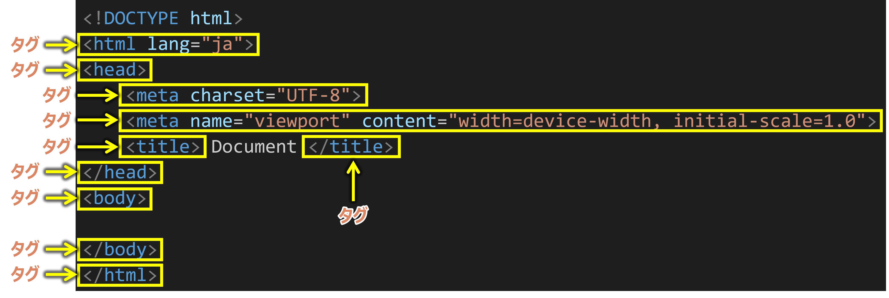

### 髢句ｧ九ち繧ｰ繝ｻ邨ゆｺ・ち繧ｰ縺ｨ縺ｯ・・

- 髢句ｧ九ち繧ｰ・・`<窶ｦ>` 縺ｮ蠖｢・亥・鬆ｭ縺ｫ繧ｹ繝ｩ繝・す繝･縺後↑縺・ｼ・
- 邨ゆｺ・ち繧ｰ・・`</窶ｦ>` 縺ｮ蠖｢・亥・鬆ｭ縺ｫ繧ｹ繝ｩ繝・す繝･縺後≠繧具ｼ・
  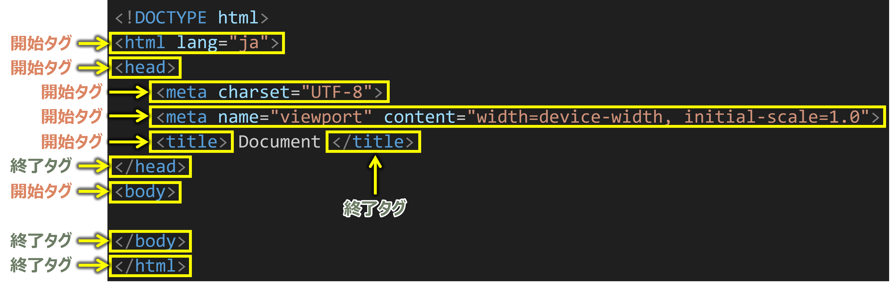

### 繧ｿ繧ｰ蜷阪→縺ｯ・・

`<縲・€・...>` 縺ｾ縺溘・ `</縲・€・` 縺ｮ 縲・€・縺ｮ驛ｨ蛻・
萓具ｼ啻html`,`head`,`meta`,`title`,`body`


## JavaScript 繧呈嶌縺・

1. head隕∫ｴ縺ｮ荳ｭ縺ｫscript隕∫ｴ繧呈嶌縺上€・
   ![head隕∫ｴ縺ｮ荳ｭ縺ｫscript隕∫ｴ繧呈嶌縺従(./img/write-script-in-html-head.png)

2. script隕∫ｴ縺ｮ荳ｭ縺ｫ JavaScript 縺ｮ繧ｳ繝ｼ繝峨ｒ譖ｸ縺上€・
   ![head隕∫ｴ縺ｮ荳ｭ縺ｫscript隕∫ｴ繧呈嶌縺従(./img/write-js-in-script.png)

邨先棡縺薙≧縺ｪ縺｣縺ｦ縺・ｌ縺ｰOK・・

<CodePreview>
```html
<!DOCTYPE html>
<html lang="ja">
<head>
    <meta charset="UTF-8">
    <meta name="viewport" content="width=device-width, initial-scale=1.0">
    <title>Document</title>
    <script>
        console.log("縺薙ｓ縺ｫ縺｡縺ｯ");
    </script>
</head>
<body></body>
</html>
```
</CodePreview>

## 繧､繝ｳ繝・Φ繝・

繧ｳ繝ｼ繝峨・蟾ｦ縺ｮ譁ｹ縺ｫ譖ｸ縺・◆菴咏區縺ｮ縺薙→繧偵€・繧､繝ｳ繝・Φ繝・縲阪→縺・≧縲・
![繧､繝ｳ繝・Φ繝・(./img/html-indent.png)

谺｡縺ｮ繧ｭ繝ｼ縺ｧ繧､繝ｳ繝・Φ繝医・霑ｽ蜉/蜑企勁縺後〒縺阪ｋ

|   繧ｭ繝ｼ    |         蜍穂ｽ・         |                      隕壹∴譁ｹ                       |
| :---------: | :---------------------: | :-------------------------------------------------: |
|     Tab     | 繧､繝ｳ繝・Φ繝医・霑ｽ蜉 |                       縺ｪ縺・                       |
| Shift + Tab | 繧､繝ｳ繝・Φ繝医・蜑企勁 | Tab縺ｮ騾・ｼ・hift 縺碁€・ｒ陦ｨ縺吶％縺ｨ縺悟､壹＞・・ |

![繧､繝ｳ繝・Φ繝医・蜈･蜉帶婿豕評(./img/indent-key-input.png)

## 菫晏ｭ倥☆繧・

繧ｿ繝悶・繝輔ぃ繧､繝ｫ蜷阪・讓ｪ縺ｫ鮟剃ｸｸ・遺酪・峨′縺､縺・※縺・ｋ縺ｨ縺阪・縲・\_菫晏ｭ倥＆繧後※縺・↑縺・憾諷祇

谺｡縺ｮ繧ｭ繝ｼ縺ｧ菫晏ｭ倥〒縺阪ｋ縲・

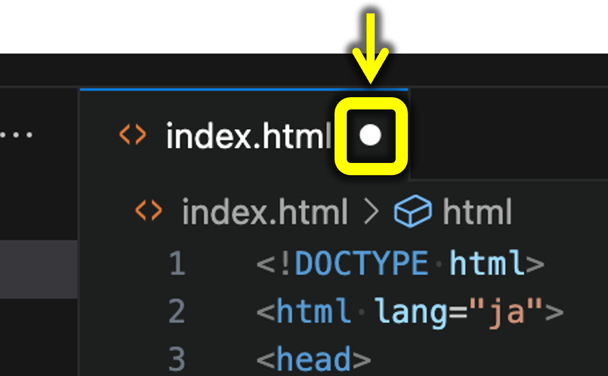

| 繧ｭ繝ｼ  | 蜍穂ｽ・ |             隕壹∴譁ｹ             |
| :-----: | :-----: | :------------------------------: |
| Cmd + S | 菫晏ｭ・ | S 縺ｯ Save(菫晏ｭ・ 縺ｮ鬆ｭ譁・ｭ・ |

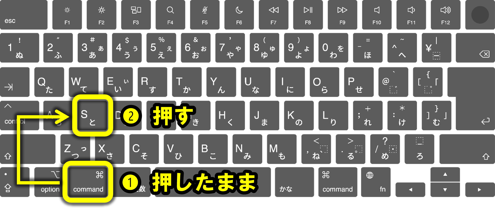

## 蜍穂ｽ懃｢ｺ隱・

1. Opt + B 繧呈款縺・
2. 襍ｷ蜍輔＠縺・Chrome 荳翫〒 [蜿ｳ繧ｯ繝ｪ繝・け] 竊・[讀懆ｨｼ] 繧呈款縺・

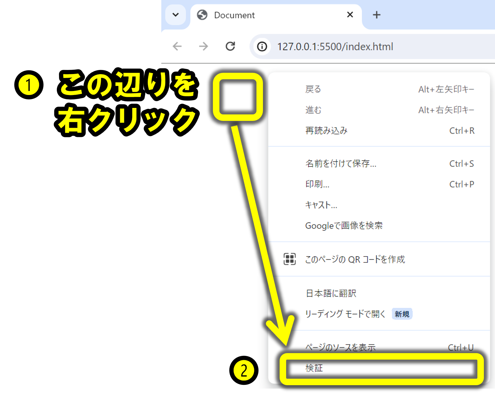

1. [繧ｳ繝ｳ繧ｽ繝ｼ繝ｫ] 繧ｿ繝悶ｒ髢九￥
   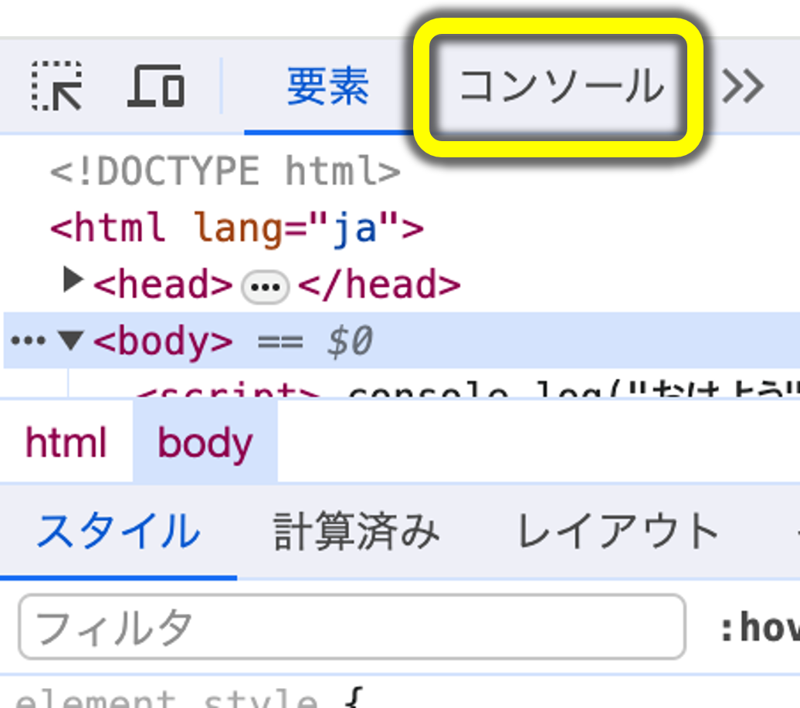

2. 縲後％繧薙↓縺｡縺ｯ縲阪′陦ｨ遉ｺ縺輔ｌ縺ｦ縺・ｋ縺ｮ縺檎｢ｺ隱阪〒縺阪ｋ・域遠縺｡髢馴＆縺・′縺ゅｋ蝣ｴ蜷医・縺薙％縺ｧ繧ｨ繝ｩ繝ｼ繧堤｢ｺ隱阪〒縺阪ｋ・・

### 謌仙粥萓・

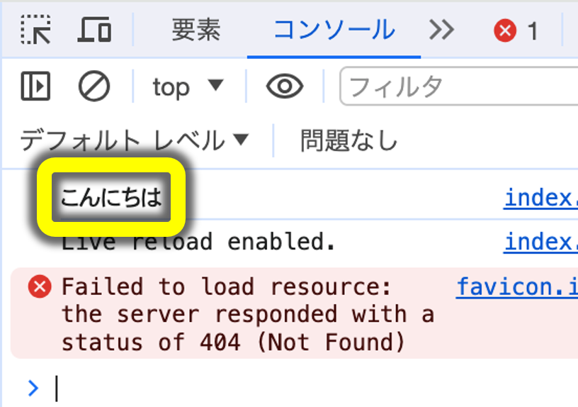

### 螟ｱ謨嶺ｾ・

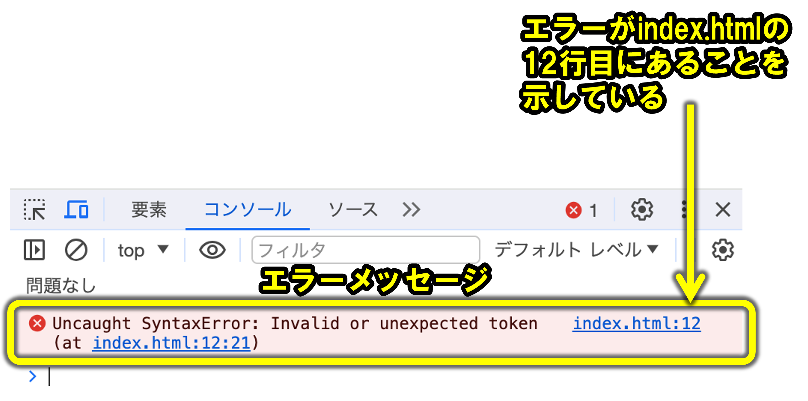

## 螳溯｡碁・ｺ・

繝励Ο繧ｰ繝ｩ繝縺ｯ縲∽ｸ翫°繧蛾・分縺ｫ螳溯｡後＆繧後∪縺吶€・

<CodePreview>
  ```javascript console.log("縺ゅ≠縺・); console.log("縺・＞縺・);
  console.log("縺・≧縺・); ```
</CodePreview>

荳願ｨ倥・繝励Ο繧ｰ繝ｩ繝繧貞ｮ溯｡後☆繧九→縲∵ｬ｡縺ｮ繧医≧縺ｪ鬆・ｺ上〒陦ｨ遉ｺ縺輔ｌ縺ｾ縺吶€・

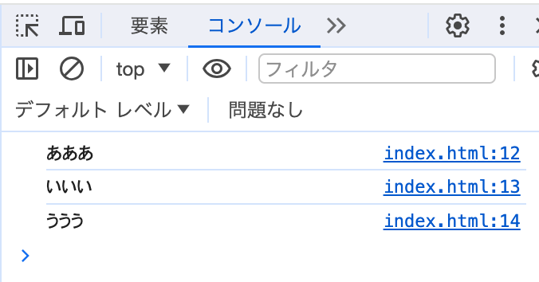

## 譁・ｭ怜・

譁・ｭ怜・縺ｮ陦ｨ迴ｾ譁ｹ豕包ｼ・_譁・ｭ怜・繝ｪ繝・Λ繝ｫ_ ・・

繝€繝悶Ν繧ｯ繧ｩ繝ｼ繝茨ｼ・・峨〒蝗ｲ繧€蝣ｴ蜷茨ｼ・
`"縺薙ｓ縺ｫ縺｡縺ｯ"`

繧ｷ繝ｳ繧ｰ繝ｫ繧ｯ繧ｩ繝ｼ繝茨ｼ・・峨〒蝗ｲ繧€蝣ｴ蜷茨ｼ・
`'縺薙ｓ縺ｫ縺｡縺ｯ'`

縺ｩ縺｡繧峨・譖ｸ縺肴婿縺ｧ繧ゅ€∝虚菴懃ｵ先棡縺ｯ螟峨ｏ繧峨↑縺・€・

---

<Exercise title="貍皮ｿ・">

縲後♀縺ｯ繧医≧縲阪€後％繧薙↓縺｡縺ｯ縲阪€後＆繧医≧縺ｪ繧峨€阪・3縺､繧貞・蜉帙○繧医€・
![繧ｳ繝ｳ繧ｽ繝ｼ繝ｫ縺ｮ逕ｻ蜒従(./img/exercise-1.png)

<Solution>

<CodePreview>
```html
<!DOCTYPE html>
<html lang="ja">

<head>
    <meta charset="UTF-8">
    <meta name="viewport" content="width=device-width, initial-scale=1.0">
    <title>Document</title>
    <script>
        console.log("縺翫・繧医≧");
        console.log("縺薙ｓ縺ｫ縺｡縺ｯ");
        console.log("縺輔ｈ縺・↑繧・);
    </script>
</head>

<body></body>

</html>
```
</CodePreview>

</Solution>

</Exercise>

<Exercise title="貍皮ｿ・-逋ｺ螻・>

縲後ム繝悶Ν繧ｯ繧ｩ繝ｼ繝・窶・縲阪€後す繝ｳ繧ｰ繝ｫ繧ｯ繧ｩ繝ｼ繝・窶・縲阪・2縺､繧呈ｬ｡縺ｮ逕ｻ髱｢縺ｮ繧医≧縺ｫ蜃ｺ蜉帙○繧医€・
![繧ｳ繝ｳ繧ｽ繝ｼ繝ｫ縺ｮ逕ｻ蜒従(./img/exercise-1-advanced.png)

<Solution>

<CodePreview>
```html
<!DOCTYPE html>
<html lang="ja">

<head>
    <meta charset="UTF-8">
    <meta name="viewport" content="width=device-width, initial-scale=1.0">
    <title>Document</title>
    <script>
        console.log('"'); // 繝€繝悶Ν繧ｯ繧ｩ繝ｼ繝医ｒ繧ｷ繝ｳ繧ｰ繝ｫ繧ｯ繧ｩ繝ｼ繝医〒謖溘ａ縺ｰ蜃ｺ蜉帙〒縺阪ｋ
        console.log("'"); // 繧ｷ繝ｳ繧ｰ繝ｫ繧ｯ繧ｩ繝ｼ繝医ｒ繝€繝悶Ν繧ｯ繧ｩ繝ｼ繝医〒謖溘ａ縺ｰ蜃ｺ蜉帙〒縺阪ｋ
    </script>
</head>

<body></body>

</html>
```
</CodePreview>

</Solution>

</Exercise>
