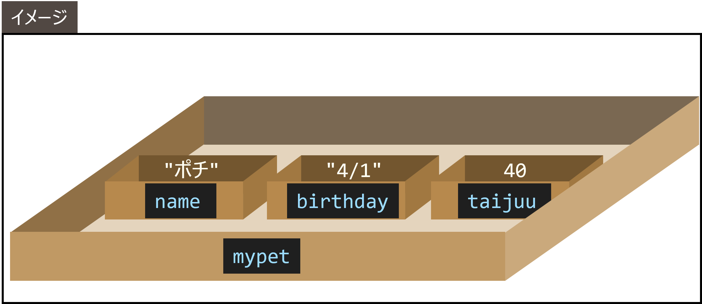
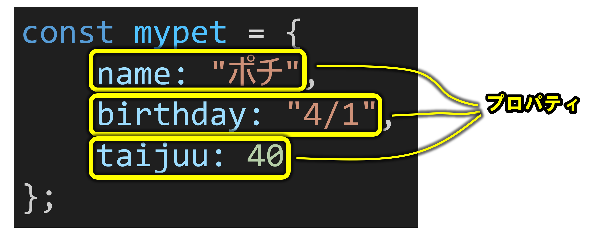

# オブジェクト

## オブジェクトとは？
複数の値をまとめて管理できる値のこと。

| 型 | 意味 |
| :-: | :-: |
| Object | オブジェクト |

オブジェクトの作り方（ _オブジェクトリテラル_ ）

#### 構文
```
{
    キー: 値,
    キー: 値,
    キー: 値
}
```

:::tip
キーと値の区切りには「:」を使い、各ペアの間は「,」で区切ります。
:::

#### 例
<CodePreview>
```javascript
let mypet = {
    name: "ポチ",
    birthday: "2024/4/1",
    taijuu: 40
};
console.log(mypet);
```
</CodePreview>



### オブジェクトの中の値へのアクセス

#### 構文
```
オブジェクト.キー
```

#### 例
<CodePreview>
```javascript
let mypet = {
    name: "ポチ",
    birthday: "4/1",
    taijuu: 40
};
// 変数のように値を読み取ったり
console.log(mypet.name);
// 変数のように値に代入したりできる
mypet.taijuu = 50;
// 代入後はちゃんと中身の taijuu が変化している
console.log(mypet.taijuu);
```
</CodePreview>

* _プロパティ_
  * オブジェクト内の各キーと値の組のこと
  

## オブジェクトのプロパティに設定できる値

:::info
オブジェクトの値には、文字列・数値・オブジェクト・関数など様々な型の値が使えます。
:::

<CodePreview>
```javascript
let example = {
    // 文字列OK
    str: "文字列",
    // 数値OK
    num: 10,
    // オブジェクトOK
    obj: { key: "value" },
    // 関数OK
    fn: function(a, b) {
        return a + b;
    }
};
console.log(example);
console.log(example.fn(1, 2));
```
</CodePreview>

実は関数は Function 型の "値" なので、変数に入れることができる。  
なお、値として関数を書くときは、関数名の部分は省略できる。
:::info
実は関数も「値」（Function 型）なので、変数やオブジェクトのプロパティに入れることができます。
:::

:::tip
なお、値として関数を書く場合は、functionキーワードの後の関数名は省略できます。
:::

## console.log について

console は実はオブジェクト（ブラウザがあらかじめ用意してくれている）  
console オブジェクトの中に log プロパティがあって、その値が関数になっている  
値が関数であるプロパティを、特に _メソッド_ と呼ぶ。

#### イメージ
```javascript
console = {
    ...
    log: function(...) {
        ...
    },
    ...
};
console.log(console);
```

#### 確認方法

<CodePreview>
```javascript
console.log(console);
```
</CodePreview>

---

<Exercise title="演習1">
1. 自分の情報をまとめたオブジェクトを作れ。  
ただし、**文字列型の値**と、**数値型の値**を少なくとも1つずつ含むこと。  
（例えば、名前と、年齢など。値は嘘でも良い）
2. その後、オブジェクトのプロパティの値にアクセスして、出力せよ。（すべてのプロパティの値を出力すること）

<Solution>
この課題では、オブジェクトを自分で作り、プロパティの値を取り出して出力します。

- まず `{ ... }` でオブジェクトを作り、`name` には文字列、`age` には数値を入れます。
- 値を取り出すときはドット記法（`オブジェクト.キー`）を使います。`me.name` は文字列、「山田太郎」が返り、`me.age` は数値、`20` が返ります。
- 取り出した値を `console.log` でそのまま出力します。

<CodePreview>
```javascript
let me = {
    name: "山田太郎",
    age: 20
};
console.log(me.name);
console.log(me.age);
```
</CodePreview>
</Solution>
</Exercise>

---

<Exercise title="演習1-発展1">

次のexampleオブジェクトの中の奥深くにあるstrプロパティの値にアクセスするプログラムを☆☆☆の部分に書いて、「文字列」と出力せよ。

```js
let example = {
    obj: {
        str: "文字列"
    },
    num: 2
};
// 出力
console.log(☆☆☆);
```

<Solution>
ポイントは「入れ子になったオブジェクトから、ドットを使って深く辿る」ことです。

1. いちばん外側は `example`。
2. その中の `obj` に進むので `example.obj`。
3. さらにその中の `str` を読むので `example.obj.str`。

この順番でプロパティをたどると、値「文字列」に到達し、出力できます。

<CodePreview>
```javascript
let example = {
    obj: {
        str: "文字列"
    },
    num: 2
};
console.log(example.obj.str);
```
</CodePreview>
</Solution>

</Exercise>

---

<Exercise title="演習1-発展2">
1. 次のdogオブジェクトのメソッドgreetを呼び出せ。（「ポチです。」と出力される）
2. その後、メソッドbarkを実引数に3を渡して呼び出せ。（「ワンワンワン」と出力される）

```js
let dog = {
    name: "ポチ",
    greet: function() {
        console.log(`${dog.name}です。`);
    },
    bark: function(numberOfBarks) {
        let barkText = "";
        for (let n = 1; n <= numberOfBarks; n++) {
            barkText += "ワン";
        }
        console.log(barkText);
    }
};
```

<Solution>
この課題では、オブジェクトの「メソッド」を呼び出します（プロパティの値が関数のもの）。

- `greet` は引数なしの関数で、`dog.name` を使って挨拶文を出力します。
- `bark(numberOfBarks)` は、渡した回数だけ「ワン」をつなげて出力します。`for` 文で 1 から指定回数までループし、そのたびに文字列を足し込んでいます。
- メソッドの呼び出しも通常のプロパティアクセスと同様にドット記法で行います（例: `dog.greet()`、`dog.bark(3)`）。

<CodePreview>
```javascript
let dog = {
    name: "ポチ",
    greet: function() {
        console.log(dog.name + "です。");
    },
    bark: function(numberOfBarks) {
        let barkText = "";
        for (let n = 1; n <= numberOfBarks; n++) {
            barkText += "ワン";
        }
        console.log(barkText);
    }
};
dog.greet();
dog.bark(3);
```
</CodePreview>
</Solution>
</Exercise>

