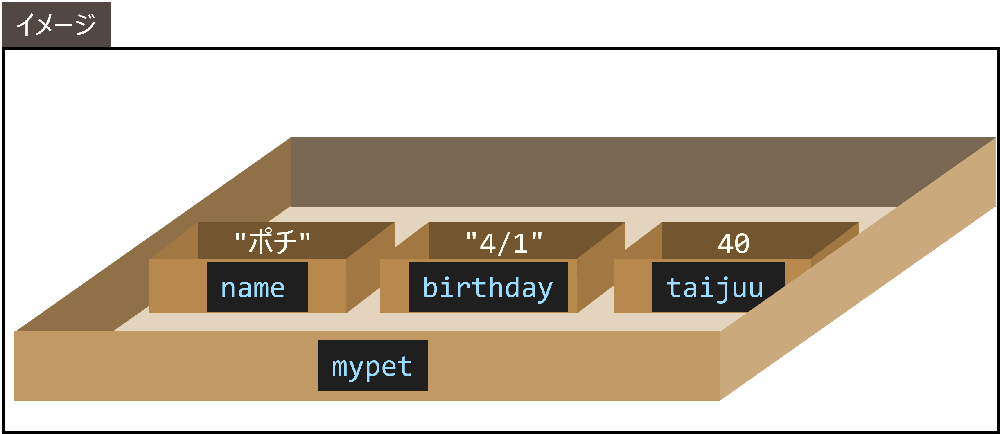
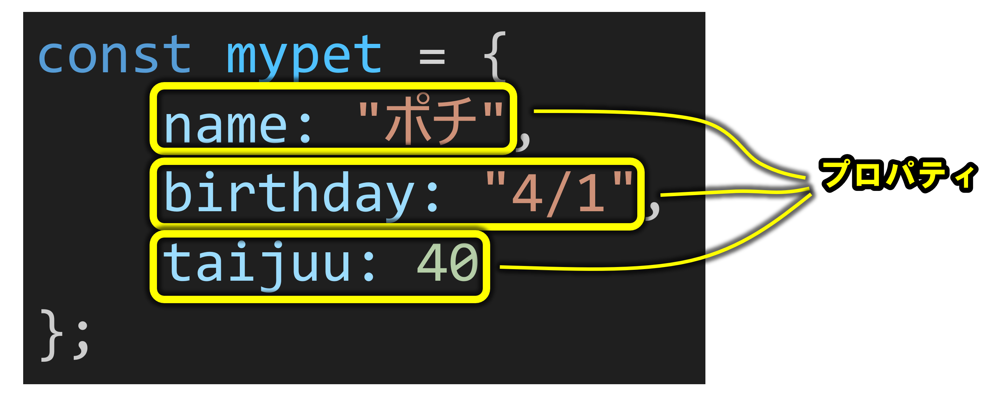

---
title: 繧ｪ繝悶ず繧ｧ繧ｯ繝亥・髢€
---

# 繧ｪ繝悶ず繧ｧ繧ｯ繝・

## 繧ｪ繝悶ず繧ｧ繧ｯ繝医→縺ｯ・・

隍・焚縺ｮ蛟､繧偵∪縺ｨ繧√※邂｡逅・〒縺阪ｋ蛟､縺ｮ縺薙→縲・

|  蝙・  |       諢丞袖        |
| :----: | :-----------------: |
| Object | 繧ｪ繝悶ず繧ｧ繧ｯ繝・ |

繧ｪ繝悶ず繧ｧ繧ｯ繝医・菴懊ｊ譁ｹ・・_繧ｪ繝悶ず繧ｧ繧ｯ繝医Μ繝・Λ繝ｫ_ ・・

#### 讒区枚

```
{
    繧ｭ繝ｼ: 蛟､,
    繧ｭ繝ｼ: 蛟､,
    繧ｭ繝ｼ: 蛟､
}
```

:::tip
繧ｭ繝ｼ縺ｨ蛟､縺ｮ蛹ｺ蛻・ｊ縺ｫ縺ｯ縲・縲阪ｒ菴ｿ縺・€∝推繝壹い縺ｮ髢薙・縲・縲阪〒蛹ｺ蛻・ｊ縺ｾ縺吶€・
:::

#### 萓・

<CodePreview>
```javascript
let mypet = {
    name: "繝昴メ",
    birthday: "2024/4/1",
    taijuu: 40
};
console.log(mypet);
```
</CodePreview>



### 繧ｪ繝悶ず繧ｧ繧ｯ繝医・荳ｭ縺ｮ蛟､縺ｸ縺ｮ繧｢繧ｯ繧ｻ繧ｹ

#### 讒区枚

```
繧ｪ繝悶ず繧ｧ繧ｯ繝・繧ｭ繝ｼ
```

#### 萓・

<CodePreview>
```javascript
let mypet = {
    name: "繝昴メ",
    birthday: "4/1",
    taijuu: 40
};
// 螟画焚縺ｮ繧医≧縺ｫ蛟､繧定ｪｭ縺ｿ蜿悶▲縺溘ｊ
console.log(mypet.name);
// 螟画焚縺ｮ繧医≧縺ｫ蛟､縺ｫ莉｣蜈･縺励◆繧翫〒縺阪ｋ
mypet.taijuu = 50;
// 莉｣蜈･蠕後・縺｡繧・ｓ縺ｨ荳ｭ霄ｫ縺ｮ taijuu 縺悟､牙喧縺励※縺・ｋ
console.log(mypet.taijuu);
```
</CodePreview>

- _繝励Ο繝代ユ繧｣_
  - 繧ｪ繝悶ず繧ｧ繧ｯ繝亥・縺ｮ蜷・く繝ｼ縺ｨ蛟､縺ｮ邨・・縺薙→
    

## 繧ｪ繝悶ず繧ｧ繧ｯ繝医・繝励Ο繝代ユ繧｣縺ｫ險ｭ螳壹〒縺阪ｋ蛟､

:::info
繧ｪ繝悶ず繧ｧ繧ｯ繝医・蛟､縺ｫ縺ｯ縲∵枚蟄怜・繝ｻ謨ｰ蛟､繝ｻ繧ｪ繝悶ず繧ｧ繧ｯ繝医・髢｢謨ｰ縺ｪ縺ｩ讒倥€・↑蝙九・蛟､縺御ｽｿ縺医∪縺吶€・
:::

<CodePreview>
```javascript
let example = {
    // 譁・ｭ怜・OK
    str: "譁・ｭ怜・",
    // 謨ｰ蛟､OK
    num: 10,
    // 繧ｪ繝悶ず繧ｧ繧ｯ繝・K
    obj: { key: "value" },
    // 髢｢謨ｰOK
    fn: function(a, b) {
        return a + b;
    }
};
console.log(example);
console.log(example.fn(1, 2));
```
</CodePreview>

螳溘・髢｢謨ｰ縺ｯ Function 蝙九・ "蛟､" 縺ｪ縺ｮ縺ｧ縲∝､画焚縺ｫ蜈･繧後ｋ縺薙→縺後〒縺阪ｋ縲・
縺ｪ縺翫€∝€､縺ｨ縺励※髢｢謨ｰ繧呈嶌縺上→縺阪・縲・未謨ｰ蜷阪・驛ｨ蛻・・逵∫払縺ｧ縺阪ｋ縲・
:::info
螳溘・髢｢謨ｰ繧ゅ€悟€､縲搾ｼ・unction 蝙具ｼ峨↑縺ｮ縺ｧ縲∝､画焚繧・が繝悶ず繧ｧ繧ｯ繝医・繝励Ο繝代ユ繧｣縺ｫ蜈･繧後ｋ縺薙→縺後〒縺阪∪縺吶€・
:::

:::tip
縺ｪ縺翫€∝€､縺ｨ縺励※髢｢謨ｰ繧呈嶌縺丞ｴ蜷医・縲’unction繧ｭ繝ｼ繝ｯ繝ｼ繝峨・蠕後・髢｢謨ｰ蜷阪・逵∫払縺ｧ縺阪∪縺吶€・
:::

## console.log 縺ｫ縺､縺・※

console 縺ｯ螳溘・繧ｪ繝悶ず繧ｧ繧ｯ繝茨ｼ医ヶ繝ｩ繧ｦ繧ｶ縺後≠繧峨°縺倥ａ逕ｨ諢上＠縺ｦ縺上ｌ縺ｦ縺・ｋ・・
console 繧ｪ繝悶ず繧ｧ繧ｯ繝医・荳ｭ縺ｫ log 繝励Ο繝代ユ繧｣縺後≠縺｣縺ｦ縲√◎縺ｮ蛟､縺碁未謨ｰ縺ｫ縺ｪ縺｣縺ｦ縺・ｋ  
蛟､縺碁未謨ｰ縺ｧ縺ゅｋ繝励Ο繝代ユ繧｣繧偵€∫音縺ｫ _繝｡繧ｽ繝・ラ_ 縺ｨ蜻ｼ縺ｶ縲・

#### 繧､繝｡繝ｼ繧ｸ

```javascript
console = {
    ...
    log: function(...) {
        ...
    },
    ...
};
console.log(console);
```

#### 遒ｺ隱肴婿豕・

<CodePreview>```javascript console.log(console);```</CodePreview>

---

<Exercise title="貍皮ｿ・">
1. 閾ｪ蛻・・諠・ｱ繧偵∪縺ｨ繧√◆繧ｪ繝悶ず繧ｧ繧ｯ繝医ｒ菴懊ｌ縲・
縺溘□縺励€・*譁・ｭ怜・蝙九・蛟､**縺ｨ縲・*謨ｰ蛟､蝙九・蛟､**繧貞ｰ代↑縺上→繧・縺､縺壹▽蜷ｫ繧€縺薙→縲・
・井ｾ九∴縺ｰ縲∝錐蜑阪→縲∝ｹｴ鮨｢縺ｪ縺ｩ縲ょ€､縺ｯ蝌倥〒繧り憶縺・ｼ・
2. 縺昴・蠕後€√が繝悶ず繧ｧ繧ｯ繝医・繝励Ο繝代ユ繧｣縺ｮ蛟､縺ｫ繧｢繧ｯ繧ｻ繧ｹ縺励※縲∝・蜉帙○繧医€ゑｼ医☆縺ｹ縺ｦ縺ｮ繝励Ο繝代ユ繧｣縺ｮ蛟､繧貞・蜉帙☆繧九％縺ｨ・・

<Solution>
縺薙・隱ｲ鬘後〒縺ｯ縲√が繝悶ず繧ｧ繧ｯ繝医ｒ閾ｪ蛻・〒菴懊ｊ縲√・繝ｭ繝代ユ繧｣縺ｮ蛟､繧貞叙繧雁・縺励※蜃ｺ蜉帙＠縺ｾ縺吶€・

- 縺ｾ縺・`{ ... }` 縺ｧ繧ｪ繝悶ず繧ｧ繧ｯ繝医ｒ菴懊ｊ縲～name`縺ｫ縺ｯ譁・ｭ怜・縲～age` 縺ｫ縺ｯ謨ｰ蛟､繧貞・繧後∪縺吶€・
- 蛟､繧貞叙繧雁・縺吶→縺阪・繝峨ャ繝郁ｨ俶ｳ包ｼ・繧ｪ繝悶ず繧ｧ繧ｯ繝・繧ｭ繝ｼ`・峨ｒ菴ｿ縺・∪縺吶€Ａme.name` 縺ｯ譁・ｭ怜・縲√€悟ｱｱ逕ｰ螟ｪ驛弱€阪′霑斐ｊ縲～me.age`縺ｯ謨ｰ蛟､縲～20` 縺瑚ｿ斐ｊ縺ｾ縺吶€・
- 蜿悶ｊ蜃ｺ縺励◆蛟､繧・`console.log` 縺ｧ縺昴・縺ｾ縺ｾ蜃ｺ蜉帙＠縺ｾ縺吶€・

<CodePreview>
```javascript
let me = {
    name: "螻ｱ逕ｰ螟ｪ驛・,
    age: 20
};
console.log(me.name);
console.log(me.age);
```
</CodePreview>
</Solution>
</Exercise>

---

<Exercise title="貍皮ｿ・-逋ｺ螻・">

谺｡縺ｮexample繧ｪ繝悶ず繧ｧ繧ｯ繝医・荳ｭ縺ｮ螂･豺ｱ縺上↓縺ゅｋstr繝励Ο繝代ユ繧｣縺ｮ蛟､縺ｫ繧｢繧ｯ繧ｻ繧ｹ縺吶ｋ繝励Ο繧ｰ繝ｩ繝繧停・笘・・縺ｮ驛ｨ蛻・↓譖ｸ縺・※縲√€梧枚蟄怜・縲阪→蜃ｺ蜉帙○繧医€・

```js
let example = {
    obj: {
        str: "譁・ｭ怜・"
    },
    num: 2
};
// 蜃ｺ蜉・
console.log(笘・・笘・;
```

<Solution>
繝昴う繝ｳ繝医・縲悟・繧悟ｭ舌↓縺ｪ縺｣縺溘が繝悶ず繧ｧ繧ｯ繝医°繧峨€√ラ繝・ヨ繧剃ｽｿ縺｣縺ｦ豺ｱ縺剰ｾｿ繧九€阪％縺ｨ縺ｧ縺吶€・

1. 縺・■縺ｰ繧灘､門・縺ｯ `example`縲・
2. 縺昴・荳ｭ縺ｮ `obj` 縺ｫ騾ｲ繧€縺ｮ縺ｧ `example.obj`縲・
3. 縺輔ｉ縺ｫ縺昴・荳ｭ縺ｮ `str` 繧定ｪｭ繧€縺ｮ縺ｧ `example.obj.str`縲・

縺薙・鬆・分縺ｧ繝励Ο繝代ユ繧｣繧偵◆縺ｩ繧九→縲∝€､縲梧枚蟄怜・縲阪↓蛻ｰ驕斐＠縲∝・蜉帙〒縺阪∪縺吶€・

<CodePreview>
```javascript
let example = {
    obj: {
        str: "譁・ｭ怜・"
    },
    num: 2
};
console.log(example.obj.str);
```
</CodePreview>
</Solution>

</Exercise>

---

<Exercise title="貍皮ｿ・-逋ｺ螻・">
1. 谺｡縺ｮdog繧ｪ繝悶ず繧ｧ繧ｯ繝医・繝｡繧ｽ繝・ラgreet繧貞他縺ｳ蜃ｺ縺帙€ゑｼ医€後・繝√〒縺吶€ゅ€阪→蜃ｺ蜉帙＆繧後ｋ・・
2. 縺昴・蠕後€√Γ繧ｽ繝・ラbark繧貞ｮ溷ｼ墓焚縺ｫ3繧呈ｸ｡縺励※蜻ｼ縺ｳ蜃ｺ縺帙€ゑｼ医€後Ρ繝ｳ繝ｯ繝ｳ繝ｯ繝ｳ縲阪→蜃ｺ蜉帙＆繧後ｋ・・

```js
let dog = {
    name: "繝昴メ",
    greet: function() {
        console.log(`${dog.name}縺ｧ縺吶€Ａ);
    },
    bark: function(numberOfBarks) {
        let barkText = "";
        for (let n = 1; n <= numberOfBarks; n++) {
            barkText += "繝ｯ繝ｳ";
        }
        console.log(barkText);
    }
};
```

<Solution>
縺薙・隱ｲ鬘後〒縺ｯ縲√が繝悶ず繧ｧ繧ｯ繝医・縲後Γ繧ｽ繝・ラ縲阪ｒ蜻ｼ縺ｳ蜃ｺ縺励∪縺呻ｼ医・繝ｭ繝代ユ繧｣縺ｮ蛟､縺碁未謨ｰ縺ｮ繧ゅ・・峨€・

- `greet` 縺ｯ蠑墓焚縺ｪ縺励・髢｢謨ｰ縺ｧ縲～dog.name` 繧剃ｽｿ縺｣縺ｦ謖ｨ諡ｶ譁・ｒ蜃ｺ蜉帙＠縺ｾ縺吶€・
- `bark(numberOfBarks)` 縺ｯ縲∵ｸ｡縺励◆蝗樊焚縺縺代€後Ρ繝ｳ縲阪ｒ縺､縺ｪ縺偵※蜃ｺ蜉帙＠縺ｾ縺吶€Ａfor` 譁・〒 1 縺九ｉ謖・ｮ壼屓謨ｰ縺ｾ縺ｧ繝ｫ繝ｼ繝励＠縲√◎縺ｮ縺溘・縺ｫ譁・ｭ怜・繧定ｶｳ縺苓ｾｼ繧薙〒縺・∪縺吶€・
- 繝｡繧ｽ繝・ラ縺ｮ蜻ｼ縺ｳ蜃ｺ縺励ｂ騾壼ｸｸ縺ｮ繝励Ο繝代ユ繧｣繧｢繧ｯ繧ｻ繧ｹ縺ｨ蜷梧ｧ倥↓繝峨ャ繝郁ｨ俶ｳ輔〒陦後＞縺ｾ縺呻ｼ井ｾ・ `dog.greet()`縲～dog.bark(3)`・峨€・

<CodePreview>
```javascript
let dog = {
    name: "繝昴メ",
    greet: function() {
        console.log(dog.name + "縺ｧ縺吶€・);
    },
    bark: function(numberOfBarks) {
        let barkText = "";
        for (let n = 1; n <= numberOfBarks; n++) {
            barkText += "繝ｯ繝ｳ";
        }
        console.log(barkText);
    }
};
dog.greet();
dog.bark(3);
```
</CodePreview>
</Solution>
</Exercise>
