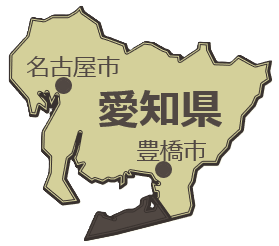
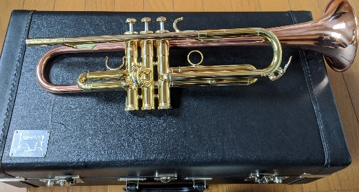
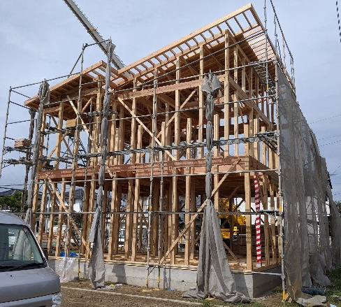

## 自己紹介 😊

はじめまして！担当の山本航大（やまもと こうだい）です。まずは気軽にプロフィールを紹介します。

### プロフィール
- 名前：山本 航大（やまもと こうだい）
- 年齢：28歳
- 出身：愛知県田原市
  
- 大学：愛媛大学理学部数学科

### 部活・趣味
- 小・中・高：吹奏楽部　　大学：交響楽団(オーケストラ)　トランペット🎺
  > *トランペットの写真です！*
  > 

- 趣味：
  - ゲーム（最近はVRChat！）
    - 好きなゲーム：ゼルダ、FF、DQ、マリオ、マイクラ、ピクミンなど
  - プログラミング（C++, C#, Java, HTML/CSS/JavaScript, Perl...）

### 経歴
- 2017年：個別指導塾講師（数学）
- 2019年：大工
- 2020年：システムエンジニア
- 2022年：塾で映像授業の教材制作（数学）
  - <u>応用情報技術者試験 合格</u>
- 2023年：**さいたまIT・WEB専門学校 職員（週1日）**
- 2024年：
  - **ソフトウェア開発エンジニア（Unreal Engine）（週4日）**
  - <u>ハッカソン出場（東京AI技術大合戦） メイン部門1位＆NovelAI賞1位 受賞</u>

> *大工時代の写真もどうぞ！*
> 

### 好きな食べ物🍜
- うどん、そば、ラーメン、スパゲティ
- 辛いもの

## 受講に際して 📝

:::tip
この授業は「プログラミングって何？」というところから、みんなで一緒に学んでいきます！
「難しそう…」と思うかもしれませんが、分からないことは何でも質問してください。
:::

### シラバス・到達目標
- 授業で私が提供できるもの
- 科目の到達点（＝到達目標）
  - 将来プログラミングを行う職業に就くのであれば、プログラムの一行一行の意味を全て理解して入力していることが必要です。
    - この科目ではこの能力を身に着けることを目標とします。
    - これは、全てを “覚える” ことまでは要求していません。
      - 忘れた時に調べて、理解して使うことが出来れば十分です。
      - ただ、「どんなものでも調べて、理解して使える状態」になるには、プログラミングの基本的な考え方や仕組みだけは知っておく必要があります。これを知らないと、調べて出てきたものを、作ろうとしているものに合う形に作り替えることができないから、です。

### 自主勉強のコツ
:::info
プログラミングは「慣れ」が大事！
:::
- 授業中に終わらなかった演習問題や、発展問題をやってみる
- 自分で問題を考えてプログラムを書いてみる
- 自分で作りたいものを作る挑戦をしてみる

### 授業中の演習・小テストについて

:::caution
授業中に行う演習・小テストは、1つでも取り組んでいない場合「欠席」となります。
:::

※発展問題は除く

:::note
小テストは授業の最初に毎回行います。
:::

成績には入りませんが、皆さん自身の振り返りに活用してください！  
※講義のない日は除く（中間テスト、期末テストなど）

## 成績について

- **中間試験は 20点満点、期末試験は 80点満点です。**
- 出席に問題がなければ、<u>**中間試験の点数と、期末試験の点数の合計が評点**</u> です。
  - 試験は、授業スライドの確認可、過去に作ったプログラムのコピペ可、検索可、生成AI(ChatGPTなど)の使用可 の予定
- _詳細は、学生便覧_
- この JavaScript の授業は、_毎回新しい内容を積み重ねて勉強していく_ ので、1回でも休むとついていけなくなる可能性が高いです。まずは毎週出席しましょう。

:::caution
5回以上休むと、E判定（不可）確定です。毎週出席しましょう！
:::
