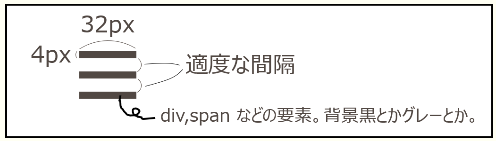
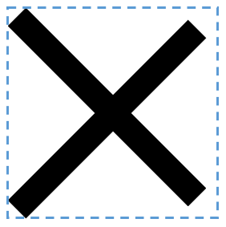
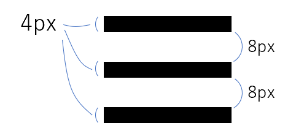
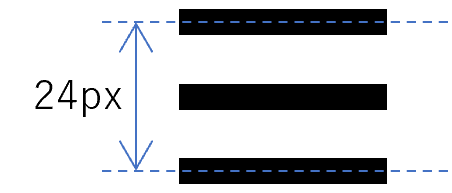
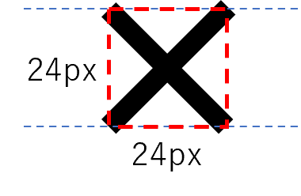
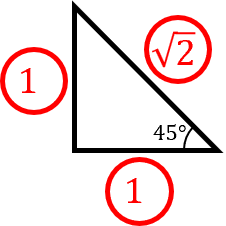
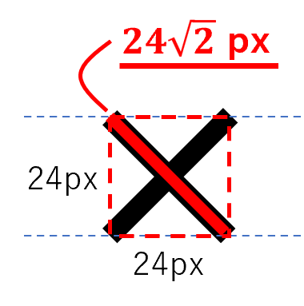

## ドロワーメニューとは

ドロワーメニューは、画面の端から引き出すように表示されるメニューです。スマートフォンサイトでよく使われる UI パターンで、ハンバーガーアイコンと組み合わせて実装されることが多いです。

このページでは、ドロワーメニューの作り方を順を追って学んでいきます。

<Exercise title="演習1（ヘッダーとハンバーガーアイコンの作成）">

まずは、ヘッダーとハンバーガーアイコンの見た目を作りましょう。以下のプレビューと同じ見た目になるように、HTML と CSS を書いてください。

但し、ハンバーガーアイコンの部分は、次の図のように、3つの要素を使って作成してください。  


<CodePreview
  sourceId="演習1"
  htmlVisible={false}
  cssVisible={false}
  jsVisible={false}
  previewVisible={true}
>
```html
<header>
  <button class="ham-btn">
    <span class="ham-icon">
      <span class="line top"></span>
      <span class="line middle"></span>
      <span class="line bottom"></span>
    </span>
  </button>
</header>
```

```css
body {
    margin: 0; /* ページの端の余白をなくす */
}

header {
  border-bottom: solid black 1px; /* ヘッダーの下の線 */
}

/* ハンバーガーのボタンとアイコンの調整 */
.ham-btn {
  display: block; /* block にしないと変な意図しない余白が勝手に入るので */
  padding: 20px;

  border: none; /* 枠線を消す */
  background: transparent; /* 背景を消す */
  cursor: pointer; /* カーソルは手のマーク */
}

.ham-icon {
  display: flex; /* gap を使いたいだけ */
  flex-direction: column; /* 縦並び */
  gap: 8px; /* 間隔 8px */
}

.ham-icon .line {
  width: 32px;
  height: 4px;

  display: block; /* span はデフォルトで display: inline なので、width, height を効かせるために block にする */
  background-color: black;
}
```
</CodePreview>

<Solution>
<CodePreview sourceId="演習1"/>
</Solution>
</Exercise>

<Exercise title="演習2（メニューコンテンツの作成）">

続いて、ドロワーメニューのメニューコンテンツを作りましょう。以下のプレビューと同じ見た目になるように、HTML と CSS を書いてください。

<CodePreview
  sourceId="演習2"
  htmlVisible={false}
  cssVisible={false}
  jsVisible={false}
  previewVisible={true}
>
```html
<header>
  <button class="ham-btn">
    <span class="ham-icon">
      <span class="line top"></span>
      <span class="line middle"></span>
      <span class="line bottom"></span>
    </span>
  </button>
</header>
<nav class="drawer">
  <ul>
    <li><a href="#">ホーム</a></li>
    <li><a href="#">サービス</a></li>
    <li><a href="#">会社情報</a></li>
    <li><a href="#">お問い合わせ</a></li>
    <li><a href="#">お問い合わせ2</a></li>
    <li><a href="#">お問い合わせ3</a></li>
    <li><a href="#">お問い合わせ4</a></li>
  </ul>
</nav>
```

```css
body {
    margin: 0;
}

header {
  border-bottom: solid black 1px;
}

/* ハンバーガーのボタンとアイコンの調整 */
.ham-btn {
  display: block;
  padding: 20px;

  border: none;
  background: transparent;
  cursor: pointer;

  position: relative; /* z-index を効かせるためだけに position を relative に */
  z-index: 1; /* ハンバーガーボタンをメニューコンテンツより面に表示するため */
}

.ham-icon {
  display: flex;
  flex-direction: column;
  gap: 8px;
}

.ham-icon .line {
  width: 32px;
  height: 4px;

  display: block;
  background-color: black;
}

/* ドロワーのメニューコンテンツ部分の調整 */
.drawer {
  position: fixed; /* 画面内で、位置固定 */
  top: 0; /* 要素の上端は画面の上端に合わせる */
  bottom: 0; /* 要素の下端は画面の下端に合わせる(top:0, bottom:0 によって高さが画面いっぱいになる) */
  left: 0; /* 画面の左端に配置 */
  background-color: white; /* 背景をつけないと透明になるから */
  box-shadow: 4px 0 6px rgba(0, 0, 0, 0.2); /* 右側に影をつける */

  padding-top: 60px; /* 上に60pxの余白 */
}
```
</CodePreview>

<Solution>
前の演習から増えたり、変わったりしたところだけ、プロパティの後ろにコメントを書いています。
<CodePreview sourceId="演習2"/>
</Solution>
</Exercise>

<Exercise title="演習3（開閉機能の作成）">

ついに、JavaScript で開閉機能を作りましょう。以下のプレビューのように、ハンバーガーアイコンをクリックしたら、メニューが出し入れするように、CSS と JavaScript を書いてください。

（次の演習でアニメーションさせたいので）transform プロパティを使用して、画面左外にメニューを隠すようにしてください。  
また、CSSの変更はクラスのつけ外しで行ってください。

<CodePreview
  sourceId="演習3"
  htmlVisible={false}
  cssVisible={false}
  jsVisible={false}
  previewVisible={true}
>
```html
<header>
  <button class="ham-btn">
    <span class="ham-icon">
      <span class="line top"></span>
      <span class="line middle"></span>
      <span class="line bottom"></span>
    </span>
  </button>
</header>
<nav class="drawer">
  <ul>
    <li><a href="#">ホーム</a></li>
    <li><a href="#">サービス</a></li>
    <li><a href="#">会社情報</a></li>
    <li><a href="#">お問い合わせ</a></li>
    <li><a href="#">お問い合わせ2</a></li>
    <li><a href="#">お問い合わせ3</a></li>
    <li><a href="#">お問い合わせ4</a></li>
  </ul>
</nav>
```

```css
body {
    margin: 0;
}

header {
  border-bottom: solid black 1px;
}

/* ハンバーガーのボタンとアイコンの調整 */
.ham-btn {
  display: block;
  padding: 20px;

  border: none;
  background: transparent;
  cursor: pointer;

  position: relative;
  z-index: 1;
}

.ham-icon {
  display: flex;
  flex-direction: column;
  gap: 8px;
}

.ham-icon .line {
  width: 32px;
  height: 4px;

  display: block;
  background-color: black;
}

/* ドロワーのメニューコンテンツ部分の調整 */
.drawer {
  position: fixed;
  top: 0;
  bottom: 0;
  left: 0;
  background-color: white;
  box-shadow: 4px 0 6px rgba(0, 0, 0, 0.2);

  padding-top: 60px;

  transform: translateX(-100%); /* 初期の閉じている状態では、画面左に隠す */
}

.drawer.open { /* メニューコンテンツに open クラスがついているとき（開いているとき） */
  transform: translateX(0); /* 元の位置に表示する */
}
```

```javascript
// ハンバーガーボタンの要素を取得
let hamBtnYoso = document.querySelector('.ham-btn');
// ドロワーの要素を取得
let drawerYoso = document.querySelector('.drawer');

// ハンバーガーボタンがクリックされたときの処理
hamBtnYoso.addEventListener('click', () => {
  // ドロワー要素に対して、open クラスの付け外しを行う
  drawerYoso.classList.toggle('open');
});
```
</CodePreview>

<Solution>
前の演習から増えたり、変わったりしたところだけ、プロパティの後ろにコメントを書いています。
<CodePreview sourceId="演習3"/>
</Solution>
</Exercise>

<Exercise title="演習4（アニメーション化）">

あとは適切にアニメーションするように調整しましょう。以下のプレビューのように、ハンバーガーアイコンをクリックしたら、
- 滑らかにメニューが出し入れする
- 閉じているときにメニューの影がちらっと見えないようにする
ように CSS を書き換えてください。

<CodePreview
  sourceId="演習4"
  htmlVisible={false}
  cssVisible={false}
  jsVisible={false}
  previewVisible={true}
>
```html
<header>
  <button class="ham-btn">
    <span class="ham-icon">
      <span class="line top"></span>
      <span class="line middle"></span>
      <span class="line bottom"></span>
    </span>
  </button>
</header>
<nav class="drawer">
  <ul>
    <li><a href="#">ホーム</a></li>
    <li><a href="#">サービス</a></li>
    <li><a href="#">会社情報</a></li>
    <li><a href="#">お問い合わせ</a></li>
    <li><a href="#">お問い合わせ2</a></li>
    <li><a href="#">お問い合わせ3</a></li>
    <li><a href="#">お問い合わせ4</a></li>
  </ul>
</nav>
```

```css
body {
    margin: 0;
}

header {
  border-bottom: solid black 1px;
}

/* ハンバーガーのボタンとアイコンの調整 */
.ham-btn {
  display: block;
  padding: 20px;

  border: none;
  background: transparent;
  cursor: pointer;

  position: relative;
  z-index: 1;
}

.ham-icon {
  display: flex;
  flex-direction: column;
  gap: 8px;
}

.ham-icon .line {
  width: 32px;
  height: 4px;

  display: block;
  background-color: black;
}

/* ドロワーのメニューコンテンツ部分の調整 */
.drawer {
  position: fixed;
  top: 0;
  bottom: 0;
  left: 0;
  background-color: white;
  /* box-shadow: 4px 0 6px rgba(0, 0, 0, 0.2); これは、open の時の方に移動 */

  padding-top: 60px;

  transform: translateX(-100%);
  transition: all 1s; /* 滑らかに変化するようにする */
}

.drawer.open {
  transform: translateX(0);
  box-shadow: 4px 0 6px rgba(0, 0, 0, 0.2); /* 開いている時だけ影をつけるようにする */
}
```

```javascript
let hamBtnYoso = document.querySelector('.ham-btn');
let drawerYoso = document.querySelector('.drawer');

hamBtnYoso.addEventListener('click', () => {
  drawerYoso.classList.toggle('open');
});
```
</CodePreview>

<Solution>
前の演習から増えたり、変わったりしたところだけ、プロパティの後ろにコメントを書いています。
<CodePreview sourceId="演習4"/>
</Solution>
</Exercise>

<Exercise title="演習-発展1（オーバーレイ）">

以下のプレビューのように、メニューが開いているときは、ページの内容の上にグレーの半透明のもの（オーバーレイと言います）が表示されるようにしてください。
また、オーバーレイ部分をクリックしたらメニューが閉じるようにしてください。

:::tip
ヒント
- オーバーレイは画面全体を覆う、要素として作ります。そのため、それ用の要素を HTML に追加する必要があります。
:::

<CodePreview
  sourceId="演習-発展1"
  htmlVisible={false}
  cssVisible={false}
  jsVisible={false}
  previewVisible={true}
>
```html
<header>
  <button class="ham-btn">
    <span class="ham-icon">
      <span class="line top"></span>
      <span class="line middle"></span>
      <span class="line bottom"></span>
    </span>
  </button>
</header>
<nav class="drawer">
  <ul>
    <li><a href="#">ホーム</a></li>
    <li><a href="#">サービス</a></li>
    <li><a href="#">会社情報</a></li>
    <li><a href="#">お問い合わせ</a></li>
    <li><a href="#">お問い合わせ2</a></li>
    <li><a href="#">お問い合わせ3</a></li>
    <li><a href="#">お問い合わせ4</a></li>
  </ul>
</nav>
<div class="overlay"></div>
```

```css
body {
    margin: 0;
}

header {
  border-bottom: solid black 1px;
}

/* ハンバーガーのボタンとアイコンの調整 */
.ham-btn {
  display: block;
  padding: 20px;

  border: none;
  background: transparent;
  cursor: pointer;

  position: relative;
  z-index: 2; /* メニューコンテンツより上に表示するために、z-index を 2 に */
}

.ham-icon {
  display: flex;
  flex-direction: column;
  gap: 8px;
}

.ham-icon .line {
  width: 32px;
  height: 4px;

  display: block;
  background-color: black;
}

/* ドロワーのメニューコンテンツ部分の調整 */
.drawer {
  position: fixed;
  top: 0;
  bottom: 0;
  left: 0;
  background-color: white;

  padding-top: 60px;

  transform: translateX(-100%);
  transition: all 1s;
  z-index: 1; /* オーバーレイの上に表示するために、z-index を 1 に */
}

.drawer.open {
  transform: translateX(0);
  box-shadow: 4px 0 6px rgba(0, 0, 0, 0.2);
}

/* オーバーレイ部分の調整 */
.overlay {
  position: fixed; /* 画面内で位置固定 */
  top: 0; /* 上端を画面の上端に合わせる */
  bottom: 0; /* 下端を画面の下端に合わせる */
  left: 0; /* 左端を画面の左端に合わせる */
  right: 0; /* 右端を画面の右端に合わせる */
  background-color: rgba(0, 0, 0, 0.5); /* 半透明の黒 */
  opacity: 0; /* 初期状態では透明にする */
  transition: opacity 1s; /* opacity の変化を滑らかにする */
  z-index: 0; /* メニューの下に表示するために、z-index を 0 に */
}

.overlay.open { /* オーバーレイに open クラスがついているとき（開いているとき） */
  opacity: 1; /* 見えるようにする */
}
```

```javascript
let hamBtnYoso = document.querySelector('.ham-btn');
let drawerYoso = document.querySelector('.drawer');
// オーバーレイ部分の要素を取得
let overlayYoso = document.querySelector('.overlay');

hamBtnYoso.addEventListener('click', () => {
  drawerYoso.classList.toggle('open');
  overlayYoso.classList.toggle('open'); // オーバーレイ部分も open クラスの付け外しを行う
});

// オーバーレイ部分がクリックされたときの処理
overlayYoso.addEventListener('click', () => {
  drawerYoso.classList.remove('open'); // メニューを閉じる
  overlayYoso.classList.remove('open'); // オーバーレイ部分も閉じる
});
```
</CodePreview>

<Solution>
前の演習から増えたり、変わったりしたところだけ、プロパティの後ろにコメントを書いています。
<CodePreview sourceId="演習-発展1"/>
</Solution>
</Exercise>

<Exercise title="演習-発展2（ハンバーガーから×アイコンにアニメーション）">

以下のプレビューのように、メニューを開いたときに、ハンバーガーアイコンが×アイコンに変化するようにしてください。

:::tip
ヒント
- ハンバーガーアイコンの各線に対して、transform: rotate で回転させると良いです。
- 真ん中の線は、透明にしましょう。
- transform: rotate する際の基準点は、transform-origin プロパティで変更することができます。（デフォルトは中央です）
:::

<CodePreview
  sourceId="演習-発展2"
  htmlVisible={false}
  cssVisible={false}
  jsVisible={false}
  previewVisible={true}
>
```html
<header>
  <button class="ham-btn">
    <span class="ham-icon">
      <span class="line top"></span>
      <span class="line middle"></span>
      <span class="line bottom"></span>
    </span>
  </button>
</header>
<nav class="drawer">
  <ul>
    <li><a href="#">ホーム</a></li>
    <li><a href="#">サービス</a></li>
    <li><a href="#">会社情報</a></li>
    <li><a href="#">お問い合わせ</a></li>
    <li><a href="#">お問い合わせ2</a></li>
    <li><a href="#">お問い合わせ3</a></li>
    <li><a href="#">お問い合わせ4</a></li>
  </ul>
</nav>
<div class="overlay"></div>
```

```css
body {
    margin: 0;
}

header {
  border-bottom: solid black 1px;
}

/* ハンバーガーのボタンとアイコンの調整 */
.ham-btn {
  display: block;
  padding: 20px;

  border: none;
  background: transparent;
  cursor: pointer;

  position: relative;
  z-index: 2;
}

.ham-icon {
  display: flex;
  flex-direction: column;
  gap: 8px;
}

.ham-icon .line {
  width: 32px;
  height: 4px;

  display: block;
  background-color: black;

  transform-origin: left center; /* 左中央を基準点にする */
  transition: all 1s; /* プロパティの変化を滑らかに */
}

.ham-icon.open .line.top { /* ハンバーガーアイコンに open クラスがついているとき（開いているとき）　の　一番上の線 */
  transform: rotate(45deg); /* 45度回転 */
}
.ham-icon.open .line.middle { /* ハンバーガーアイコンに open クラスがついているとき（開いているとき）　の　真ん中の線 */
  opacity: 0; /* 透明にする */
}
.ham-icon.open .line.bottom { /* ハンバーガーアイコンに open クラスがついているとき（開いているとき）　の　一番下の線 */
  transform: rotate(-45deg); /* -45度回転 */
}

/* ドロワーのメニューコンテンツ部分の調整 */
.drawer {
  position: fixed;
  top: 0;
  bottom: 0;
  left: 0;
  background-color: white;

  padding-top: 60px;

  transform: translateX(-100%);
  transition: all 1s;
  z-index: 1;
}

.drawer.open {
  transform: translateX(0);
  box-shadow: 4px 0 6px rgba(0, 0, 0, 0.2);
}

/* オーバーレイ部分の調整 */
.overlay {
  position: fixed;
  top: 0;
  bottom: 0;
  left: 0;
  right: 0;
  background-color: rgba(0, 0, 0, 0.5);
  opacity: 0;
  transition: opacity 1s;
  z-index: 0;
}

.overlay.open {
  opacity: 1;
}
```

```javascript
let hamBtnYoso = document.querySelector('.ham-btn');
let drawerYoso = document.querySelector('.drawer');
let overlayYoso = document.querySelector('.overlay');
// ハンバーガーアイコン部分の要素を取得
let hamIconYoso = document.querySelector('.ham-icon');

hamBtnYoso.addEventListener('click', () => {
  drawerYoso.classList.toggle('open');
  overlayYoso.classList.toggle('open');
  hamIconYoso.classList.toggle('open'); // ハンバーガーアイコン部分も open クラスの付け外しを行う
});

overlayYoso.addEventListener('click', () => {
  drawerYoso.classList.remove('open');
  overlayYoso.classList.remove('open');
  hamIconYoso.classList.remove('open'); // ハンバーガーアイコン部分も open クラスを外す
});
```
</CodePreview>

<Solution>
前の演習から増えたり、変わったりしたところだけ、プロパティの後ろにコメントを書いています。
<CodePreview sourceId="演習-発展2"/>
</Solution>
</Exercise>

<Exercise title="演習-発展3（ハンバーガーアイコンの長さ調整）">

先ほどの演習-発展2では、実は×が綺麗な正方形になっていません。

- なぜでしょうか？
- どうすれば綺麗な正方形になるでしょうか？
- 綺麗な正方形になるように、CSS を修正してください。

<CodePreview
  sourceId="演習-発展3"
  htmlVisible={false}
  cssVisible={false}
  jsVisible={false}
  previewVisible={true}
>
```html
<header>
  <button class="ham-btn">
    <span class="ham-icon">
      <span class="line top"></span>
      <span class="line middle"></span>
      <span class="line bottom"></span>
    </span>
  </button>
</header>
<nav class="drawer">
  <ul>
    <li><a href="#">ホーム</a></li>
    <li><a href="#">サービス</a></li>
    <li><a href="#">会社情報</a></li>
    <li><a href="#">お問い合わせ</a></li>
    <li><a href="#">お問い合わせ2</a></li>
    <li><a href="#">お問い合わせ3</a></li>
    <li><a href="#">お問い合わせ4</a></li>
  </ul>
</nav>
<div class="overlay"></div>
```

```css
body {
    margin: 0;
}

header {
  border-bottom: solid black 1px;
}

/* ハンバーガーのボタンとアイコンの調整 */
.ham-btn {
  display: block;
  padding: 20px;

  border: none;
  background: transparent;
  cursor: pointer;

  position: relative;
  z-index: 2;
}

.ham-icon {
  display: flex;
  flex-direction: column;
  gap: 8px;
}

.ham-icon .line {
  width: calc(24px * sqrt(2)); /* ここを 24√2 px になるように調整 */
  height: 4px;

  display: block;
  background-color: black;

  transform-origin: left center;
  transition: all 1s;
}

.ham-icon.open .line.top {
  transform: rotate(45deg);
}
.ham-icon.open .line.middle {
  opacity: 0;
}
.ham-icon.open .line.bottom {
  transform: rotate(-45deg);
}

/* ドロワーのメニューコンテンツ部分の調整 */
.drawer {
  position: fixed;
  top: 0;
  bottom: 0;
  left: 0;
  background-color: white;

  padding-top: 60px;

  transform: translateX(-100%);
  transition: all 1s;
  z-index: 1;
}

.drawer.open {
  transform: translateX(0);
  box-shadow: 4px 0 6px rgba(0, 0, 0, 0.2);
}

/* オーバーレイ部分の調整 */
.overlay {
  position: fixed;
  top: 0;
  bottom: 0;
  left: 0;
  right: 0;
  background-color: rgba(0, 0, 0, 0.5);
  opacity: 0;
  transition: opacity 1s;
  z-index: 0;
}

.overlay.open {
  opacity: 1;
}
```

```javascript
let hamBtnYoso = document.querySelector('.ham-btn');
let drawerYoso = document.querySelector('.drawer');
let overlayYoso = document.querySelector('.overlay');
let hamIconYoso = document.querySelector('.ham-icon');

hamBtnYoso.addEventListener('click', () => {
  drawerYoso.classList.toggle('open');
  overlayYoso.classList.toggle('open');
  hamIconYoso.classList.toggle('open');
});

overlayYoso.addEventListener('click', () => {
  drawerYoso.classList.remove('open');
  overlayYoso.classList.remove('open');
  hamIconYoso.classList.remove('open');
});
```
</CodePreview>

<Solution>
答えは、線の横幅が少し短く、足りないからです。（あるいは別の表現で、線の高さが高すぎる、間隔が広すぎる、などとも言えます）  
この解答では、ぴったり正方形になるように、もう少し線の width を長くしてあげることにします。

勘で長さを調整しても良いですが、正確に正方形にするには、数学的に図を書いて計算で求めることができます。

まず、高さ方向の長さについて考えると、
このようになっているので、一番上の線の中心線と、一番下の線の中心線の間隔（つまり今長方形になっている領域の高さ）は、4*2 + 8*2 = 24 px です。


ということは、上下の線を、左端の中央位置を基準に45度回転させたときに正方形になるようにするには、下の図のようになる必要があります。


ということは、線は、この正方形の対角線になります。  
45度の直角三角形の辺の長さの比は 1:1:√2 なので、


線の長さは、正方形の対角線の長さである 24√2 px になる必要があることが分かります。


CSS上で24√2 px は、calc(24px * sqrt(2)) で表すことができます。

前の演習から増えたり、変わったりしたところだけ、プロパティの後ろにコメントを書いています。
<CodePreview sourceId="演習-発展3"/>
</Solution>
</Exercise>

<Exercise title="演習-発展4（メニューコンテンツのデザイン調整）">

以下のプレビューのように、メニューコンテンツのデザインを調整してください。
- リストのマーカー（黒丸）を消す
- リンクの下線を消す
- リンクの色を黒にする
- リンクにホバーしたときに背景色をライトグレー(#f0f0f0)にする

<CodePreview
  sourceId="演習-発展4"
  htmlVisible={false}
  cssVisible={false}
  jsVisible={false}
  previewVisible={true}
>
```html
<header>
  <button class="ham-btn">
    <span class="ham-icon">
      <span class="line top"></span>
      <span class="line middle"></span>
      <span class="line bottom"></span>
    </span>
  </button>
</header>
<nav class="drawer">
  <ul>
    <li><a href="#">ホーム</a></li>
    <li><a href="#">サービス</a></li>
    <li><a href="#">会社情報</a></li>
    <li><a href="#">お問い合わせ</a></li>
  </ul>
</nav>
<div class="overlay"></div>
```

```css
body {
    margin: 0;
}

header {
  border-bottom: solid black 1px;
}

/* ハンバーガーのボタンとアイコンの調整 */
.ham-btn {
  display: block;
  padding: 20px;

  border: none;
  background: transparent;
  cursor: pointer;

  position: relative;
  z-index: 2;
}

.ham-icon {
  display: flex;
  flex-direction: column;
  gap: 8px;
}

.ham-icon .line {
  width: calc(24px * sqrt(2));
  height: 4px;

  display: block;
  background-color: black;

  transform-origin: left center;
  transition: all 1s;
}

.ham-icon.open .line.top {
  transform: rotate(45deg);
}
.ham-icon.open .line.middle {
  opacity: 0;
}
.ham-icon.open .line.bottom {
  transform: rotate(-45deg);
}

/* ドロワーのメニューコンテンツ部分の調整 */
.drawer {
  position: fixed;
  top: 0;
  bottom: 0;
  left: 0;
  background-color: white;

  padding-top: 60px;

  transform: translateX(-100%);
  transition: all 1s;
  z-index: 1;
}

.drawer.open {
  transform: translateX(0);
  box-shadow: 4px 0 6px rgba(0, 0, 0, 0.2);
}

/* メニューリストのスタイル調整 */
.drawer ul {
  list-style: none; /* リストマーカーを消す */
  padding: 0; /* デフォルトのパディングを消す */
  margin: 0; /* デフォルトのマージンを消す */
}

.drawer a {
  display: block; /* 余計な余白を生まないために、ブロック要素にする */
  padding: 12px 36px; /* リンクの内側の余白 */
  color: black; /* リンクの色を黒に */
  text-decoration: none; /* 下線を消す */
  transition: background-color 0.3s; /* 背景色の変化を滑らかにする */
}

.drawer a:hover {
  background-color: #f0f0f0; /* ホバー時の背景色をライトグレーに */
}

/* オーバーレイ部分の調整 */
.overlay {
  position: fixed;
  top: 0;
  bottom: 0;
  left: 0;
  right: 0;
  background-color: rgba(0, 0, 0, 0.5);
  opacity: 0;
  transition: opacity 1s;
  z-index: 0;
}

.overlay.open {
  opacity: 1;
}
```

```javascript
let hamBtnYoso = document.querySelector('.ham-btn');
let drawerYoso = document.querySelector('.drawer');
let overlayYoso = document.querySelector('.overlay');
let hamIconYoso = document.querySelector('.ham-icon');

hamBtnYoso.addEventListener('click', () => {
  drawerYoso.classList.toggle('open');
  overlayYoso.classList.toggle('open');
  hamIconYoso.classList.toggle('open');
});

overlayYoso.addEventListener('click', () => {
  drawerYoso.classList.remove('open');
  overlayYoso.classList.remove('open');
  hamIconYoso.classList.remove('open');
});
```
</CodePreview>

<Solution>
前の演習から増えたり、変わったりしたところだけ、プロパティの後ろにコメントを書いています。
<CodePreview sourceId="演習-発展4"/>
</Solution>
</Exercise>

