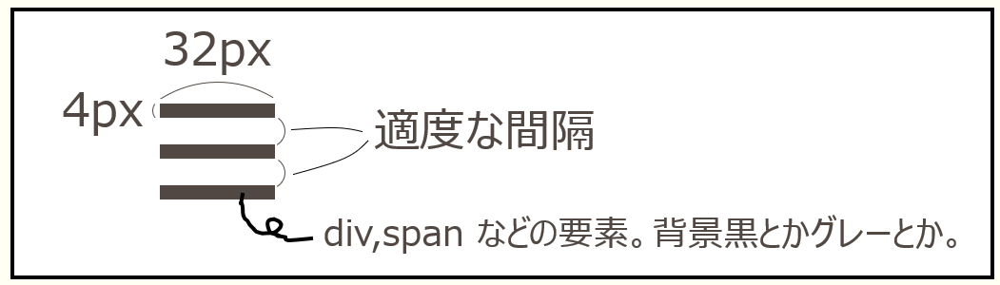
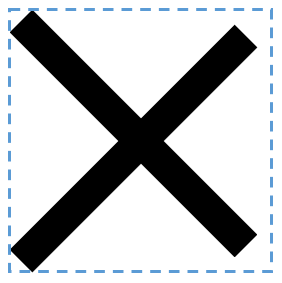
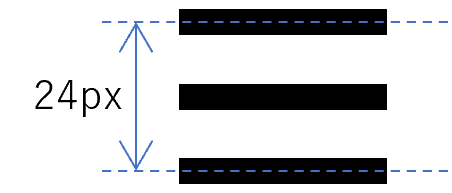
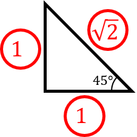
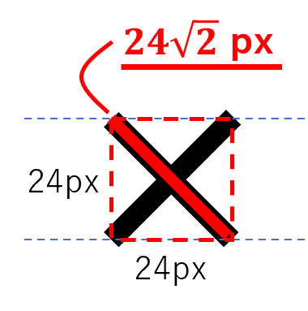

---
title: 繝峨Ο繝ｯ繝ｼ繝｡繝九Η繝ｼ
---

## 繝峨Ο繝ｯ繝ｼ繝｡繝九Η繝ｼ縺ｨ縺ｯ

繝峨Ο繝ｯ繝ｼ繝｡繝九Η繝ｼ縺ｯ縲∫判髱｢縺ｮ遶ｯ縺九ｉ蠑輔″蜃ｺ縺吶ｈ縺・↓陦ｨ遉ｺ縺輔ｌ繧九Γ繝九Η繝ｼ縺ｧ縺吶€ゅせ繝槭・繝医ヵ繧ｩ繝ｳ繧ｵ繧､繝医〒繧医￥菴ｿ繧上ｌ繧・UI 繝代ち繝ｼ繝ｳ縺ｧ縲√ワ繝ｳ繝舌・繧ｬ繝ｼ繧｢繧､繧ｳ繝ｳ縺ｨ邨・∩蜷医ｏ縺帙※螳溯｣・＆繧後ｋ縺薙→縺悟､壹＞縺ｧ縺吶€・

縺薙・繝壹・繧ｸ縺ｧ縺ｯ縲√ラ繝ｭ繝ｯ繝ｼ繝｡繝九Η繝ｼ縺ｮ菴懊ｊ譁ｹ繧帝・ｒ霑ｽ縺｣縺ｦ蟄ｦ繧薙〒縺・″縺ｾ縺吶€・

<Exercise title="貍皮ｿ・・医・繝・ム繝ｼ縺ｨ繝上Φ繝舌・繧ｬ繝ｼ繧｢繧､繧ｳ繝ｳ縺ｮ菴懈・・・>

縺ｾ縺壹・縲√・繝・ム繝ｼ縺ｨ繝上Φ繝舌・繧ｬ繝ｼ繧｢繧､繧ｳ繝ｳ縺ｮ隕九◆逶ｮ繧剃ｽ懊ｊ縺ｾ縺励ｇ縺・€ゆｻ･荳九・繝励Ξ繝薙Η繝ｼ縺ｨ蜷後§隕九◆逶ｮ縺ｫ縺ｪ繧九ｈ縺・↓縲？TML 縺ｨ CSS 繧呈嶌縺・※縺上□縺輔＞縲・

菴・＠縲√ワ繝ｳ繝舌・繧ｬ繝ｼ繧｢繧､繧ｳ繝ｳ縺ｮ驛ｨ蛻・・縲∵ｬ｡縺ｮ蝗ｳ縺ｮ繧医≧縺ｫ縲・縺､縺ｮ隕∫ｴ繧剃ｽｿ縺｣縺ｦ菴懈・縺励※縺上□縺輔＞縲・


<CodePreview
  sourceId="貍皮ｿ・"
  htmlVisible={false}
  cssVisible={false}
  jsVisible={false}
  previewVisible={true}
>
```html
<header>
  <button class="ham-btn">
    <span class="ham-icon">
      <span class="line top"></span>
      <span class="line middle"></span>
      <span class="line bottom"></span>
    </span>
  </button>
</header>
```

```css
body {
  margin: 0; /* 繝壹・繧ｸ縺ｮ遶ｯ縺ｮ菴咏區繧偵↑縺上☆ */
}

header {
  border-bottom: solid black 1px; /* 繝倥ャ繝€繝ｼ縺ｮ荳九・邱・*/
}

/* 繝上Φ繝舌・繧ｬ繝ｼ縺ｮ繝懊ち繝ｳ縺ｨ繧｢繧､繧ｳ繝ｳ縺ｮ隱ｿ謨ｴ */
.ham-btn {
  display: block; /* block 縺ｫ縺励↑縺・→螟峨↑諢丞峙縺励↑縺・ｽ咏區縺悟享謇九↓蜈･繧九・縺ｧ */
  padding: 20px;

  border: none; /* 譫邱壹ｒ豸医☆ */
  background: transparent; /* 閭梧勹繧呈ｶ医☆ */
  cursor: pointer; /* 繧ｫ繝ｼ繧ｽ繝ｫ縺ｯ謇九・繝槭・繧ｯ */
}

.ham-icon {
  display: flex; /* gap 繧剃ｽｿ縺・◆縺・□縺・*/
  flex-direction: column; /* 邵ｦ荳ｦ縺ｳ */
  gap: 8px; /* 髢馴囈 8px */
}

.ham-icon .line {
  width: 32px;
  height: 4px;

  display: block; /* span 縺ｯ繝・ヵ繧ｩ繝ｫ繝医〒 display: inline 縺ｪ縺ｮ縺ｧ縲『idth, height 繧貞柑縺九○繧九◆繧√↓ block 縺ｫ縺吶ｋ */
  background-color: black;
}
```

</CodePreview>

<Solution>
<CodePreview sourceId="貍皮ｿ・"/>
</Solution>
</Exercise>

<Exercise title="貍皮ｿ・・医Γ繝九Η繝ｼ繧ｳ繝ｳ繝・Φ繝・・菴懈・・・>

邯壹＞縺ｦ縲√ラ繝ｭ繝ｯ繝ｼ繝｡繝九Η繝ｼ縺ｮ繝｡繝九Η繝ｼ繧ｳ繝ｳ繝・Φ繝・ｒ菴懊ｊ縺ｾ縺励ｇ縺・€ゆｻ･荳九・繝励Ξ繝薙Η繝ｼ縺ｨ蜷後§隕九◆逶ｮ縺ｫ縺ｪ繧九ｈ縺・↓縲？TML 縺ｨ CSS 繧呈嶌縺・※縺上□縺輔＞縲・

<CodePreview
  sourceId="貍皮ｿ・"
  htmlVisible={false}
  cssVisible={false}
  jsVisible={false}
  previewVisible={true}
>
```html
<header>
  <button class="ham-btn">
    <span class="ham-icon">
      <span class="line top"></span>
      <span class="line middle"></span>
      <span class="line bottom"></span>
    </span>
  </button>
</header>
<nav class="drawer">
  <ul>
    <li><a href="#">繝帙・繝</a></li>
    <li><a href="#">繧ｵ繝ｼ繝薙せ</a></li>
    <li><a href="#">莨夂､ｾ諠・ｱ</a></li>
    <li><a href="#">縺雁撫縺・粋繧上○</a></li>
    <li><a href="#">縺雁撫縺・粋繧上○2</a></li>
    <li><a href="#">縺雁撫縺・粋繧上○3</a></li>
    <li><a href="#">縺雁撫縺・粋繧上○4</a></li>
  </ul>
</nav>
```

```css
body {
  margin: 0;
}

header {
  border-bottom: solid black 1px;
}

/* 繝上Φ繝舌・繧ｬ繝ｼ縺ｮ繝懊ち繝ｳ縺ｨ繧｢繧､繧ｳ繝ｳ縺ｮ隱ｿ謨ｴ */
.ham-btn {
  display: block;
  padding: 20px;

  border: none;
  background: transparent;
  cursor: pointer;

  position: relative; /* z-index 繧貞柑縺九○繧九◆繧√□縺代↓ position 繧・relative 縺ｫ */
  z-index: 1; /* 繝上Φ繝舌・繧ｬ繝ｼ繝懊ち繝ｳ繧偵Γ繝九Η繝ｼ繧ｳ繝ｳ繝・Φ繝・ｈ繧企擇縺ｫ陦ｨ遉ｺ縺吶ｋ縺溘ａ */
}

.ham-icon {
  display: flex;
  flex-direction: column;
  gap: 8px;
}

.ham-icon .line {
  width: 32px;
  height: 4px;

  display: block;
  background-color: black;
}

/* 繝峨Ο繝ｯ繝ｼ縺ｮ繝｡繝九Η繝ｼ繧ｳ繝ｳ繝・Φ繝・Κ蛻・・隱ｿ謨ｴ */
.drawer {
  position: fixed; /* 逕ｻ髱｢蜀・〒縲∽ｽ咲ｽｮ蝗ｺ螳・*/
  top: 0; /* 隕∫ｴ縺ｮ荳顔ｫｯ縺ｯ逕ｻ髱｢縺ｮ荳顔ｫｯ縺ｫ蜷医ｏ縺帙ｋ */
  bottom: 0; /* 隕∫ｴ縺ｮ荳狗ｫｯ縺ｯ逕ｻ髱｢縺ｮ荳狗ｫｯ縺ｫ蜷医ｏ縺帙ｋ(top:0, bottom:0 縺ｫ繧医▲縺ｦ鬮倥＆縺檎判髱｢縺・▲縺ｱ縺・↓縺ｪ繧・ */
  left: 0; /* 逕ｻ髱｢縺ｮ蟾ｦ遶ｯ縺ｫ驟咲ｽｮ */
  background-color: white; /* 閭梧勹繧偵▽縺代↑縺・→騾乗・縺ｫ縺ｪ繧九°繧・*/
  box-shadow: 4px 0 6px rgba(0, 0, 0, 0.2); /* 蜿ｳ蛛ｴ縺ｫ蠖ｱ繧偵▽縺代ｋ */

  padding-top: 60px; /* 荳翫↓60px縺ｮ菴咏區 */
}
```

</CodePreview>

<Solution>
蜑阪・貍皮ｿ偵°繧牙｢励∴縺溘ｊ縲∝､峨ｏ縺｣縺溘ｊ縺励◆縺ｨ縺薙ｍ縺縺代€√・繝ｭ繝代ユ繧｣縺ｮ蠕後ｍ縺ｫ繧ｳ繝｡繝ｳ繝医ｒ譖ｸ縺・※縺・∪縺吶€・
<CodePreview sourceId="貍皮ｿ・"/>
</Solution>
</Exercise>

<Exercise title="貍皮ｿ・・磯幕髢画ｩ溯・縺ｮ菴懈・・・>

縺､縺・↓縲゛avaScript 縺ｧ髢矩哩讖溯・繧剃ｽ懊ｊ縺ｾ縺励ｇ縺・€ゆｻ･荳九・繝励Ξ繝薙Η繝ｼ縺ｮ繧医≧縺ｫ縲√ワ繝ｳ繝舌・繧ｬ繝ｼ繧｢繧､繧ｳ繝ｳ繧偵け繝ｪ繝・け縺励◆繧峨€√Γ繝九Η繝ｼ縺悟・縺怜・繧後☆繧九ｈ縺・↓縲，SS 縺ｨ JavaScript 繧呈嶌縺・※縺上□縺輔＞縲・

・域ｬ｡縺ｮ貍皮ｿ偵〒繧｢繝九Γ繝ｼ繧ｷ繝ｧ繝ｳ縺輔○縺溘＞縺ｮ縺ｧ・液ransform 繝励Ο繝代ユ繧｣繧剃ｽｿ逕ｨ縺励※縲∫判髱｢蟾ｦ螟悶↓繝｡繝九Η繝ｼ繧帝國縺吶ｈ縺・↓縺励※縺上□縺輔＞縲・
縺ｾ縺溘€，SS縺ｮ螟画峩縺ｯ繧ｯ繝ｩ繧ｹ縺ｮ縺､縺大､悶＠縺ｧ陦後▲縺ｦ縺上□縺輔＞縲・

<CodePreview
  sourceId="貍皮ｿ・"
  htmlVisible={false}
  cssVisible={false}
  jsVisible={false}
  previewVisible={true}
>
```html
<header>
  <button class="ham-btn">
    <span class="ham-icon">
      <span class="line top"></span>
      <span class="line middle"></span>
      <span class="line bottom"></span>
    </span>
  </button>
</header>
<nav class="drawer">
  <ul>
    <li><a href="#">繝帙・繝</a></li>
    <li><a href="#">繧ｵ繝ｼ繝薙せ</a></li>
    <li><a href="#">莨夂､ｾ諠・ｱ</a></li>
    <li><a href="#">縺雁撫縺・粋繧上○</a></li>
    <li><a href="#">縺雁撫縺・粋繧上○2</a></li>
    <li><a href="#">縺雁撫縺・粋繧上○3</a></li>
    <li><a href="#">縺雁撫縺・粋繧上○4</a></li>
  </ul>
</nav>
```

```css
body {
  margin: 0;
}

header {
  border-bottom: solid black 1px;
}

/* 繝上Φ繝舌・繧ｬ繝ｼ縺ｮ繝懊ち繝ｳ縺ｨ繧｢繧､繧ｳ繝ｳ縺ｮ隱ｿ謨ｴ */
.ham-btn {
  display: block;
  padding: 20px;

  border: none;
  background: transparent;
  cursor: pointer;

  position: relative;
  z-index: 1;
}

.ham-icon {
  display: flex;
  flex-direction: column;
  gap: 8px;
}

.ham-icon .line {
  width: 32px;
  height: 4px;

  display: block;
  background-color: black;
}

/* 繝峨Ο繝ｯ繝ｼ縺ｮ繝｡繝九Η繝ｼ繧ｳ繝ｳ繝・Φ繝・Κ蛻・・隱ｿ謨ｴ */
.drawer {
  position: fixed;
  top: 0;
  bottom: 0;
  left: 0;
  background-color: white;
  box-shadow: 4px 0 6px rgba(0, 0, 0, 0.2);

  padding-top: 60px;

  transform: translateX(
    -100%
  ); /* 蛻晄悄縺ｮ髢峨§縺ｦ縺・ｋ迥ｶ諷九〒縺ｯ縲∫判髱｢蟾ｦ縺ｫ髫縺・*/
}

.drawer.open {
  /* 繝｡繝九Η繝ｼ繧ｳ繝ｳ繝・Φ繝・↓ open 繧ｯ繝ｩ繧ｹ縺後▽縺・※縺・ｋ縺ｨ縺搾ｼ磯幕縺・※縺・ｋ縺ｨ縺搾ｼ・*/
  transform: translateX(0); /* 蜈・・菴咲ｽｮ縺ｫ陦ｨ遉ｺ縺吶ｋ */
}
```

```javascript
// 繝上Φ繝舌・繧ｬ繝ｼ繝懊ち繝ｳ縺ｮ隕∫ｴ繧貞叙蠕・
let hamBtnYoso = document.querySelector('.ham-btn');
// 繝峨Ο繝ｯ繝ｼ縺ｮ隕∫ｴ繧貞叙蠕・
let drawerYoso = document.querySelector('.drawer');

// 繝上Φ繝舌・繧ｬ繝ｼ繝懊ち繝ｳ縺後け繝ｪ繝・け縺輔ｌ縺溘→縺阪・蜃ｦ逅・
hamBtnYoso.addEventListener('click', () => {
  // 繝峨Ο繝ｯ繝ｼ隕∫ｴ縺ｫ蟇ｾ縺励※縲｛pen 繧ｯ繝ｩ繧ｹ縺ｮ莉倥￠螟悶＠繧定｡後≧
  drawerYoso.classList.toggle('open');
});
```

</CodePreview>

<Solution>
蜑阪・貍皮ｿ偵°繧牙｢励∴縺溘ｊ縲∝､峨ｏ縺｣縺溘ｊ縺励◆縺ｨ縺薙ｍ縺縺代€√・繝ｭ繝代ユ繧｣縺ｮ蠕後ｍ縺ｫ繧ｳ繝｡繝ｳ繝医ｒ譖ｸ縺・※縺・∪縺吶€・
<CodePreview sourceId="貍皮ｿ・"/>
</Solution>
</Exercise>

<Exercise title="貍皮ｿ・・医い繝九Γ繝ｼ繧ｷ繝ｧ繝ｳ蛹厄ｼ・>

縺ゅ→縺ｯ驕ｩ蛻・↓繧｢繝九Γ繝ｼ繧ｷ繝ｧ繝ｳ縺吶ｋ繧医≧縺ｫ隱ｿ謨ｴ縺励∪縺励ｇ縺・€ゆｻ･荳九・繝励Ξ繝薙Η繝ｼ縺ｮ繧医≧縺ｫ縲√ワ繝ｳ繝舌・繧ｬ繝ｼ繧｢繧､繧ｳ繝ｳ繧偵け繝ｪ繝・け縺励◆繧峨€・

- 貊代ｉ縺九↓繝｡繝九Η繝ｼ縺悟・縺怜・繧後☆繧・
- 髢峨§縺ｦ縺・ｋ縺ｨ縺阪↓繝｡繝九Η繝ｼ縺ｮ蠖ｱ縺後■繧峨▲縺ｨ隕九∴縺ｪ縺・ｈ縺・↓縺吶ｋ
  繧医≧縺ｫ CSS 繧呈嶌縺肴鋤縺医※縺上□縺輔＞縲・

<CodePreview
  sourceId="貍皮ｿ・"
  htmlVisible={false}
  cssVisible={false}
  jsVisible={false}
  previewVisible={true}
>
```html
<header>
  <button class="ham-btn">
    <span class="ham-icon">
      <span class="line top"></span>
      <span class="line middle"></span>
      <span class="line bottom"></span>
    </span>
  </button>
</header>
<nav class="drawer">
  <ul>
    <li><a href="#">繝帙・繝</a></li>
    <li><a href="#">繧ｵ繝ｼ繝薙せ</a></li>
    <li><a href="#">莨夂､ｾ諠・ｱ</a></li>
    <li><a href="#">縺雁撫縺・粋繧上○</a></li>
    <li><a href="#">縺雁撫縺・粋繧上○2</a></li>
    <li><a href="#">縺雁撫縺・粋繧上○3</a></li>
    <li><a href="#">縺雁撫縺・粋繧上○4</a></li>
  </ul>
</nav>
```

```css
body {
  margin: 0;
}

header {
  border-bottom: solid black 1px;
}

/* 繝上Φ繝舌・繧ｬ繝ｼ縺ｮ繝懊ち繝ｳ縺ｨ繧｢繧､繧ｳ繝ｳ縺ｮ隱ｿ謨ｴ */
.ham-btn {
  display: block;
  padding: 20px;

  border: none;
  background: transparent;
  cursor: pointer;

  position: relative;
  z-index: 1;
}

.ham-icon {
  display: flex;
  flex-direction: column;
  gap: 8px;
}

.ham-icon .line {
  width: 32px;
  height: 4px;

  display: block;
  background-color: black;
}

/* 繝峨Ο繝ｯ繝ｼ縺ｮ繝｡繝九Η繝ｼ繧ｳ繝ｳ繝・Φ繝・Κ蛻・・隱ｿ謨ｴ */
.drawer {
  position: fixed;
  top: 0;
  bottom: 0;
  left: 0;
  background-color: white;
  /* box-shadow: 4px 0 6px rgba(0, 0, 0, 0.2); 縺薙ｌ縺ｯ縲｛pen 縺ｮ譎ゅ・譁ｹ縺ｫ遘ｻ蜍・*/

  padding-top: 60px;

  transform: translateX(-100%);
  transition: all 1s; /* 貊代ｉ縺九↓螟牙喧縺吶ｋ繧医≧縺ｫ縺吶ｋ */
}

.drawer.open {
  transform: translateX(0);
  box-shadow: 4px 0 6px rgba(0, 0, 0, 0.2); /* 髢九＞縺ｦ縺・ｋ譎ゅ□縺大ｽｱ繧偵▽縺代ｋ繧医≧縺ｫ縺吶ｋ */
}
```

```javascript
let hamBtnYoso = document.querySelector('.ham-btn');
let drawerYoso = document.querySelector('.drawer');

hamBtnYoso.addEventListener('click', () => {
  drawerYoso.classList.toggle('open');
});
```

</CodePreview>

<Solution>
蜑阪・貍皮ｿ偵°繧牙｢励∴縺溘ｊ縲∝､峨ｏ縺｣縺溘ｊ縺励◆縺ｨ縺薙ｍ縺縺代€√・繝ｭ繝代ユ繧｣縺ｮ蠕後ｍ縺ｫ繧ｳ繝｡繝ｳ繝医ｒ譖ｸ縺・※縺・∪縺吶€・
<CodePreview sourceId="貍皮ｿ・"/>
</Solution>
</Exercise>

<Exercise title="貍皮ｿ・逋ｺ螻・・医が繝ｼ繝舌・繝ｬ繧､・・>

莉･荳九・繝励Ξ繝薙Η繝ｼ縺ｮ繧医≧縺ｫ縲√Γ繝九Η繝ｼ縺碁幕縺・※縺・ｋ縺ｨ縺阪・縲√・繝ｼ繧ｸ縺ｮ蜀・ｮｹ縺ｮ荳翫↓繧ｰ繝ｬ繝ｼ縺ｮ蜊企€乗・縺ｮ繧ゅ・・医が繝ｼ繝舌・繝ｬ繧､縺ｨ險€縺・∪縺呻ｼ峨′陦ｨ遉ｺ縺輔ｌ繧九ｈ縺・↓縺励※縺上□縺輔＞縲・
縺ｾ縺溘€√が繝ｼ繝舌・繝ｬ繧､驛ｨ蛻・ｒ繧ｯ繝ｪ繝・け縺励◆繧峨Γ繝九Η繝ｼ縺碁哩縺倥ｋ繧医≧縺ｫ縺励※縺上□縺輔＞縲・

:::tip
繝偵Φ繝・

- 繧ｪ繝ｼ繝舌・繝ｬ繧､縺ｯ逕ｻ髱｢蜈ｨ菴薙ｒ隕・≧縲∬ｦ∫ｴ縺ｨ縺励※菴懊ｊ縺ｾ縺吶€ゅ◎縺ｮ縺溘ａ縲√◎繧檎畑縺ｮ隕∫ｴ繧・HTML 縺ｫ霑ｽ蜉縺吶ｋ蠢・ｦ√′縺ゅｊ縺ｾ縺吶€・

  :::

<CodePreview
  sourceId="貍皮ｿ・逋ｺ螻・"
  htmlVisible={false}
  cssVisible={false}
  jsVisible={false}
  previewVisible={true}
>
```html
<header>
  <button class="ham-btn">
    <span class="ham-icon">
      <span class="line top"></span>
      <span class="line middle"></span>
      <span class="line bottom"></span>
    </span>
  </button>
</header>
<nav class="drawer">
  <ul>
    <li><a href="#">繝帙・繝</a></li>
    <li><a href="#">繧ｵ繝ｼ繝薙せ</a></li>
    <li><a href="#">莨夂､ｾ諠・ｱ</a></li>
    <li><a href="#">縺雁撫縺・粋繧上○</a></li>
    <li><a href="#">縺雁撫縺・粋繧上○2</a></li>
    <li><a href="#">縺雁撫縺・粋繧上○3</a></li>
    <li><a href="#">縺雁撫縺・粋繧上○4</a></li>
  </ul>
</nav>
<div class="overlay"></div>
```

```css
body {
  margin: 0;
}

header {
  border-bottom: solid black 1px;
}

/* 繝上Φ繝舌・繧ｬ繝ｼ縺ｮ繝懊ち繝ｳ縺ｨ繧｢繧､繧ｳ繝ｳ縺ｮ隱ｿ謨ｴ */
.ham-btn {
  display: block;
  padding: 20px;

  border: none;
  background: transparent;
  cursor: pointer;

  position: relative;
  z-index: 2; /* 繝｡繝九Η繝ｼ繧ｳ繝ｳ繝・Φ繝・ｈ繧贋ｸ翫↓陦ｨ遉ｺ縺吶ｋ縺溘ａ縺ｫ縲】-index 繧・2 縺ｫ */
}

.ham-icon {
  display: flex;
  flex-direction: column;
  gap: 8px;
}

.ham-icon .line {
  width: 32px;
  height: 4px;

  display: block;
  background-color: black;
}

/* 繝峨Ο繝ｯ繝ｼ縺ｮ繝｡繝九Η繝ｼ繧ｳ繝ｳ繝・Φ繝・Κ蛻・・隱ｿ謨ｴ */
.drawer {
  position: fixed;
  top: 0;
  bottom: 0;
  left: 0;
  background-color: white;

  padding-top: 60px;

  transform: translateX(-100%);
  transition: all 1s;
  z-index: 1; /* 繧ｪ繝ｼ繝舌・繝ｬ繧､縺ｮ荳翫↓陦ｨ遉ｺ縺吶ｋ縺溘ａ縺ｫ縲】-index 繧・1 縺ｫ */
}

.drawer.open {
  transform: translateX(0);
  box-shadow: 4px 0 6px rgba(0, 0, 0, 0.2);
}

/* 繧ｪ繝ｼ繝舌・繝ｬ繧､驛ｨ蛻・・隱ｿ謨ｴ */
.overlay {
  position: fixed; /* 逕ｻ髱｢蜀・〒菴咲ｽｮ蝗ｺ螳・*/
  top: 0; /* 荳顔ｫｯ繧堤判髱｢縺ｮ荳顔ｫｯ縺ｫ蜷医ｏ縺帙ｋ */
  bottom: 0; /* 荳狗ｫｯ繧堤判髱｢縺ｮ荳狗ｫｯ縺ｫ蜷医ｏ縺帙ｋ */
  left: 0; /* 蟾ｦ遶ｯ繧堤判髱｢縺ｮ蟾ｦ遶ｯ縺ｫ蜷医ｏ縺帙ｋ */
  right: 0; /* 蜿ｳ遶ｯ繧堤判髱｢縺ｮ蜿ｳ遶ｯ縺ｫ蜷医ｏ縺帙ｋ */
  background-color: rgba(0, 0, 0, 0.5); /* 蜊企€乗・縺ｮ鮟・*/
  opacity: 0; /* 蛻晄悄迥ｶ諷九〒縺ｯ騾乗・縺ｫ縺吶ｋ */
  transition: opacity 1s; /* opacity 縺ｮ螟牙喧繧呈ｻ代ｉ縺九↓縺吶ｋ */
  z-index: 0; /* 繝｡繝九Η繝ｼ縺ｮ荳九↓陦ｨ遉ｺ縺吶ｋ縺溘ａ縺ｫ縲】-index 繧・0 縺ｫ */
}

.overlay.open {
  /* 繧ｪ繝ｼ繝舌・繝ｬ繧､縺ｫ open 繧ｯ繝ｩ繧ｹ縺後▽縺・※縺・ｋ縺ｨ縺搾ｼ磯幕縺・※縺・ｋ縺ｨ縺搾ｼ・*/
  opacity: 1; /* 隕九∴繧九ｈ縺・↓縺吶ｋ */
}
```

```javascript
let hamBtnYoso = document.querySelector('.ham-btn');
let drawerYoso = document.querySelector('.drawer');
// 繧ｪ繝ｼ繝舌・繝ｬ繧､驛ｨ蛻・・隕∫ｴ繧貞叙蠕・
let overlayYoso = document.querySelector('.overlay');

hamBtnYoso.addEventListener('click', () => {
  drawerYoso.classList.toggle('open');
  overlayYoso.classList.toggle('open'); // 繧ｪ繝ｼ繝舌・繝ｬ繧､驛ｨ蛻・ｂ open 繧ｯ繝ｩ繧ｹ縺ｮ莉倥￠螟悶＠繧定｡後≧
});

// 繧ｪ繝ｼ繝舌・繝ｬ繧､驛ｨ蛻・′繧ｯ繝ｪ繝・け縺輔ｌ縺溘→縺阪・蜃ｦ逅・
overlayYoso.addEventListener('click', () => {
  drawerYoso.classList.remove('open'); // 繝｡繝九Η繝ｼ繧帝哩縺倥ｋ
  overlayYoso.classList.remove('open'); // 繧ｪ繝ｼ繝舌・繝ｬ繧､驛ｨ蛻・ｂ髢峨§繧・
});
```

</CodePreview>

<Solution>
蜑阪・貍皮ｿ偵°繧牙｢励∴縺溘ｊ縲∝､峨ｏ縺｣縺溘ｊ縺励◆縺ｨ縺薙ｍ縺縺代€√・繝ｭ繝代ユ繧｣縺ｮ蠕後ｍ縺ｫ繧ｳ繝｡繝ｳ繝医ｒ譖ｸ縺・※縺・∪縺吶€・
<CodePreview sourceId="貍皮ｿ・逋ｺ螻・"/>
</Solution>
</Exercise>

<Exercise title="貍皮ｿ・逋ｺ螻・・医ワ繝ｳ繝舌・繧ｬ繝ｼ縺九ｉﾃ励い繧､繧ｳ繝ｳ縺ｫ繧｢繝九Γ繝ｼ繧ｷ繝ｧ繝ｳ・・>

莉･荳九・繝励Ξ繝薙Η繝ｼ縺ｮ繧医≧縺ｫ縲√Γ繝九Η繝ｼ繧帝幕縺・◆縺ｨ縺阪↓縲√ワ繝ｳ繝舌・繧ｬ繝ｼ繧｢繧､繧ｳ繝ｳ縺古励い繧､繧ｳ繝ｳ縺ｫ螟牙喧縺吶ｋ繧医≧縺ｫ縺励※縺上□縺輔＞縲・

:::tip
繝偵Φ繝・

- 繝上Φ繝舌・繧ｬ繝ｼ繧｢繧､繧ｳ繝ｳ縺ｮ蜷・ｷ壹↓蟇ｾ縺励※縲》ransform: rotate 縺ｧ蝗櫁ｻ｢縺輔○繧九→濶ｯ縺・〒縺吶€・
- 逵溘ｓ荳ｭ縺ｮ邱壹・縲・€乗・縺ｫ縺励∪縺励ｇ縺・€・
- transform: rotate 縺吶ｋ髫帙・蝓ｺ貅也せ縺ｯ縲》ransform-origin 繝励Ο繝代ユ繧｣縺ｧ螟画峩縺吶ｋ縺薙→縺後〒縺阪∪縺吶€ゑｼ医ョ繝輔か繝ｫ繝医・荳ｭ螟ｮ縺ｧ縺呻ｼ・

  :::

<CodePreview
  sourceId="貍皮ｿ・逋ｺ螻・"
  htmlVisible={false}
  cssVisible={false}
  jsVisible={false}
  previewVisible={true}
>
```html
<header>
  <button class="ham-btn">
    <span class="ham-icon">
      <span class="line top"></span>
      <span class="line middle"></span>
      <span class="line bottom"></span>
    </span>
  </button>
</header>
<nav class="drawer">
  <ul>
    <li><a href="#">繝帙・繝</a></li>
    <li><a href="#">繧ｵ繝ｼ繝薙せ</a></li>
    <li><a href="#">莨夂､ｾ諠・ｱ</a></li>
    <li><a href="#">縺雁撫縺・粋繧上○</a></li>
    <li><a href="#">縺雁撫縺・粋繧上○2</a></li>
    <li><a href="#">縺雁撫縺・粋繧上○3</a></li>
    <li><a href="#">縺雁撫縺・粋繧上○4</a></li>
  </ul>
</nav>
<div class="overlay"></div>
```

```css
body {
  margin: 0;
}

header {
  border-bottom: solid black 1px;
}

/* 繝上Φ繝舌・繧ｬ繝ｼ縺ｮ繝懊ち繝ｳ縺ｨ繧｢繧､繧ｳ繝ｳ縺ｮ隱ｿ謨ｴ */
.ham-btn {
  display: block;
  padding: 20px;

  border: none;
  background: transparent;
  cursor: pointer;

  position: relative;
  z-index: 2;
}

.ham-icon {
  display: flex;
  flex-direction: column;
  gap: 8px;
}

.ham-icon .line {
  width: 32px;
  height: 4px;

  display: block;
  background-color: black;

  transform-origin: left center; /* 蟾ｦ荳ｭ螟ｮ繧貞渕貅也せ縺ｫ縺吶ｋ */
  transition: all 1s; /* 繝励Ο繝代ユ繧｣縺ｮ螟牙喧繧呈ｻ代ｉ縺九↓ */
}

.ham-icon.open .line.top {
  /* 繝上Φ繝舌・繧ｬ繝ｼ繧｢繧､繧ｳ繝ｳ縺ｫ open 繧ｯ繝ｩ繧ｹ縺後▽縺・※縺・ｋ縺ｨ縺搾ｼ磯幕縺・※縺・ｋ縺ｨ縺搾ｼ峨€€縺ｮ縲€荳€逡ｪ荳翫・邱・*/
  transform: rotate(45deg); /* 45蠎ｦ蝗櫁ｻ｢ */
}
.ham-icon.open .line.middle {
  /* 繝上Φ繝舌・繧ｬ繝ｼ繧｢繧､繧ｳ繝ｳ縺ｫ open 繧ｯ繝ｩ繧ｹ縺後▽縺・※縺・ｋ縺ｨ縺搾ｼ磯幕縺・※縺・ｋ縺ｨ縺搾ｼ峨€€縺ｮ縲€逵溘ｓ荳ｭ縺ｮ邱・*/
  opacity: 0; /* 騾乗・縺ｫ縺吶ｋ */
}
.ham-icon.open .line.bottom {
  /* 繝上Φ繝舌・繧ｬ繝ｼ繧｢繧､繧ｳ繝ｳ縺ｫ open 繧ｯ繝ｩ繧ｹ縺後▽縺・※縺・ｋ縺ｨ縺搾ｼ磯幕縺・※縺・ｋ縺ｨ縺搾ｼ峨€€縺ｮ縲€荳€逡ｪ荳九・邱・*/
  transform: rotate(-45deg); /* -45蠎ｦ蝗櫁ｻ｢ */
}

/* 繝峨Ο繝ｯ繝ｼ縺ｮ繝｡繝九Η繝ｼ繧ｳ繝ｳ繝・Φ繝・Κ蛻・・隱ｿ謨ｴ */
.drawer {
  position: fixed;
  top: 0;
  bottom: 0;
  left: 0;
  background-color: white;

  padding-top: 60px;

  transform: translateX(-100%);
  transition: all 1s;
  z-index: 1;
}

.drawer.open {
  transform: translateX(0);
  box-shadow: 4px 0 6px rgba(0, 0, 0, 0.2);
}

/* 繧ｪ繝ｼ繝舌・繝ｬ繧､驛ｨ蛻・・隱ｿ謨ｴ */
.overlay {
  position: fixed;
  top: 0;
  bottom: 0;
  left: 0;
  right: 0;
  background-color: rgba(0, 0, 0, 0.5);
  opacity: 0;
  transition: opacity 1s;
  z-index: 0;
}

.overlay.open {
  opacity: 1;
}
```

```javascript
let hamBtnYoso = document.querySelector('.ham-btn');
let drawerYoso = document.querySelector('.drawer');
let overlayYoso = document.querySelector('.overlay');
// 繝上Φ繝舌・繧ｬ繝ｼ繧｢繧､繧ｳ繝ｳ驛ｨ蛻・・隕∫ｴ繧貞叙蠕・
let hamIconYoso = document.querySelector('.ham-icon');

hamBtnYoso.addEventListener('click', () => {
  drawerYoso.classList.toggle('open');
  overlayYoso.classList.toggle('open');
  hamIconYoso.classList.toggle('open'); // 繝上Φ繝舌・繧ｬ繝ｼ繧｢繧､繧ｳ繝ｳ驛ｨ蛻・ｂ open 繧ｯ繝ｩ繧ｹ縺ｮ莉倥￠螟悶＠繧定｡後≧
});

overlayYoso.addEventListener('click', () => {
  drawerYoso.classList.remove('open');
  overlayYoso.classList.remove('open');
  hamIconYoso.classList.remove('open'); // 繝上Φ繝舌・繧ｬ繝ｼ繧｢繧､繧ｳ繝ｳ驛ｨ蛻・ｂ open 繧ｯ繝ｩ繧ｹ繧貞､悶☆
});
```

</CodePreview>

<Solution>
蜑阪・貍皮ｿ偵°繧牙｢励∴縺溘ｊ縲∝､峨ｏ縺｣縺溘ｊ縺励◆縺ｨ縺薙ｍ縺縺代€√・繝ｭ繝代ユ繧｣縺ｮ蠕後ｍ縺ｫ繧ｳ繝｡繝ｳ繝医ｒ譖ｸ縺・※縺・∪縺吶€・
<CodePreview sourceId="貍皮ｿ・逋ｺ螻・"/>
</Solution>
</Exercise>

<Exercise title="貍皮ｿ・逋ｺ螻・・医ワ繝ｳ繝舌・繧ｬ繝ｼ繧｢繧､繧ｳ繝ｳ縺ｮ髟ｷ縺戊ｪｿ謨ｴ・・>

蜈医⊇縺ｩ縺ｮ貍皮ｿ・逋ｺ螻・縺ｧ縺ｯ縲∝ｮ溘・ﾃ励′邯ｺ鮗励↑豁｣譁ｹ蠖｢縺ｫ縺ｪ縺｣縺ｦ縺・∪縺帙ｓ縲・


- 縺ｪ縺懊〒縺励ｇ縺・°・・
- 縺ｩ縺・☆繧後・邯ｺ鮗励↑豁｣譁ｹ蠖｢縺ｫ縺ｪ繧九〒縺励ｇ縺・°・・
- 邯ｺ鮗励↑豁｣譁ｹ蠖｢縺ｫ縺ｪ繧九ｈ縺・↓縲，SS 繧剃ｿｮ豁｣縺励※縺上□縺輔＞縲・

<CodePreview
  sourceId="貍皮ｿ・逋ｺ螻・"
  htmlVisible={false}
  cssVisible={false}
  jsVisible={false}
  previewVisible={true}
>
```html
<header>
  <button class="ham-btn">
    <span class="ham-icon">
      <span class="line top"></span>
      <span class="line middle"></span>
      <span class="line bottom"></span>
    </span>
  </button>
</header>
<nav class="drawer">
  <ul>
    <li><a href="#">繝帙・繝</a></li>
    <li><a href="#">繧ｵ繝ｼ繝薙せ</a></li>
    <li><a href="#">莨夂､ｾ諠・ｱ</a></li>
    <li><a href="#">縺雁撫縺・粋繧上○</a></li>
    <li><a href="#">縺雁撫縺・粋繧上○2</a></li>
    <li><a href="#">縺雁撫縺・粋繧上○3</a></li>
    <li><a href="#">縺雁撫縺・粋繧上○4</a></li>
  </ul>
</nav>
<div class="overlay"></div>
```

```css
body {
  margin: 0;
}

header {
  border-bottom: solid black 1px;
}

/* 繝上Φ繝舌・繧ｬ繝ｼ縺ｮ繝懊ち繝ｳ縺ｨ繧｢繧､繧ｳ繝ｳ縺ｮ隱ｿ謨ｴ */
.ham-btn {
  display: block;
  padding: 20px;

  border: none;
  background: transparent;
  cursor: pointer;

  position: relative;
  z-index: 2;
}

.ham-icon {
  display: flex;
  flex-direction: column;
  gap: 8px;
}

.ham-icon .line {
  width: calc(24px * sqrt(2)); /* 縺薙％繧・24竏・ px 縺ｫ縺ｪ繧九ｈ縺・↓隱ｿ謨ｴ */
  height: 4px;

  display: block;
  background-color: black;

  transform-origin: left center;
  transition: all 1s;
}

.ham-icon.open .line.top {
  transform: rotate(45deg);
}
.ham-icon.open .line.middle {
  opacity: 0;
}
.ham-icon.open .line.bottom {
  transform: rotate(-45deg);
}

/* 繝峨Ο繝ｯ繝ｼ縺ｮ繝｡繝九Η繝ｼ繧ｳ繝ｳ繝・Φ繝・Κ蛻・・隱ｿ謨ｴ */
.drawer {
  position: fixed;
  top: 0;
  bottom: 0;
  left: 0;
  background-color: white;

  padding-top: 60px;

  transform: translateX(-100%);
  transition: all 1s;
  z-index: 1;
}

.drawer.open {
  transform: translateX(0);
  box-shadow: 4px 0 6px rgba(0, 0, 0, 0.2);
}

/* 繧ｪ繝ｼ繝舌・繝ｬ繧､驛ｨ蛻・・隱ｿ謨ｴ */
.overlay {
  position: fixed;
  top: 0;
  bottom: 0;
  left: 0;
  right: 0;
  background-color: rgba(0, 0, 0, 0.5);
  opacity: 0;
  transition: opacity 1s;
  z-index: 0;
}

.overlay.open {
  opacity: 1;
}
```

```javascript
let hamBtnYoso = document.querySelector('.ham-btn');
let drawerYoso = document.querySelector('.drawer');
let overlayYoso = document.querySelector('.overlay');
let hamIconYoso = document.querySelector('.ham-icon');

hamBtnYoso.addEventListener('click', () => {
  drawerYoso.classList.toggle('open');
  overlayYoso.classList.toggle('open');
  hamIconYoso.classList.toggle('open');
});

overlayYoso.addEventListener('click', () => {
  drawerYoso.classList.remove('open');
  overlayYoso.classList.remove('open');
  hamIconYoso.classList.remove('open');
});
```

</CodePreview>

<Solution>
遲斐∴縺ｯ縲∫ｷ壹・讓ｪ蟷・′蟆代＠遏ｭ縺上€∬ｶｳ繧翫↑縺・°繧峨〒縺吶€ゑｼ医≠繧九＞縺ｯ蛻･縺ｮ陦ｨ迴ｾ縺ｧ縲∫ｷ壹・鬮倥＆縺碁ｫ倥☆縺弱ｋ縲・俣髫斐′蠎・☆縺弱ｋ縲√↑縺ｩ縺ｨ繧りｨ€縺医∪縺呻ｼ・
縺薙・隗｣遲斐〒縺ｯ縲√・縺｣縺溘ｊ豁｣譁ｹ蠖｢縺ｫ縺ｪ繧九ｈ縺・↓縲√ｂ縺・ｰ代＠邱壹・ width 繧帝聞縺上＠縺ｦ縺ゅ￡繧九％縺ｨ縺ｫ縺励∪縺吶€・

蜍倥〒髟ｷ縺輔ｒ隱ｿ謨ｴ縺励※繧り憶縺・〒縺吶′縲∵ｭ｣遒ｺ縺ｫ豁｣譁ｹ蠖｢縺ｫ縺吶ｋ縺ｫ縺ｯ縲∵焚蟄ｦ逧・↓蝗ｳ繧呈嶌縺・※險育ｮ励〒豎ゅａ繧九％縺ｨ縺後〒縺阪∪縺吶€・

縺ｾ縺壹€・ｫ倥＆譁ｹ蜷代・髟ｷ縺輔↓縺､縺・※閠・∴繧九→縲・[繝上Φ繝舌・繧ｬ繝ｼ繧｢繧､繧ｳ繝ｳ縺ｮ蜷・ｷ壹・鬮倥＆縺ｯ4px, 髢馴囈縺ｯ8px](./img/hamburger-height-size-detail.png)
縺薙・繧医≧縺ｫ縺ｪ縺｣縺ｦ縺・ｋ縺ｮ縺ｧ縲∽ｸ€逡ｪ荳翫・邱壹・荳ｭ蠢・ｷ壹→縲∽ｸ€逡ｪ荳九・邱壹・荳ｭ蠢・ｷ壹・髢馴囈・医▽縺ｾ繧贋ｻ企聞譁ｹ蠖｢縺ｫ縺ｪ縺｣縺ｦ縺・ｋ鬆伜沺縺ｮ鬮倥＆・峨・縲・*2 + 8*2 = 24 px 縺ｧ縺吶€・


縺ｨ縺・≧縺薙→縺ｯ縲∽ｸ贋ｸ九・邱壹ｒ縲∝ｷｦ遶ｯ縺ｮ荳ｭ螟ｮ菴咲ｽｮ繧貞渕貅悶↓45蠎ｦ蝗櫁ｻ｢縺輔○縺溘→縺阪↓豁｣譁ｹ蠖｢縺ｫ縺ｪ繧九ｈ縺・↓縺吶ｋ縺ｫ縺ｯ縲∽ｸ九・蝗ｳ縺ｮ繧医≧縺ｫ縺ｪ繧句ｿ・ｦ√′縺ゅｊ縺ｾ縺吶€・
![邵ｦ24px縲∵ｨｪ24px縺ｮ豁｣譁ｹ蠖｢縺ｫﾃ励′蜿弱∪繧犠(./img/cross-icon-square-alignment-highlight.png)

縺ｨ縺・≧縺薙→縺ｯ縲∫ｷ壹・縲√％縺ｮ豁｣譁ｹ蠖｢縺ｮ蟇ｾ隗堤ｷ壹↓縺ｪ繧翫∪縺吶€・
45蠎ｦ縺ｮ逶ｴ隗剃ｸ芽ｧ貞ｽ｢縺ｮ霎ｺ縺ｮ髟ｷ縺輔・豈斐・ 1:1:竏・ 縺ｪ縺ｮ縺ｧ縲・


邱壹・髟ｷ縺輔・縲∵ｭ｣譁ｹ蠖｢縺ｮ蟇ｾ隗堤ｷ壹・髟ｷ縺輔〒縺ゅｋ 24竏・ px 縺ｫ縺ｪ繧句ｿ・ｦ√′縺ゅｋ縺薙→縺悟・縺九ｊ縺ｾ縺吶€・


CSS荳翫〒24竏・ px 縺ｯ縲…alc(24px \* sqrt(2)) 縺ｧ陦ｨ縺吶％縺ｨ縺後〒縺阪∪縺吶€・

蜑阪・貍皮ｿ偵°繧牙｢励∴縺溘ｊ縲∝､峨ｏ縺｣縺溘ｊ縺励◆縺ｨ縺薙ｍ縺縺代€√・繝ｭ繝代ユ繧｣縺ｮ蠕後ｍ縺ｫ繧ｳ繝｡繝ｳ繝医ｒ譖ｸ縺・※縺・∪縺吶€・

<CodePreview sourceId="貍皮ｿ・逋ｺ螻・"/>
</Solution>
</Exercise>

<Exercise title="貍皮ｿ・逋ｺ螻・・医Γ繝九Η繝ｼ繧ｳ繝ｳ繝・Φ繝・・繝・じ繧､繝ｳ隱ｿ謨ｴ・・>

莉･荳九・繝励Ξ繝薙Η繝ｼ縺ｮ繧医≧縺ｫ縲√Γ繝九Η繝ｼ繧ｳ繝ｳ繝・Φ繝・・繝・じ繧､繝ｳ繧定ｪｿ謨ｴ縺励※縺上□縺輔＞縲・

- 繝ｪ繧ｹ繝医・繝槭・繧ｫ繝ｼ・磯ｻ剃ｸｸ・峨ｒ豸医☆
- 繝ｪ繝ｳ繧ｯ縺ｮ荳狗ｷ壹ｒ豸医☆
- 繝ｪ繝ｳ繧ｯ縺ｮ濶ｲ繧帝ｻ偵↓縺吶ｋ
- 繝ｪ繝ｳ繧ｯ縺ｫ繝帙ヰ繝ｼ縺励◆縺ｨ縺阪↓閭梧勹濶ｲ繧偵Λ繧､繝医げ繝ｬ繝ｼ(#f0f0f0)縺ｫ縺吶ｋ

<CodePreview
  sourceId="貍皮ｿ・逋ｺ螻・"
  htmlVisible={false}
  cssVisible={false}
  jsVisible={false}
  previewVisible={true}
>
```html
<header>
  <button class="ham-btn">
    <span class="ham-icon">
      <span class="line top"></span>
      <span class="line middle"></span>
      <span class="line bottom"></span>
    </span>
  </button>
</header>
<nav class="drawer">
  <ul>
    <li><a href="#">繝帙・繝</a></li>
    <li><a href="#">繧ｵ繝ｼ繝薙せ</a></li>
    <li><a href="#">莨夂､ｾ諠・ｱ</a></li>
    <li><a href="#">縺雁撫縺・粋繧上○</a></li>
  </ul>
</nav>
<div class="overlay"></div>
```

```css
body {
  margin: 0;
}

header {
  border-bottom: solid black 1px;
}

/* 繝上Φ繝舌・繧ｬ繝ｼ縺ｮ繝懊ち繝ｳ縺ｨ繧｢繧､繧ｳ繝ｳ縺ｮ隱ｿ謨ｴ */
.ham-btn {
  display: block;
  padding: 20px;

  border: none;
  background: transparent;
  cursor: pointer;

  position: relative;
  z-index: 2;
}

.ham-icon {
  display: flex;
  flex-direction: column;
  gap: 8px;
}

.ham-icon .line {
  width: calc(24px * sqrt(2));
  height: 4px;

  display: block;
  background-color: black;

  transform-origin: left center;
  transition: all 1s;
}

.ham-icon.open .line.top {
  transform: rotate(45deg);
}
.ham-icon.open .line.middle {
  opacity: 0;
}
.ham-icon.open .line.bottom {
  transform: rotate(-45deg);
}

/* 繝峨Ο繝ｯ繝ｼ縺ｮ繝｡繝九Η繝ｼ繧ｳ繝ｳ繝・Φ繝・Κ蛻・・隱ｿ謨ｴ */
.drawer {
  position: fixed;
  top: 0;
  bottom: 0;
  left: 0;
  background-color: white;

  padding-top: 60px;

  transform: translateX(-100%);
  transition: all 1s;
  z-index: 1;
}

.drawer.open {
  transform: translateX(0);
  box-shadow: 4px 0 6px rgba(0, 0, 0, 0.2);
}

/* 繝｡繝九Η繝ｼ繝ｪ繧ｹ繝医・繧ｹ繧ｿ繧､繝ｫ隱ｿ謨ｴ */
.drawer ul {
  list-style: none; /* 繝ｪ繧ｹ繝医・繝ｼ繧ｫ繝ｼ繧呈ｶ医☆ */
  padding: 0; /* 繝・ヵ繧ｩ繝ｫ繝医・繝代ョ繧｣繝ｳ繧ｰ繧呈ｶ医☆ */
  margin: 0; /* 繝・ヵ繧ｩ繝ｫ繝医・繝槭・繧ｸ繝ｳ繧呈ｶ医☆ */
}

.drawer a {
  display: block; /* 菴呵ｨ医↑菴咏區繧堤函縺ｾ縺ｪ縺・◆繧√↓縲√ヶ繝ｭ繝・け隕∫ｴ縺ｫ縺吶ｋ */
  padding: 12px 36px; /* 繝ｪ繝ｳ繧ｯ縺ｮ蜀・・縺ｮ菴咏區 */
  color: black; /* 繝ｪ繝ｳ繧ｯ縺ｮ濶ｲ繧帝ｻ偵↓ */
  text-decoration: none; /* 荳狗ｷ壹ｒ豸医☆ */
  transition: background-color 0.3s; /* 閭梧勹濶ｲ縺ｮ螟牙喧繧呈ｻ代ｉ縺九↓縺吶ｋ */
}

.drawer a:hover {
  background-color: #f0f0f0; /* 繝帙ヰ繝ｼ譎ゅ・閭梧勹濶ｲ繧偵Λ繧､繝医げ繝ｬ繝ｼ縺ｫ */
}

/* 繧ｪ繝ｼ繝舌・繝ｬ繧､驛ｨ蛻・・隱ｿ謨ｴ */
.overlay {
  position: fixed;
  top: 0;
  bottom: 0;
  left: 0;
  right: 0;
  background-color: rgba(0, 0, 0, 0.5);
  opacity: 0;
  transition: opacity 1s;
  z-index: 0;
}

.overlay.open {
  opacity: 1;
}
```

```javascript
let hamBtnYoso = document.querySelector('.ham-btn');
let drawerYoso = document.querySelector('.drawer');
let overlayYoso = document.querySelector('.overlay');
let hamIconYoso = document.querySelector('.ham-icon');

hamBtnYoso.addEventListener('click', () => {
  drawerYoso.classList.toggle('open');
  overlayYoso.classList.toggle('open');
  hamIconYoso.classList.toggle('open');
});

overlayYoso.addEventListener('click', () => {
  drawerYoso.classList.remove('open');
  overlayYoso.classList.remove('open');
  hamIconYoso.classList.remove('open');
});
```

</CodePreview>

<Solution>
蜑阪・貍皮ｿ偵°繧牙｢励∴縺溘ｊ縲∝､峨ｏ縺｣縺溘ｊ縺励◆縺ｨ縺薙ｍ縺縺代€√・繝ｭ繝代ユ繧｣縺ｮ蠕後ｍ縺ｫ繧ｳ繝｡繝ｳ繝医ｒ譖ｸ縺・※縺・∪縺吶€・
<CodePreview sourceId="貍皮ｿ・逋ｺ螻・"/>
</Solution>
</Exercise>
