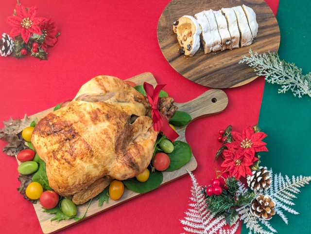

---
title: 繝昴ャ繝励い繝・・/繝€繧､繧｢繝ｭ繧ｰ/繝｢繝ｼ繝€繝ｫ (Magnific Popup)
---

import christmasChicken from './img/christmas_chicken.jpg';
import christmasSnowman from './img/christmas_snowman.jpg';
import wholeCake from './img/whole_cake.jpg';

## 莉頑律縺ｮ蟄ｦ鄙偵・縺薙ｓ縺ｪ縺ｨ縺薙ｍ縺ｧ菴ｿ縺・ｈ

莉頑律縺ｯ縲√・繝・・繧｢繝・・・医ム繧､繧｢繝ｭ繧ｰ/繝｢繝ｼ繝€繝ｫ・峨ｒ螳溯｣・＠縺ｦ縺ｿ縺ｾ縺励ｇ縺・€・
螳滄圀縺ｮ繧ｦ繧ｧ繝悶し繧､繝医〒縺ｯ縲√€後♀遏･繧峨○縺ｮ陦ｨ遉ｺ縲阪€瑚ｩｳ邏ｰ諠・ｱ縺ｮ陦ｨ遉ｺ縲阪€悟・蜉帙ヵ繧ｩ繝ｼ繝縲阪€檎｢ｺ隱阪ム繧､繧｢繝ｭ繧ｰ縲阪↑縺ｩ縺ｧ蠎・￥菴ｿ繧上ｌ縺ｦ縺・∪縺吶€・

螳滄圀縺ｫ菴ｿ繧上ｌ縺ｦ縺・◎縺・↑繧ｵ繧､繝医・萓具ｼ井ｻ｣陦ｨ萓具ｼ・

- X (譌ｧTwitter)・医・繧ｹ繝井ｽ懈・・・ <https://x.com/>
  - 菴ｿ繧上ｌ繧狗ｮ・園: 縲後・繧ｹ繝医☆繧九€阪・繧ｿ繝ｳ繧偵け繝ｪ繝・け 竊・繝｢繝ｼ繝€繝ｫ縺ｧ謚慕ｨｿ繝輔か繝ｼ繝縺瑚｡ｨ遉ｺ
- Google 繝峨Λ繧､繝厄ｼ域眠隕上ヵ繧ｩ繝ｫ繝€菴懈・・・ <https://drive.google.com/>
  - 菴ｿ繧上ｌ繧狗ｮ・園: 縲梧眠隕上€坂・縲梧眠縺励＞繝輔か繝ｫ繝€縲阪ｒ繧ｯ繝ｪ繝・け 竊・繝｢繝ｼ繝€繝ｫ縺ｧ繝輔か繝ｫ繝€蜷榊・蜉帙ヵ繧ｩ繝ｼ繝縺瑚｡ｨ遉ｺ

莉･荳九・縲∝ｮ梧・繧､繝｡繝ｼ繧ｸ縺ｧ縺吶€ゅ€後・繝・・繧｢繝・・繧帝幕縺上€阪・繧ｿ繝ｳ繧偵け繝ｪ繝・け縺吶ｋ縺ｨ縲√・繝・・繧｢繝・・縺瑚｡ｨ遉ｺ縺輔ｌ縺ｾ縺吶€・

<CodePreview
  htmlVisible={false}
  cssVisible={false}
  jsVisible={false}
  previewVisible={true}>

```html
<link
  rel="stylesheet"
  href="https://cdnjs.cloudflare.com/ajax/libs/magnific-popup.js/1.1.0/magnific-popup.min.css"
/>
<script src="https://code.jquery.com/jquery-3.7.1.min.js"></script>
<script src="https://cdnjs.cloudflare.com/ajax/libs/magnific-popup.js/1.1.0/jquery.magnific-popup.min.js"></script>

<a class="open-popup-link" href="#popup-content"
  >繝昴ャ繝励い繝・・繧帝幕縺・/a>

  <div id="popup-content" class="mfp-hide white-popup">
    <h2>縺顔衍繧峨○</h2>
    <p>縺薙ｌ縺ｯ繝昴ャ繝励い繝・・縺ｮ蜀・ｮｹ縺ｧ縺吶€・/p></p>
    <p>閭梧勹繧偵け繝ｪ繝・け縺吶ｋ縺ｨ縲・哩縺倥ｋ縺薙→縺後〒縺阪∪縺吶€・/p></p>
  </div></a
>
```

```css
.white-popup {
  background: white;
  padding: 20px;
  max-width: 400px;
  margin: 0 auto;
}
```

```javascript
$('.open-popup-link').magnificPopup({
  type: 'inline',
  closeBtnInside: true,
  midClick: true,
});
```

</CodePreview>

---

## 縺薙・遶縺ｮ騾ｲ繧∵婿・医Λ繧､繝悶Λ繝ｪ繧剃ｽｿ縺｣縺ｦ縺ｿ繧医≧・・

繝昴ャ繝励い繝・・縺ｯ縲∫ｴ皮ｲ九↑ HTML縲，SS縲゛avaScript 縺縺代〒豈碑ｼ・噪邁｡蜊倥↓菴懊ｌ縺ｾ縺吶′縲∽ｻ雁屓縺ｯ縲・_縲後Λ繧､繝悶Λ繝ｪ縲・_ 繧剃ｽｿ縺｣縺ｦ縺ｿ縺ｾ縺励ｇ縺・€・

螳溷漁縺ｧ縺ｯ縲∬ｪｰ縺九′菴懊▲縺ｦ縺上ｌ縺溘ｂ縺ｮ繧貞€溘ｊ縺ｦ菴ｿ縺｣縺ｦ縲∫岼逧・ｒ驕疲・縺吶ｋ縺ｨ縺・≧縺薙→縺後ｈ縺上≠繧翫∪縺吶€・
莉頑律縺ｯ縲√％縺ｮ縲瑚ｪｰ縺九′菴懊▲縺ｦ縺上ｌ縺溘Λ繧､繝悶Λ繝ｪ縲阪ｒ繝峨く繝･繝｡繝ｳ繝医ｒ隕九↑縺後ｉ菴ｿ縺・→縺・≧菴馴ｨ薙ｒ縺励∪縺励ｇ縺・€・

莉雁屓菴ｿ逕ｨ縺吶ｋ繝ｩ繧､繝悶Λ繝ｪ縺ｯ縲勲agnific Popup縲阪→縺・≧縲√・繝・・繧｢繝・・繧堤ｰ｡蜊倥↓螳溯｣・〒縺阪ｋ jQuery 繝励Λ繧ｰ繧､繝ｳ縺ｧ縺吶€・

繝吶・繧ｹ縺ｯ jQuery 縺ｨ縺ｪ繧九◆繧√€）Query 縺ｮ蝓ｺ譛ｬ逧・↑謇ｱ縺・・縲ー莉･蜑・jQuery 繧貞ｭｦ鄙偵＠縺滄圀縺ｮ蜀・ｮｹ](../accordion-menu_jquery-slidetoggle)繧呈€昴＞蜃ｺ縺励※縺ｿ縺ｦ縺上□縺輔＞縲・

- 縺ｾ縺壼・蠑上し繧､繝医ｒ縺悶▲縺ｨ逵ｺ繧√ｋ: <https://dimsemenov.com/plugins/magnific-popup/>
- 讀懃ｴ｢繧ｭ繝ｼ繝ｯ繝ｼ繝我ｾ・
  - 縲勲agnific Popup 菴ｿ縺・婿縲・縲勲agnific Popup 蟋九ａ譁ｹ縲・
  - 縲勲agnific Popup 逕ｻ蜒上€・

莉･荳九・貍皮ｿ偵・縲｀agnific Popup 縺ｮ菴ｿ縺・婿繧定・蛻・〒隱ｿ縺ｹ縺ｦ隗｣縺・※縺上□縺輔＞縲・

---

<Exercise title="貍皮ｿ・・医ユ繧ｭ繧ｹ繝医Μ繝ｳ繧ｯ縺九ｉ逕ｻ蜒上・繝・・繧｢繝・・・・>
繝・く繧ｹ繝医・繝ｪ繝ｳ繧ｯ繧偵け繝ｪ繝・け縺吶ｋ縺ｨ縲∫判蜒上′繝昴ャ繝励い繝・・縺ｧ陦ｨ遉ｺ縺輔ｌ繧九ｂ縺ｮ繧剃ｽ懈・縺励※荳九＆縺・€・

<CodePreview
  sourceId="貍皮ｿ・_繝・く繧ｹ繝医Μ繝ｳ繧ｯ逕ｻ蜒・
  htmlVisible={false}
  cssVisible={false}
  jsVisible={false}
  previewVisible={true}
  images={{
    "img/christmas_chicken.jpg": christmasChicken
  }}
>
```html
<!-- 縺薙ｌ繧・head 蜀・↓蜈･繧後※ -->
<link rel="stylesheet" href="https://cdnjs.cloudflare.com/ajax/libs/magnific-popup.js/1.1.0/magnific-popup.min.css">
<script src="https://code.jquery.com/jquery-3.7.1.min.js"></script>
<script src="https://cdnjs.cloudflare.com/ajax/libs/magnific-popup.js/1.1.0/jquery.magnific-popup.min.js"></script>

<!-- 縺薙ｌ繧・body 蜀・↓蜈･繧後※ -->

<a class="image-link" href="img/christmas_chicken.jpg">
  逕ｻ蜒上ｒ隕九ｋ
</a>
```

```javascript
$('.image-link').magnificPopup({
  type: 'image',
});
```

</CodePreview>

<Solution>
<CodePreview sourceId="貍皮ｿ・_繝・く繧ｹ繝医Μ繝ｳ繧ｯ逕ｻ蜒・/>

**隗｣隱ｬ**:

**1. HTML縺ｮ貅門ｙ**

- `<a>` 繧ｿ繧ｰ縺ｮ `href` 螻樊€ｧ縺ｫ縲∬｡ｨ遉ｺ縺励◆縺・判蜒上・繝代せ繧呈欠螳壹＠縺ｾ縺・
- 繝ｪ繝ｳ繧ｯ繝・く繧ｹ繝医・縲檎判蜒上ｒ隕九ｋ縲阪↑縺ｩ縲∝・縺九ｊ繧・☆縺・枚險€縺ｫ縺励∪縺励ｇ縺・
- 繧ｯ繝ｩ繧ｹ蜷搾ｼ・class="image-link"`・峨・縲゛avaScript縺ｧ隕∫ｴ繧堤音螳壹☆繧九◆繧√↓菴ｿ縺・∪縺・

\*_2. JavaScript縺ｮ險ｭ螳・_

```javascript
$('.image-link').magnificPopup({
  type: 'image',
});
```

- `$('.image-link')`: 繧ｯ繝ｩ繧ｹ蜷阪′ `image-link` 縺ｮ隕∫ｴ繧帝∈謚橸ｼ・Query險俶ｳ包ｼ・
- `.magnificPopup()`: Magnific Popup繧帝←逕ｨ縺吶ｋ繝｡繧ｽ繝・ラ
- `type: 'image'`: 逕ｻ蜒上ｒ繝昴ャ繝励い繝・・陦ｨ遉ｺ縺吶ｋ繝｢繝ｼ繝峨↓險ｭ螳・

\*_3. 繝昴う繝ｳ繝・_

- CSS縺ｯ荳€蛻・嶌縺九↑縺上※繧ゅ€√Λ繧､繝悶Λ繝ｪ縺瑚・蜍慕噪縺ｫ隕区・∴縺ｮ濶ｯ縺・・繝・・繧｢繝・・繧剃ｽ懈・縺励※縺上ｌ縺ｾ縺・
- `href` 縺ｫ謖・ｮ壹＠縺溽判蜒上′縲√・繝・・繧｢繝・・縺ｧ諡｡螟ｧ陦ｨ遉ｺ縺輔ｌ縺ｾ縺・
    </Solution>
</Exercise>

---

<Exercise title="貍皮ｿ・・育判蜒上け繝ｪ繝・け縺ｧ繝昴ャ繝励い繝・・・・>
繧ｵ繝繝阪う繝ｫ逕ｻ蜒上ｒ繧ｯ繝ｪ繝・け縺吶ｋ縺ｨ縲∝酔縺倡判蜒上′螟ｧ縺阪￥繝昴ャ繝励い繝・・縺ｧ陦ｨ遉ｺ縺輔ｌ繧九ｂ縺ｮ繧剃ｽ懈・縺励※荳九＆縺・€・

<CodePreview
  sourceId="貍皮ｿ・_逕ｻ蜒上・繝・・繧｢繝・・"
  htmlVisible={false}
  cssVisible={false}
  jsVisible={false}
  previewVisible={true}
  images={{
    "img/christmas_chicken.jpg": christmasChicken
  }}
>
```html
<!-- 縺薙ｌ繧・head 蜀・↓蜈･繧後※ -->
<link rel="stylesheet" href="https://cdnjs.cloudflare.com/ajax/libs/magnific-popup.js/1.1.0/magnific-popup.min.css">
<script src="https://code.jquery.com/jquery-3.7.1.min.js"></script>
<script src="https://cdnjs.cloudflare.com/ajax/libs/magnific-popup.js/1.1.0/jquery.magnific-popup.min.js"></script>

<!-- 縺薙ｌ繧・body 蜀・↓蜈･繧後※ -->

<a class="image-popup" href="img/christmas_chicken.jpg">
  
</a>
```

```javascript
$('.image-popup').magnificPopup({
  type: 'image',
});
```

</CodePreview>

<Solution>
<CodePreview sourceId="貍皮ｿ・_逕ｻ蜒上・繝・・繧｢繝・・"/>

**隗｣隱ｬ**:

**1. HTML縺ｮ讒矩€**

```html
<a class="image-popup" href="img/christmas_chicken.jpg">
  
</a>
```

- `<a>` 繧ｿ繧ｰ縺ｧ逕ｻ蜒上ｒ蝗ｲ繧€縺薙→縺ｧ縲∫判蜒剰・菴薙ｒ繧ｯ繝ｪ繝・け蜿ｯ閭ｽ縺ｫ縺励∪縺・
- `href`: 繝昴ャ繝励い繝・・縺ｧ陦ｨ遉ｺ縺吶ｋ逕ｻ蜒上・繝代せ・域僑螟ｧ陦ｨ遉ｺ逕ｨ・・
- ``: 繝壹・繧ｸ荳翫↓陦ｨ遉ｺ縺吶ｋ蟆上＆縺・し繝繝阪う繝ｫ逕ｻ蜒・
- `width="200"`: 繧ｵ繝繝阪う繝ｫ縺ｮ繧ｵ繧､繧ｺ繧呈欠螳夲ｼ亥ｰ上＆縺剰｡ｨ遉ｺ・・

\*_2. JavaScript縺ｮ險ｭ螳・_

```javascript
$('.image-popup').magnificPopup({
  type: 'image',
});
```

- 逕ｻ蜒上ｒ繧ｯ繝ｪ繝・け縺吶ｋ縺ｨ縲～href` 縺ｫ謖・ｮ壹＠縺溽判蜒上′螟ｧ縺阪￥繝昴ャ繝励い繝・・陦ｨ遉ｺ縺輔ｌ縺ｾ縺・

\*_3. 繝昴う繝ｳ繝・_

- 繧ｵ繝繝阪う繝ｫ逕ｻ蜒上→繝昴ャ繝励い繝・・逕ｻ蜒上ｒ蜷後§繝代せ縺ｫ縺吶ｋ縺薙→縺ｧ縲√す繝ｳ繝励Ν縺ｪ螳溯｣・′蜿ｯ閭ｽ縺ｧ縺・
- 螳溷漁縺ｧ縺ｯ縲√し繝繝阪う繝ｫ逕ｨ縺ｮ霆ｽ驥上↑逕ｻ蜒上→縲√・繝・・繧｢繝・・逕ｨ縺ｮ鬮倡判雉ｪ逕ｻ蜒上ｒ蛻･縲・↓逕ｨ諢上☆繧九％縺ｨ繧ゅ≠繧翫∪縺・
    </Solution>
</Exercise>

---

<Exercise title="貍皮ｿ・・医ユ繧ｭ繧ｹ繝医さ繝ｳ繝・Φ繝・・繝昴ャ繝励い繝・・・・>
繝ｪ繝ｳ繧ｯ繧偵け繝ｪ繝・け縺吶ｋ縺ｨ縲√ユ繧ｭ繧ｹ繝医′繝昴ャ繝励い繝・・縺ｧ陦ｨ遉ｺ縺輔ｌ繧九ｂ縺ｮ繧剃ｽ懈・縺励※荳九＆縺・€・

<CodePreview
  sourceId="貍皮ｿ・_繝・く繧ｹ繝・
  htmlVisible={false}
  cssVisible={false}
  jsVisible={false}
  previewVisible={true}
>
```html
<!-- 縺薙ｌ繧・head 蜀・↓蜈･繧後※ -->
<link rel="stylesheet" href="https://cdnjs.cloudflare.com/ajax/libs/magnific-popup.js/1.1.0/magnific-popup.min.css">
<script src="https://code.jquery.com/jquery-3.7.1.min.js"></script>
<script src="https://cdnjs.cloudflare.com/ajax/libs/magnific-popup.js/1.1.0/jquery.magnific-popup.min.js"></script>

<!-- 縺薙ｌ繧・body 蜀・↓蜈･繧後※ -->

<a class="open-popup" href="#content">
  隧ｳ邏ｰ繧定ｦ九ｋ
</a>

<div id="content" class="mfp-hide">
  <p>縺薙ｌ縺ｯ繝昴ャ繝励い繝・・縺ｧ陦ｨ遉ｺ縺輔ｌ繧九ユ繧ｭ繧ｹ繝医〒縺吶€・/p>
</div>
```

```javascript
$('.open-popup').magnificPopup({
  type: 'inline',
});
```

</CodePreview>

<Solution>
<CodePreview sourceId="貍皮ｿ・_繝・く繧ｹ繝・/>

**隗｣隱ｬ**:

**1. HTML縺ｮ貅門ｙ**

```html
<a class="open-popup" href="#content">隧ｳ邏ｰ繧定ｦ九ｋ</a>

<div id="content" class="mfp-hide">
  <p>縺薙ｌ縺ｯ繝昴ャ繝励い繝・・縺ｧ陦ｨ遉ｺ縺輔ｌ繧九ユ繧ｭ繧ｹ繝医〒縺吶€・/p></p>
</div>
```

- `href="#content"`: 繝昴ャ繝励い繝・・縺ｧ陦ｨ遉ｺ縺吶ｋ隕∫ｴ縺ｮID繧・`#` 莉倥″縺ｧ謖・ｮ・
- `<div id="content">`: 繝昴ャ繝励い繝・・縺ｨ縺励※陦ｨ遉ｺ縺励◆縺・さ繝ｳ繝・Φ繝・
- `class="mfp-hide"`: Magnific Popup蟆ら畑縺ｮ繧ｯ繝ｩ繧ｹ縲る€壼ｸｸ譎ゅ・縺薙・隕∫ｴ繧帝撼陦ｨ遉ｺ縺ｫ縺励∪縺・

\*_2. JavaScript縺ｮ險ｭ螳・_

```javascript
$('.open-popup').magnificPopup({
  type: 'inline',
});
```

- `type: 'inline'`: 繝壹・繧ｸ蜀・↓譌｢縺ｫ蟄伜惠縺吶ｋHTML隕∫ｴ繧偵・繝・・繧｢繝・・縺ｨ縺励※陦ｨ遉ｺ縺吶ｋ繝｢繝ｼ繝・
- 逕ｻ蜒上〒縺ｯ縺ｪ縺上€√ユ繧ｭ繧ｹ繝医ｄ繝輔か繝ｼ繝縺ｪ縺ｩ縺ｮHTML繧ｳ繝ｳ繝・Φ繝・ｒ陦ｨ遉ｺ縺吶ｋ蝣ｴ蜷医↓菴ｿ縺・∪縺・

**3. 蜍穂ｽ懊・豬√ｌ**

1. 騾壼ｸｸ譎・ `mfp-hide` 縺ｫ繧医ｊ縲～#content` 縺ｮ隕∫ｴ縺ｯ逕ｻ髱｢縺ｫ陦ｨ遉ｺ縺輔ｌ縺ｾ縺帙ｓ
2. 繝ｪ繝ｳ繧ｯ繧偵け繝ｪ繝・け: Magnific Popup縺・`#content` 繧偵・繝・・繧｢繝・・陦ｨ遉ｺ縺励∪縺・
3. 髢峨§繧・ 閭梧勹繧ｯ繝ｪ繝・け縺ｾ縺溘・ﾃ励・繧ｿ繝ｳ縺ｧ髢峨§繧九→縲∝・縺ｳ髱櫁｡ｨ遉ｺ縺ｫ縺ｪ繧翫∪縺・

\*_4. 繝昴う繝ｳ繝・_

- 縺薙・譁ｹ豕輔ｒ菴ｿ縺医・縲∬､・尅縺ｪHTML繧ｳ繝ｳ繝・Φ繝・ｂ繝昴ャ繝励い繝・・縺ｧ陦ｨ遉ｺ縺ｧ縺阪∪縺・
- 縺顔衍繧峨○縲∝茜逕ｨ隕冗ｴ・€√ヵ繧ｩ繝ｼ繝縺ｪ縺ｩ縲∵ｧ倥€・↑逕ｨ騾斐↓蠢懃畑縺ｧ縺阪∪縺・
    </Solution>
</Exercise>

---

<Exercise title="貍皮ｿ・逋ｺ螻・・医Δ繝ｼ繝€繝ｫ繧ｦ繧｣繝ｳ繝峨え鬚ｨ縺ｮ繝昴ャ繝励い繝・・・・>
繝ｪ繝ｳ繧ｯ繧偵け繝ｪ繝・け縺吶ｋ縺ｨ縲∬ｦ九◆逶ｮ繧呈紛縺医◆繝｢繝ｼ繝€繝ｫ繧ｦ繧｣繝ｳ繝峨え鬚ｨ縺ｮ繝昴ャ繝励い繝・・縺瑚｡ｨ遉ｺ縺輔ｌ繧九ｂ縺ｮ繧剃ｽ懈・縺励※荳九＆縺・€・

<CodePreview
  sourceId="貍皮ｿ堤匱螻・_繝｢繝ｼ繝€繝ｫ"
  htmlVisible={false}
  cssVisible={false}
  jsVisible={false}
  previewVisible={true}
>
```html
<!-- 縺薙ｌ繧・head 蜀・↓蜈･繧後※ -->
<link rel="stylesheet" href="https://cdnjs.cloudflare.com/ajax/libs/magnific-popup.js/1.1.0/magnific-popup.min.css">
<script src="https://code.jquery.com/jquery-3.7.1.min.js"></script>
<script src="https://cdnjs.cloudflare.com/ajax/libs/magnific-popup.js/1.1.0/jquery.magnific-popup.min.js"></script>

<!-- 縺薙ｌ繧・body 蜀・↓蜈･繧後※ -->

<a class="open-modal" href="#modal-content">
  縺顔衍繧峨○繧定ｦ九ｋ
</a>

<div id="modal-content" class="mfp-hide white-popup">
  <h2>縺顔衍繧峨○</h2>
  <p>縺薙ｌ縺ｯ繝｢繝ｼ繝€繝ｫ繧ｦ繧｣繝ｳ繝峨え鬚ｨ縺ｮ繝昴ャ繝励い繝・・縺ｧ縺吶€・/p>
  <p>閭梧勹繧偵け繝ｪ繝・け縺吶ｋ縺ｨ髢峨§繧九％縺ｨ縺後〒縺阪∪縺吶€・/p>
</div>
```

```css
.white-popup {
  background: white;
  padding: 30px;
  max-width: 500px;
  margin: 0 auto;
  border-radius: 8px;
}
.white-popup h2 {
  margin-top: 0;
}
```

```javascript
$('.open-modal').magnificPopup({
  type: 'inline',
});
```

</CodePreview>

<Solution>
<CodePreview sourceId="貍皮ｿ堤匱螻・_繝｢繝ｼ繝€繝ｫ"/>

**隗｣隱ｬ**:

**1. HTML縺ｮ讒矩€**

```html
<a class="open-modal" href="#modal-content">縺顔衍繧峨○繧定ｦ九ｋ</a>

<div id="modal-content" class="mfp-hide white-popup">
  <h2>縺顔衍繧峨○</h2>
  <p>縺薙ｌ縺ｯ繝｢繝ｼ繝€繝ｫ繧ｦ繧｣繝ｳ繝峨え鬚ｨ縺ｮ繝昴ャ繝励い繝・・縺ｧ縺吶€・/p></p>
  <p>閭梧勹繧偵け繝ｪ繝・け縺吶ｋ縺ｨ髢峨§繧九％縺ｨ縺後〒縺阪∪縺吶€・/p></p>
</div>
```

- `class="mfp-hide white-popup"`: 2縺､縺ｮ繧ｯ繝ｩ繧ｹ繧呈欠螳・
  - `mfp-hide`: Magnific Popup逕ｨ・磯撼陦ｨ遉ｺ縺ｫ縺吶ｋ・・
  - `white-popup`: 閾ｪ蛻・〒菴懈・縺吶ｋ繧ｹ繧ｿ繧､繝ｫ逕ｨ縺ｮ繧ｯ繝ｩ繧ｹ

**2. CSS縺ｧ繝・じ繧､繝ｳ繧呈紛縺医ｋ**

```css
.white-popup {
  background: white; /* 逋ｽ縺・レ譎ｯ */
  padding: 30px; /* 蜀・・縺ｮ菴咏區 */
  max-width: 500px; /* 譛€螟ｧ蟷・ｒ蛻ｶ髯・*/
  margin: 0 auto; /* 荳ｭ螟ｮ謠・∴ */
  border-radius: 8px; /* 隗偵ｒ荳ｸ縺上☆繧・*/
}
.white-popup h2 {
  margin-top: 0; /* 隕句・縺励・荳翫・菴咏區繧貞炎髯､ */
}
```

\*_3. JavaScript縺ｮ險ｭ螳・_

```javascript
$('.open-modal').magnificPopup({
  type: 'inline',
});
```

- 貍皮ｿ・縺ｨ蜷後§莉慕ｵ・∩縺ｧ縺吶′縲，SS縺ｧ隕九◆逶ｮ繧貞､ｧ蟷・↓繧ｫ繧ｹ繧ｿ繝槭う繧ｺ縺励※縺・∪縺・

\*_4. 繝昴う繝ｳ繝・_

- Magnific Popup縺ｯ讖溯・繧呈署萓帙＠縲√ョ繧ｶ繧､繝ｳ縺ｯ閾ｪ蛻・〒閾ｪ逕ｱ縺ｫ繧ｫ繧ｹ繧ｿ繝槭う繧ｺ縺ｧ縺阪∪縺・
- 縺薙・譁ｹ豕輔〒縲∬・遉ｾ繧ｵ繧､繝医・繝・じ繧､繝ｳ縺ｫ蜷医ｏ縺帙◆繝昴ャ繝励い繝・・繧剃ｽ懈・縺ｧ縺阪∪縺・
    </Solution>
</Exercise>

---

<Exercise title="貍皮ｿ・逋ｺ螻・・・ouTube蜍慕判縺ｮ繝昴ャ繝励い繝・・・・>
繝ｪ繝ｳ繧ｯ繧偵け繝ｪ繝・け縺吶ｋ縺ｨ縲〆ouTube蜍慕判縺後・繝・・繧｢繝・・縺ｧ陦ｨ遉ｺ縺輔ｌ繧九ｂ縺ｮ繧剃ｽ懈・縺励※荳九＆縺・€・

<CodePreview
  sourceId="貍皮ｿ堤匱螻・_YouTube"
  htmlVisible={false}
  cssVisible={false}
  jsVisible={false}
  previewVisible={true}
>
```html
<!-- 縺薙ｌ繧・head 蜀・↓蜈･繧後※ -->
<link rel="stylesheet" href="https://cdnjs.cloudflare.com/ajax/libs/magnific-popup.js/1.1.0/magnific-popup.min.css">
<script src="https://code.jquery.com/jquery-3.7.1.min.js"></script>
<script src="https://cdnjs.cloudflare.com/ajax/libs/magnific-popup.js/1.1.0/jquery.magnific-popup.min.js"></script>

<!-- 縺薙ｌ繧・body 蜀・↓蜈･繧後※ -->

<a class="video-popup" href="https://www.youtube.com/watch?v=dQw4w9WgXcQ">
  蜍慕判繧定ｦ九ｋ
</a>
```

```css

```

```javascript
$('.video-popup').magnificPopup({
  type: 'iframe',
});
```

</CodePreview>

<Solution>
<CodePreview sourceId="貍皮ｿ堤匱螻・_YouTube"/>

**隗｣隱ｬ**:

**1. HTML縺ｮ貅門ｙ**

```html
<a class="video-popup" href="https://www.youtube.com/watch?v=dQw4w9WgXcQ"
  >蜍慕判繧定ｦ九ｋ</a
>
```

- `href`: YouTube蜍慕判縺ｮ騾壼ｸｸ縺ｮURL繧偵◎縺ｮ縺ｾ縺ｾ謖・ｮ壹＠縺ｾ縺・
- 迚ｹ蛻･縺ｪ蝓九ａ霎ｼ縺ｿ繧ｳ繝ｼ繝峨↓螟画鋤縺吶ｋ蠢・ｦ√・縺ゅｊ縺ｾ縺帙ｓ

\*_2. JavaScript縺ｮ險ｭ螳・_

```javascript
$('.video-popup').magnificPopup({
  type: 'iframe',
});
```

- `type: 'iframe'`: iframe繧剃ｽｿ縺｣縺ｦ繧ｳ繝ｳ繝・Φ繝・ｒ蝓九ａ霎ｼ繧€繝｢繝ｼ繝・
- YouTube繧Хimeo縺ｪ縺ｩ縺ｮ蜍慕判繧ｵ繝ｼ繝薙せ縺ｫ蟇ｾ蠢懊＠縺ｦ縺・∪縺・

\*_3. 蜀・Κ縺ｮ蜍穂ｽ・_

1. Magnific Popup縺後€〆ouTube縺ｮURL繧呈､懷・縺励∪縺・
2. 閾ｪ蜍慕噪縺ｫ蝓九ａ霎ｼ縺ｿ逕ｨ縺ｮiframe繧ｳ繝ｼ繝峨↓螟画鋤縺励∪縺・
   - 萓・ `https://www.youtube.com/watch?v=dQw4w9WgXcQ`
   - 竊・`https://www.youtube.com/embed/dQw4w9WgXcQ` 縺ｫ螟画鋤
3. 繝昴ャ繝励い繝・・蜀・〒iframe縺ｨ縺励※蜍慕判繧定｡ｨ遉ｺ縺励∪縺・

\*_4. 繝昴う繝ｳ繝・_

- YouTube縺ｮURL繧偵さ繝斐・縺励※雋ｼ繧贋ｻ倥￠繧九□縺代〒蜍穂ｽ懊＠縺ｾ縺・
- Vimeo縺ｪ縺ｩ縲∽ｻ悶・蜍慕判繧ｵ繝ｼ繝薙せ縺ｫ繧ょｯｾ蠢懊＠縺ｦ縺・∪縺・
- 繝ｬ繧ｹ繝昴Φ繧ｷ繝門ｯｾ蠢懊〒縲√せ繝槭・縺ｧ繧る←蛻・↑繧ｵ繧､繧ｺ縺ｧ陦ｨ遉ｺ縺輔ｌ縺ｾ縺・

\*_5. 蠢懃畑萓・_

- 蝠・刀邏ｹ莉句虚逕ｻ
- 繝√Η繝ｼ繝医Μ繧｢繝ｫ蜍慕判
- 繝励Ο繝｢繝ｼ繧ｷ繝ｧ繝ｳ蜍慕判
  縺ｪ縺ｩ縲∝虚逕ｻ繧ｳ繝ｳ繝・Φ繝・ｒ繧ｵ繧､繝医↓繧ｹ繝槭・繝医↓邨・∩霎ｼ繧√∪縺・
    </Solution>
</Exercise>

---

<Exercise title="貍皮ｿ・逋ｺ螻・・育判蜒上ぐ繝｣繝ｩ繝ｪ繝ｼ・・>
隍・焚縺ｮ逕ｻ蜒上ｒ繧ｮ繝｣繝ｩ繝ｪ繝ｼ縺ｨ縺励※陦ｨ遉ｺ縺励€√・繝・・繧｢繝・・蜀・〒蟾ｦ蜿ｳ縺ｮ遏｢蜊ｰ縺ｧ逕ｻ蜒上ｒ蛻・ｊ譖ｿ縺医ｉ繧後ｋ繧医≧縺ｫ縺励※荳九＆縺・€・

<CodePreview
  sourceId="貍皮ｿ堤匱螻・_繧ｮ繝｣繝ｩ繝ｪ繝ｼ"
  htmlVisible={false}
  cssVisible={false}
  jsVisible={false}
  previewVisible={true}
  images={{
    "img/christmas_chicken.jpg": christmasChicken,
    "img/christmas_snowman.jpg": christmasSnowman,
    "img/whole_cake.jpg": wholeCake
  }}
>
```html
<!-- 縺薙ｌ繧・head 蜀・↓蜈･繧後※ -->
<link rel="stylesheet" href="https://cdnjs.cloudflare.com/ajax/libs/magnific-popup.js/1.1.0/magnific-popup.min.css">
<script src="https://code.jquery.com/jquery-3.7.1.min.js"></script>
<script src="https://cdnjs.cloudflare.com/ajax/libs/magnific-popup.js/1.1.0/jquery.magnific-popup.min.js"></script>

<!-- 縺薙ｌ繧・body 蜀・↓蜈･繧後※ -->

<div class="gallery">
  <a href="img/christmas_chicken.jpg">
    
  </a>
  <a href="img/christmas_snowman.jpg">
    
  </a>
  <a href="img/whole_cake.jpg">
    
  </a>
</div>
```

```javascript
$('.gallery').magnificPopup({
  delegate: 'a',
  type: 'image',
  gallery: {
    enabled: true,
  },
});
```

</CodePreview>

<Solution>
<CodePreview sourceId="貍皮ｿ堤匱螻・_繧ｮ繝｣繝ｩ繝ｪ繝ｼ"/>

**隗｣隱ｬ**:

**1. HTML縺ｮ讒矩€**

```html
<div class="gallery">
  <a href="img/christmas_chicken.jpg">
    
  </a>
  <a href="img/christmas_snowman.jpg">
    
  </a>
  <a href="img/whole_cake.jpg">
    
  </a>
</div>
```

- 隕ｪ隕∫ｴ `<div class="gallery">` 縺ｧ隍・焚縺ｮ逕ｻ蜒上Μ繝ｳ繧ｯ繧偵げ繝ｫ繝ｼ繝怜喧縺励∪縺・
- 蜷・判蜒上・ `<a>` 繧ｿ繧ｰ縺ｧ蝗ｲ縺ｿ縲～href` 縺ｫ諡｡螟ｧ陦ｨ遉ｺ逕ｨ縺ｮ逕ｻ蜒上ヱ繧ｹ繧呈欠螳壹＠縺ｾ縺・

\*_2. JavaScript縺ｮ險ｭ螳・_

```javascript
$('.gallery').magnificPopup({
  delegate: 'a', // 縺ｩ縺ｮ蟄占ｦ∫ｴ繧偵ヨ繝ｪ繧ｬ繝ｼ縺ｫ縺吶ｋ縺・
  type: 'image', // 逕ｻ蜒上・繝・・繧｢繝・・繝｢繝ｼ繝・
  gallery: {
    enabled: true, // 繧ｮ繝｣繝ｩ繝ｪ繝ｼ繝｢繝ｼ繝峨ｒ譛牙柑蛹・
  },
});
```

\*_3. 驥崎ｦ√↑繧ｪ繝励す繝ｧ繝ｳ縺ｮ隱ｬ譏・_

**`delegate: 'a'`**

- `.gallery` 閾ｪ菴薙〒縺ｯ縺ｪ縺上€√◎縺ｮ荳ｭ縺ｮ `<a>` 繧ｿ繧ｰ繧偵け繝ｪ繝・け蟇ｾ雎｡縺ｨ縺励※謖・ｮ壹＠縺ｾ縺・
- 縺薙ｌ縺ｫ繧医ｊ縲∬､・焚縺ｮ逕ｻ蜒上Μ繝ｳ繧ｯ繧剃ｸ€縺､縺ｮ繧ｮ繝｣繝ｩ繝ｪ繝ｼ縺ｨ縺励※縺ｾ縺ｨ繧√ｉ繧後∪縺・

**`gallery: { enabled: true }`**

- 繧ｮ繝｣繝ｩ繝ｪ繝ｼ繝｢繝ｼ繝峨ｒ譛牙柑縺ｫ縺励∪縺・
- 譛牙柑縺ｫ縺吶ｋ縺ｨ莉･荳九・讖溯・縺御ｽｿ縺医∪縺・
  - 蟾ｦ蜿ｳ縺ｮ遏｢蜊ｰ繝懊ち繝ｳ縺ｧ逕ｻ蜒上ｒ蛻・ｊ譖ｿ縺・
  - 繧ｭ繝ｼ繝懊・繝峨・遏｢蜊ｰ繧ｭ繝ｼ縺ｧ繧よ桃菴懷庄閭ｽ
  - 逕ｻ蜒上・逡ｪ蜿ｷ陦ｨ遉ｺ・井ｾ・ 1/3・・

**4. 蜍穂ｽ懊・豬√ｌ**

1. 縺ｩ繧後°荳€縺､縺ｮ逕ｻ蜒上ｒ繧ｯ繝ｪ繝・け
2. 縺昴・逕ｻ蜒上′繝昴ャ繝励い繝・・縺ｧ陦ｨ遉ｺ縺輔ｌ繧・
3. 蟾ｦ遏｢蜊ｰ・遺・・峨ｒ繧ｯ繝ｪ繝・け: 蜑阪・逕ｻ蜒上∈
4. 蜿ｳ遏｢蜊ｰ・遺・・峨ｒ繧ｯ繝ｪ繝・け: 谺｡縺ｮ逕ｻ蜒上∈
5. 譛€蠕後・逕ｻ蜒上・谺｡縺ｯ縲∵怙蛻昴・逕ｻ蜒上↓謌ｻ繧翫∪縺呻ｼ医Ν繝ｼ繝暦ｼ・

\*_5. 螳溽畑萓・_

- 蝠・刀繧ｮ繝｣繝ｩ繝ｪ繝ｼ・・C繧ｵ繧､繝茨ｼ・
- 菴懷刀繝昴・繝医ヵ繧ｩ繝ｪ繧ｪ
- 譁ｽ險ｭ縺ｮ蜀咏悄繧ｮ繝｣繝ｩ繝ｪ繝ｼ
- 繧､繝吶Φ繝医・蜀咏悄繧｢繝ｫ繝舌Β

\*_6. 繝昴う繝ｳ繝・_

- 繧ｮ繝｣繝ｩ繝ｪ繝ｼ蜀・・逕ｻ蜒乗焚縺ｯ閾ｪ逕ｱ縺ｫ蠅励ｄ縺帙∪縺・
- 逕ｻ蜒上・鬆・分縺ｯ縲？TML蜀・・險倩ｿｰ鬆・↓縺ｪ繧翫∪縺・
    </Solution>
</Exercise>
