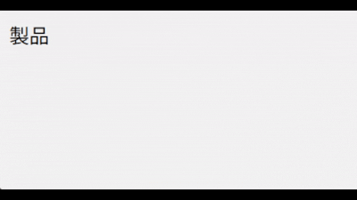

# JavaScriptⅡ 期末試験 対策問題集

この問題集は、期末試験（本試験）と同じ考え方で解ける問題を先に練習するためのものです。  
各問題の「本試験では」を読み、学習の方向性を確認してください。

---

<Exercise title="問題1：クリックでテキストを1回だけ変更（プログラム作成）">
要件を満たすような JavaScript を作成せよ。JavaScript のみ答えること。  
なお、JavaScript は HTML 全体が読み込まれた後の適切なタイミングで実行されるものとする。

**HTML:**

```html
<button id="startBtn">開始</button> <!-- このボタンをクリックすると -->
<p id="statusText">待機</p> <!-- このテキストが変わる -->
```

要件：ボタンをクリックすると、テキストが「待機」から「実行中」に変わる（2回目以降にクリックしても「実行中」のまま）。

:::tip 本試験では
`id` 名や、変更前/変更後の文字が変わります。
:::

:::info 採点基準・配点
- ボタン要素を取得できている：3点
- テキスト要素を取得できている：3点
- クリックイベントを設定する記述がある：5点
- テキストを変更する記述がある：3点
- 要件通り動作する：2点
:::

<Solution>
### 解答

**JavaScript:**

```js
let startBtnYoso = document.querySelector('#startBtn');
let statusTextYoso = document.querySelector('#statusText');

startBtnYoso.addEventListener('click', function() {
    statusTextYoso.innerText = '実行中';
});
```

### 解説

このプログラムは、Webページの要素を操作する基本の流れ（3ステップ）を確認する問題です。

1. **要素を見つける（取得する）**  
   まず、操作したい「ボタン」と「文字が表示されている場所」を `document.querySelector('CSSセレクタ')` で取得します。  
   - `#startBtn` は「id="startBtn" が付いたボタン」  
   - `#statusText` は「id="statusText" が付いた p 要素」  
2. **イベントを設定する**  
   次に、ボタンがクリックされたときに動くように `addEventListener('click', function() { ... })` を書きます。  
3. **中身を書き換える**  
   クリックされたら、`innerText` を書き換えます。`statusTextYoso.innerText = '実行中';` により、表示文字が上書きされます。  

この問題では、2回目以降にクリックしても同じ文字を入れているので、表示は変わらず「実行中」のままになります。
</Solution>
</Exercise>

---

<Exercise title="問題2：クリックで表示/非表示を切り替える（クラスの付け外し）">
要件を満たすような JavaScript を作成せよ。JavaScript のみ答えること。  
なお、JavaScript は HTML 全体が読み込まれた後の適切なタイミングで実行されるものとする。

**HTML:**

```html
<h3 class="questionTitle">質問A</h3> <!-- このタイトルをクリックすると -->
<div class="answerBox">答えA</div> <!-- この内容の表示/非表示が切り替わる -->
```

**CSS:**

```css
/* 答え部分（.answerBox）を最初は隠す */
.answerBox {
    display: none; /* 非表示 */
}

/* isOpen クラスが付いたら表示する */
.answerBox.isOpen {
    display: block; /* 表示 */
}
```

要件：タイトルの「質問A」をクリックすると、「答えA」の表示/非表示が切り替わる。この動作を、クラスの付け外しで適用するCSSを変更することで実現せよ。

**動作イメージ:**


:::tip 本試験では
クリックする要素・切り替える要素のセレクタや、付け外しするクラス名が変わります。  
CSSを見て「どのクラスが付いたら表示になるか」を読み取り、JavaScriptからそのクラスを付け外ししてください。
:::

:::info 採点基準・配点
- タイトル要素を取得できている：3点
- コンテンツ要素を取得できている：3点
- クリックイベントを設定する記述がある：5点
- クラスを付け外しする記述がある：5点
- 要件通り動作する：2点
:::

<Solution>
### 解答

**JavaScript:**

```js
let questionTitleYoso = document.querySelector('.questionTitle');
let answerBoxYoso = document.querySelector('.answerBox');

questionTitleYoso.addEventListener('click', function() {
    answerBoxYoso.classList.toggle('isOpen');
});
```

### 解説

この問題は、「状態（表示/非表示）をクラスで管理する」考え方の確認です。

1. **CSSで状態を作る**  
   - `.answerBox` は `display: none;` なので、最初は非表示  
   - `.answerBox.isOpen` は `display: block;` なので、`isOpen` クラスが付いたら表示  
2. **JavaScriptでクラスを切り替える**  
   `classList.toggle('isOpen')` は、  
   - `isOpen` が付いていないとき：付ける（表示になる）  
   - `isOpen` が付いているとき：外す（非表示になる）  
   を1行で行います。  
3. **イベントを設定する場所に注意する**  
   表示/非表示を切り替えるきっかけは「タイトルのクリック」なので、イベントはタイトル側（`.questionTitle`）に付けます。  
</Solution>
</Exercise>

---

<Exercise title="問題3：マウスが乗ったら表示、離れたら非表示（mouseenter / mouseleave）">
要件を満たすような JavaScript を作成せよ。JavaScript のみ答えること。  
なお、JavaScript は HTML 全体が読み込まれた後の適切なタイミングで実行されるものとする。

**HTML:**

```html
<li class="menuWrap"> <!-- このメニューにマウスが乗ると -->
    <span>製品</span>
    <ul class="subMenu"> <!-- このサブメニューが表示される -->
        <li>パソコン</li>
        <li>スマホ</li>
        <li>タブレット</li>
    </ul>
</li>
```

**CSS:**

```css
.menuWrap {
    /* サブメニュー（.subMenu）を絶対配置するための基準にする */
    position: relative;
}

.subMenu {
    /* タイトルのすぐ下に配置 */
    position: absolute;
    top: 100%; /* 親要素の下端 */
    left: 0; /* 親要素の左端 */

    /* 余白削除 */
    margin: 0;

    /* 初期状態は非表示 */
    opacity: 0; /* 透明 */
    visibility: hidden; /* 見えない */

    /* 表示/非表示を滑らかにする */
    transition: all 0.3s;
}

/* show クラスが付いたら表示する */
.subMenu.show {
    opacity: 1; /* 表示 */
    visibility: visible; /* 見える */
}
```

要件：`.menuWrap` にマウスが乗ったらサブメニューが表示され、`.menuWrap` からマウスが離れたら非表示になる。この動作を、クラスの付け外しで適用するCSSを変更することで実現せよ。

**動作イメージ:**



:::tip 本試験では
セレクタや、表示状態にするクラス名が変わります。
:::

:::info 採点基準・配点
- メニュー要素を取得できている：3点
- サブメニュー要素を取得できている：3点
- マウスエンターイベントを設定する記述がある：5点
- マウスリーブイベントを設定する記述がある：5点
- クラスを追加する記述がある：4点
- クラスを削除する記述がある：4点
- 要件通り動作する：2点
:::

<Solution>
### 解答

**JavaScript:**

```js
let menuWrapYoso = document.querySelector('.menuWrap');
let subMenuYoso = document.querySelector('.subMenu');

menuWrapYoso.addEventListener('mouseenter', function() {
    subMenuYoso.classList.add('show');
});

menuWrapYoso.addEventListener('mouseleave', function() {
    subMenuYoso.classList.remove('show');
});
```

### 解説

この問題は、マウスイベントとクラスの付け外しで表示状態を切り替える問題です。

1. **イベントを付ける要素の範囲が重要**  
   サブメニューを含まない小さい要素（例：文字だけの部分）にイベントを付けると、サブメニューへマウスを移動した瞬間に「マウスが離れた」と判定され、すぐに消えることがあります。  
   そのため、タイトルとサブメニューを両方含む `.menuWrap` にイベントを付けます。  
2. **CSSで表示/非表示の状態を作る**  
   - `.subMenu` は `opacity: 0` と `visibility: hidden` で非表示  
   - `.subMenu.show` は `opacity: 1` と `visibility: visible` で表示  
   - `transition` により、透明度の変化が滑らかになります  
3. **イベントに応じてクラスを付け外しする**  
   - `mouseenter` で `show` クラスを追加して表示  
   - `mouseleave` で `show` クラスを削除して非表示  
</Solution>
</Exercise>

---

<Exercise title="問題4：ポップアップ（モーダル）のCSS穴埋め（opacity / visibility / transition / transform）" enableBlanks>
次の HTML / JavaScript を使って、ポップアップが表示される機能を作成する。  
この機能が正しく動作するように、CSS の空欄を埋めよ。

**HTML:**

```html
<button id="showBtn">ポップアップを開く</button> <!-- このボタンをクリックすると -->

<!-- ↑ のボタンをクリックすると、↓ 全体が表示される -->
<div class="modalLayer"> <!-- 背景（画面全体を覆う半透明の黒い要素） -->
  <div class="modalPanel"> <!-- ポップアップ本体 -->
    <p>ポップアップの内容</p>
    <button id="hideBtn">閉じる</button>
  </div>
</div>
```

**JavaScript:**

```js
let showBtnYoso = document.querySelector('#showBtn');
let hideBtnYoso = document.querySelector('#hideBtn');
let modalLayerYoso = document.querySelector('.modalLayer');

showBtnYoso.addEventListener('click', function() {
    modalLayerYoso.classList.add('isOpen');
});

hideBtnYoso.addEventListener('click', function() {
    modalLayerYoso.classList.remove('isOpen');
});
```

**CSS:**

```css
/* ポップアップ背景 */
.modalLayer {
  /* 画面全体を覆う */
  position: fixed;
  top: 0;
  left: 0;
  width: 100%;
  height: 100%;

  /* 半透明の黒い背景 */
  background-color: rgba(0, 0, 0, 0.5);

  /* 初期状態は非表示 */
  opacity: ${0};
  visibility: hidden;
  transition: opacity 0.3s;

  /* 中央寄せ用 */
  display: flex;
  justify-content: center;
  align-items: center;
}

${.modalLayer.isOpen} {
  /* 表示状態 */
  opacity: ${1};
  visibility: visible;
}

/* ポップアップ本体 */
.modalPanel {
  /* デザインの調整 */
  background-color: #fff;
  padding: 20px;
  border-radius: 6px;

  /* 初期状態は少し小さめ */
  transform: scale(0.9);
  transition: ${/transform|all/} 0.3s;
}

${.modalLayer.isOpen .modalPanel} {
  /* 元の大きさに戻す */
  transform: scale(1);
}
```

**動作イメージ:**


:::tip 本試験では
クラス名や、アニメーションの動き方（スライド/拡大など）が変わります。`opacity` / `visibility` / `transition` / `transform` の役割を理解して埋めてください。
:::

:::info 採点基準・配点
- 1つ目の穴埋めが正答：4点
- 2つ目の穴埋めが正答：4点
- 3つ目の穴埋めが正答：4点
- 4つ目の穴埋めが正答：4点
- 5つ目の穴埋めが正答：4点
:::

<Solution>
### 解説

この問題は、モーダル（ポップアップ）を作るときによく使うCSSの組み合わせを確認する問題です。

1. **画面全体を覆う**  
   `position: fixed;` と `top: 0; left: 0; width: 100%; height: 100%;` により、画面全体を覆います。  
2. **初期状態は見えない + 触れない**  
   - `opacity: 0;` で透明にする  
   - `visibility: hidden;` で完全に非表示にする（クリックもできない）  
   `opacity` だけだと「見えないけどクリックできる」状態になるので、`visibility` も併用します。  
3. **表示状態（クラスが付いたとき）**  
   表示するときは、  
   - `opacity: 1;` で見えるようにする  
   - `visibility: visible;` で表示にする  
4. **アニメーションを滑らかにする**  
   - `transition: opacity 0.3s;` で背景のフェードを滑らかにする  
   - `transition: transform 0.3s;` で本体の動きを滑らかにする（`all` でも可）  
5. **transformで動きを作る**  
   今回は `scale` を使って「少し小さい状態から元の大きさへ」という動きを作っています。`translateY` を使えば「下から上へスライドする」動きにもできます。  
</Solution>
</Exercise>

---

## 補足：試験対策のポイント

- `document.querySelector('セレクタ')` のセレクタは、`id` なら `#id名`、クラスなら `.class名`
- 基本の流れは「要素を取得」→「イベントを設定」→「中身/クラスを変更」

よく使うもの:

- `要素.innerText = '文字'`
- `要素.classList.add('クラス')`
- `要素.classList.remove('クラス')`
- `要素.classList.toggle('クラス')`
- `click` イベント
- `mouseenter` / `mouseleave` イベント

表示/非表示の定番:

- `opacity` + `visibility` + `transition`
- `transform`（`translateY` / `scale` など）
